# 🤖 Amazon Bedrock — Prompt Management DIY | AWS Cloud Quest

<p align="center">
  
  
  
</p>

<p align="center">
  <b>AWS Cloud Quest — Generative AI Practitioner</b><br>
  Creating, testing, versioning and refining reusable prompts with Amazon Bedrock Prompt Management.
</p>

---

## 📌 Overview

This folder documents my **hands-on DIY activity from AWS Cloud Quest — Generative AI Practitioner** using **Amazon Bedrock Prompt Management**.

The activity focused on creating a prompt, adding prompt variables, testing the prompt with different values, creating prompt versions, experimenting with another model/prompt, and finally validating the completed activity.

The Cloud Quest task specifically asks for a new prompt named **`ProductDescriptionWriter`**, variables for product, audience, length and tone, testing the prompt with values such as **wireless headphones**, **remote workers**, **2 paragraphs**, and **professional**, and creating a version of the prompt. fileciteturn17file0L2-L17

---

# 🎯 DIY Objective

The main objective of this activity was to create a reusable product-description prompt in Amazon Bedrock.

### Prompt

```text
ProductDescriptionWriter
```

### Variables

```text
product  → wireless headphones
audience → remote workers
length   → 2 paragraphs
tone     → professional
```

### Overall workflow

```text
Create Prompt
      ↓
Add Prompt Variables
      ↓
Configure Model
      ↓
Test Prompt
      ↓
Review Generated Response
      ↓
Create Prompt Version
      ↓
Refine / Experiment
      ↓
Create Additional Versions
      ↓
Validate in Cloud Quest
```

---

# 🧭 Hands-On Flow

```mermaid
flowchart LR
    A[🎯 DIY Task] --> B[☁️ Amazon Bedrock]
    B --> C[📝 Prompt Management]
    C --> D[Create ProductDescriptionWriter]
    D --> E[🔤 Add Variables]
    E --> F[🤖 Configure Model]
    F --> G[🧪 Test Prompt]
    G --> H[📄 Review Response]
    H --> I[📌 Create Version]
    I --> J[🔁 Refine / Recreate]
    J --> K[📚 Review Versions]
    K --> L[✅ Validate]
```

---

# 01 — 🎯 Understand the DIY Task

The Cloud Quest DIY screen describes the objective:

- Create a new prompt named **`ProductDescriptionWriter`**
- Add prompt variables
- Test the prompt using the required variable values
- Create a version of the prompt

The validation screen also indicates that the prompt should be tested with values such as:

```text
product  = wireless headphones
audience = remote workers
length   = 2 paragraphs
tone     = professional
```

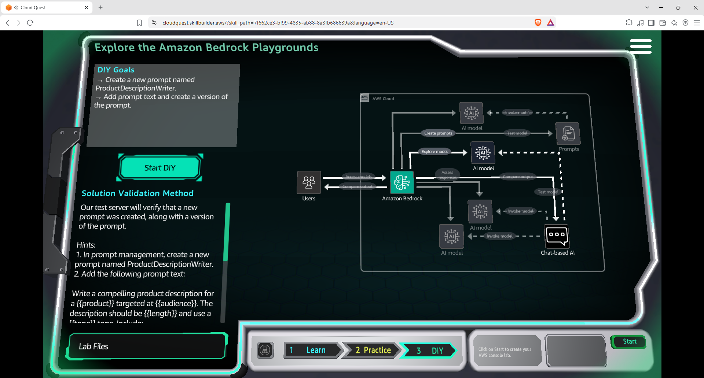

---

# 02 — 🧠 Review the Amazon Nova 2 Lite Model

Before creating the prompt, I reviewed the **Amazon Nova 2 Lite** model page in Amazon Bedrock.

The model page shows information such as:

- Model provider
- Model category
- Input modalities
- Output modalities
- Model ID
- Playground access

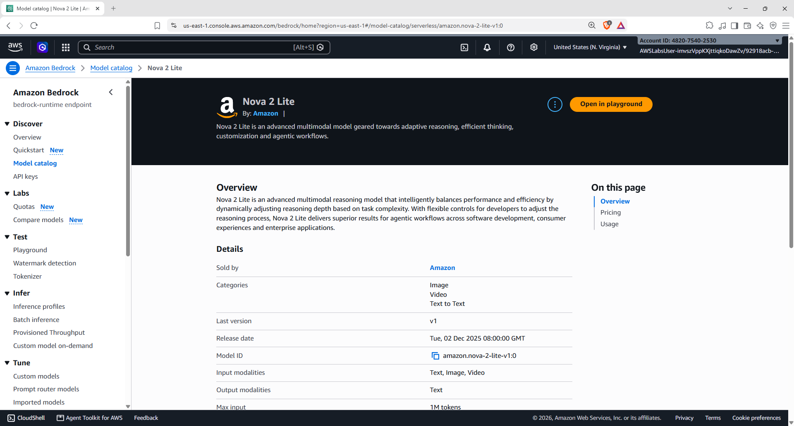

### 💡 Why this step matters

The model selected for a prompt determines which Foundation Model is used to generate the response.

For this part of the activity, **Amazon Nova 2 Lite** was used while building the prompt.

---

# 03 — 📝 Open Prompt Management

I opened **Amazon Bedrock Prompt Management**.

The Prompt Management console provides the workflow for creating and working with reusable prompts.

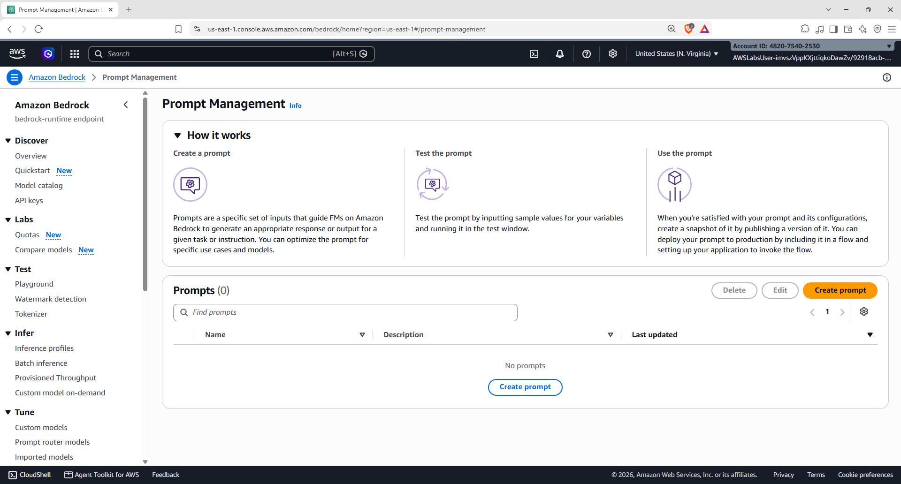

### Basic workflow

```text
Create
  ↓
Configure
  ↓
Test
  ↓
Version
  ↓
Use / Refine
```

---

# 04 — ➕ Create `ProductDescriptionWriter`

I created a new prompt named:

```text
ProductDescriptionWriter
```

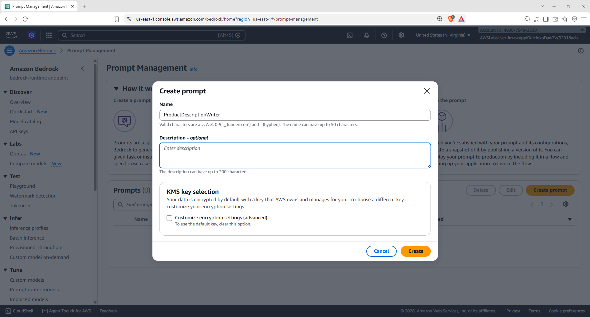

### 🎯 Purpose

The prompt is designed to generate a **compelling product description** based on variable inputs.

Instead of writing a completely new prompt for every product or audience, variables allow the same prompt structure to be reused.

---

# 05 — 🔤 Add Prompt Variables

The prompt was configured with four variables:

| Variable | Example Value |
|---|---|
| `product` | wireless headphones |
| `audience` | remote workers |
| `length` | 2 paragraphs |
| `tone` | professional |


The variables are referenced inside the prompt using variable placeholders.

### Example concept

```text
Product: {{product}}
Audience: {{audience}}
Length: {{length}}
Tone: {{tone}}
```

This allows the same prompt template to work with different inputs.

---

# 06 — 🧪 Configure Test Variables

I entered the test values for the prompt.

```text
product  = wireless headphones
audience = remote workers
length   = 2 paragraphs
tone     = professional
```

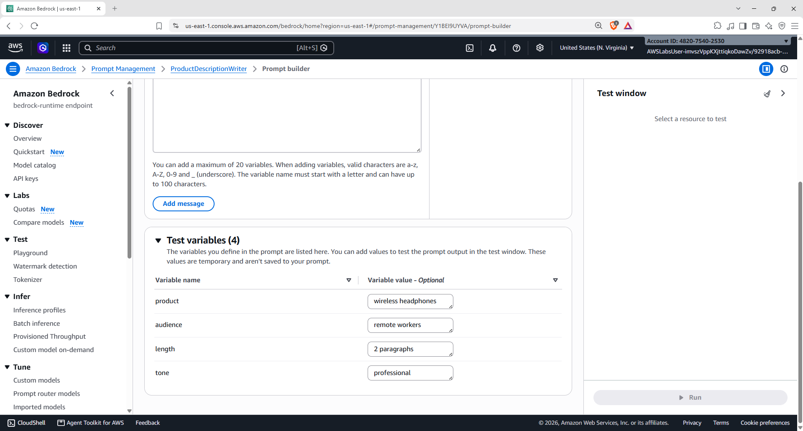

### 💡 Why variables are useful

Without variables:

```text
Prompt 1 → Wireless Headphones
Prompt 2 → Laptop
Prompt 3 → Smartphone
Prompt 4 → Monitor
```

With variables:

```text
                 ┌── wireless headphones
                 ├── laptop
Reusable Prompt ─┼── smartphone
                 └── monitor
```

The prompt structure can remain the same while the input values change.

---

# 07 — ⚙️ Prepare the Prompt Configuration

The prompt was configured in the Prompt Builder with the selected model and the required variable-based instructions.

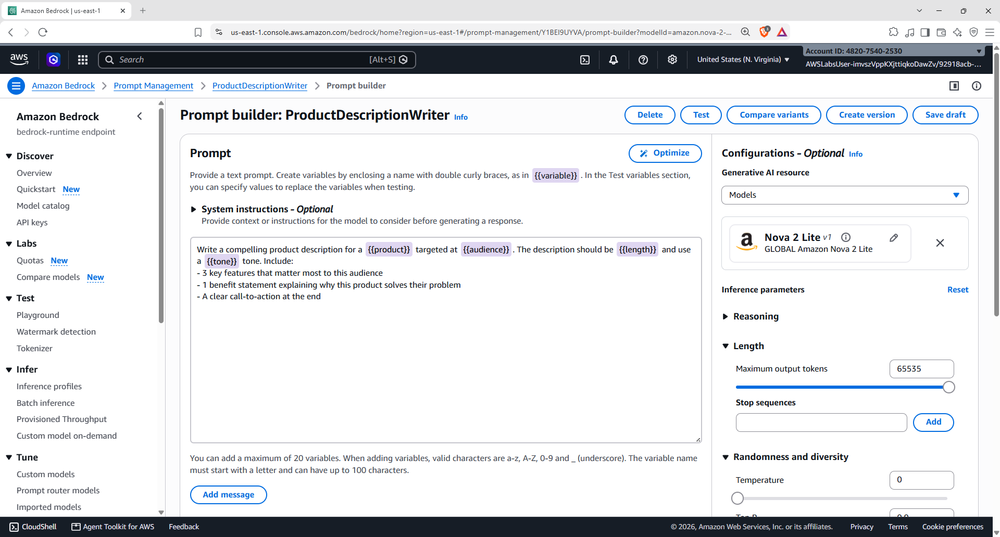

The configuration provides the environment to test the prompt before creating a version.

---

# 08 — 🧪 Test the Prompt

I tested the prompt using the configured variables and reviewed the generated product description.

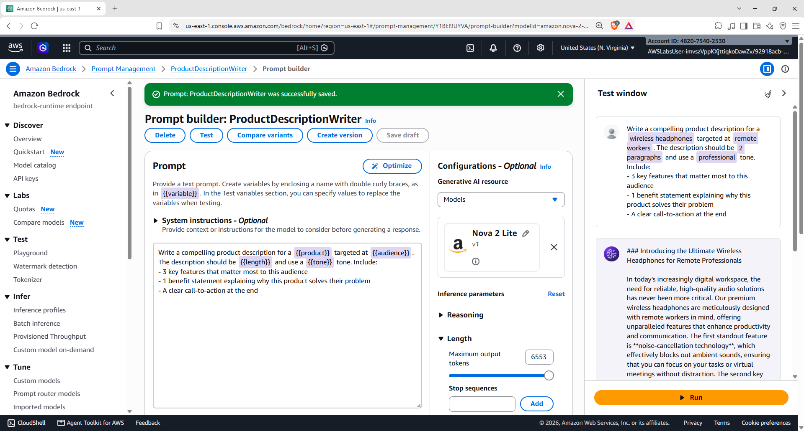

### Expected behaviour

The model receives:

```text
Prompt Template
      +
Variable Values
      ↓
Foundation Model
      ↓
Generated Product Description
```

The output is therefore based on both the instructions in the prompt and the supplied variable values.

---

# 09 — 📌 Create the First Prompt Version

After testing the prompt, I created a version of the prompt.

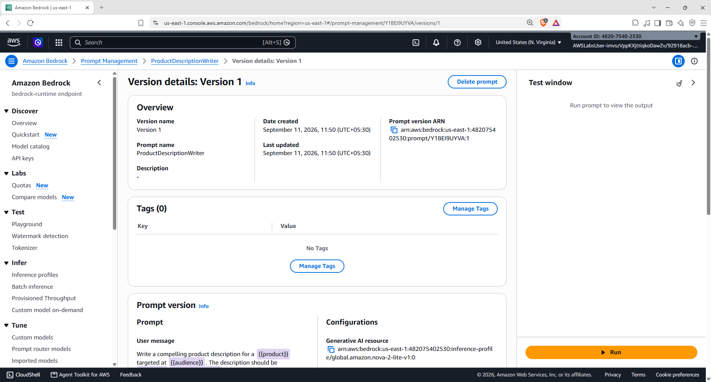

### 🧠 Why version a prompt?

Prompt changes can affect generated responses.

A version gives a specific state of the prompt a distinct version that can be reviewed and used separately from later changes.

---

# 10 — 🔄 Experiment With a Second Prompt / Model

I then created another prompt configuration using a different model.

The screenshot shows **Llama 3.1 8B Instruct** being used for the second prompt experiment.

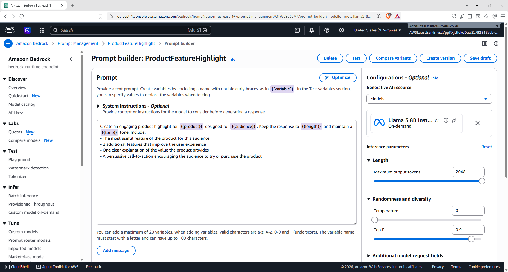

### 🔍 What I explored

This allowed me to see how the prompt workflow can be used with another Foundation Model configuration.

---

# 11 — 🔤 Configure Variables for the Second Prompt

The second prompt was also configured with the variable-based approach.

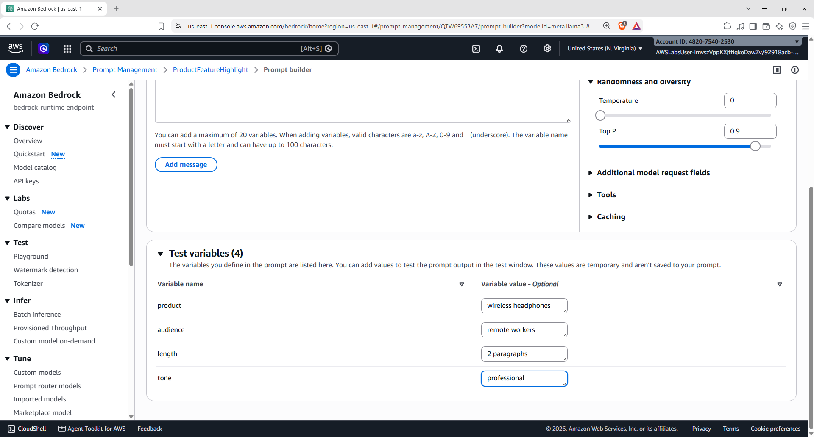

The same concept applies:

```text
Prompt Template
      +
Variables
      ↓
Selected Model
      ↓
Generated Response
```

This keeps the prompt reusable while allowing the input values to change.

---

# 12 — 💬 Test the Second Prompt

I tested the second prompt and reviewed its generated response.


This provided another opportunity to compare the prompt behaviour and generated output using a different model configuration.

---

# 13 — 📌 Create a Version for the Second Prompt

The second prompt configuration was also saved as a version.

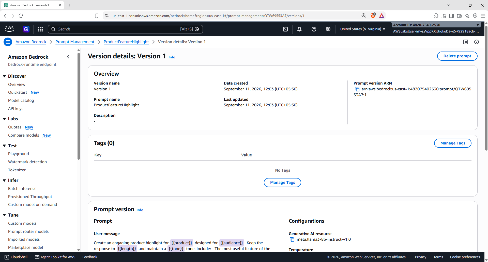

This demonstrates the same prompt lifecycle:

```text
Create → Test → Refine → Version
```

---

# 14 — 🔁 Rework the First Prompt

I returned to the first prompt configuration and revisited the prompt setup.

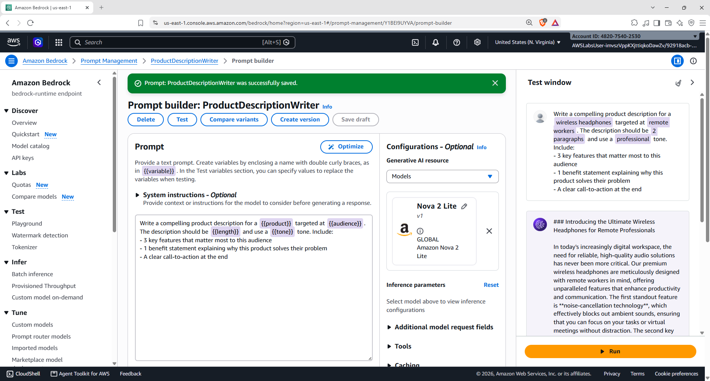

### 💡 Why this is useful

Prompt development is iterative.

A practical workflow can look like:

```text
Write Prompt
     ↓
Test
     ↓
Review Output
     ↓
Improve Prompt
     ↓
Test Again
     ↓
Create Version
```

The activity gave me hands-on practice with this iterative workflow.

---

# 15 — 📌 Recreate / Create Another Version

After refining the first prompt, I created another prompt version.

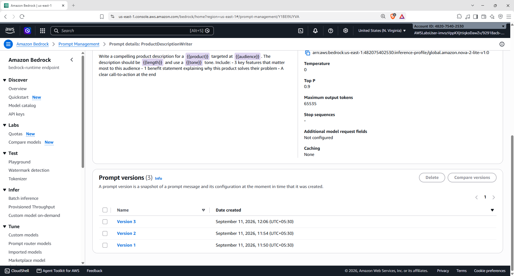

This demonstrates how multiple versions can exist as the prompt evolves.

---

# 16 — ✅ Successful Completion

Finally, I returned to the Cloud Quest validation screen.

The activity was successfully completed and validated.

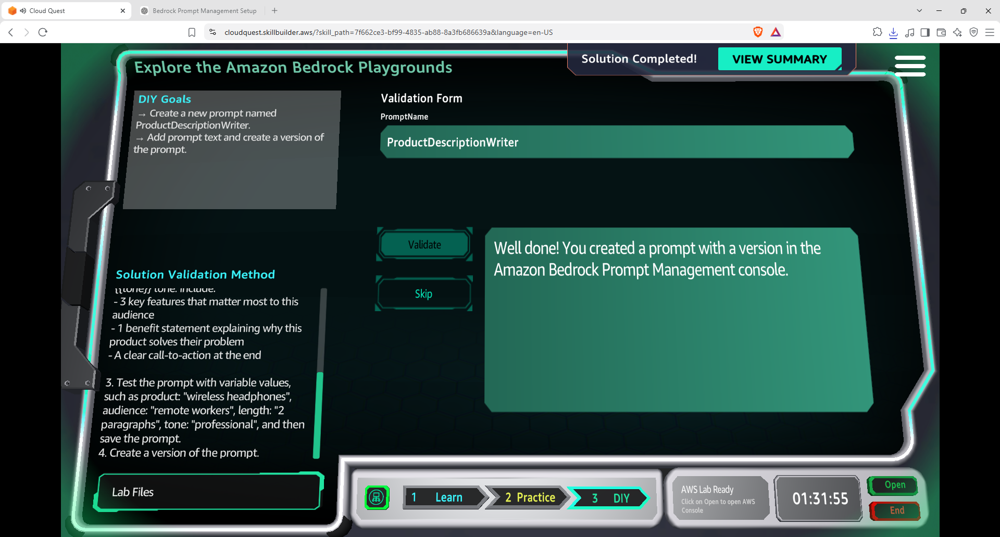

The validation confirms that the required **ProductDescriptionWriter** prompt was created with a version in the Amazon Bedrock Prompt Management console.

---

# 🧩 End-to-End Architecture

```text
                        Amazon Bedrock
                              │
                              ▼
                    ┌──────────────────┐
                    │ Prompt Management│
                    └────────┬─────────┘
                             │
                             ▼
                  ProductDescriptionWriter
                             │
                  ┌──────────┼──────────┐
                  ▼          ▼          ▼
               Prompt     Variables    Model
              Template                 │
                  │          │         │
                  └──────────┼─────────┘
                             ▼
                          Testing
                             │
                             ▼
                     Generated Output
                             │
                             ▼
                       Prompt Version
```

---

# 🧠 What I Learned

| Concept | Hands-On Practice |
|---|---|
| ☁️ **Amazon Bedrock** | Worked with Bedrock Prompt Management |
| 📝 **Prompt Management** | Created and configured reusable prompts |
| 🔤 **Prompt Variables** | Used product, audience, length and tone variables |
| 🤖 **Foundation Models** | Worked with Amazon Nova 2 Lite and Llama 3.1 8B Instruct |
| 🧪 **Prompt Testing** | Tested prompts with variable values |
| 💬 **Generated Responses** | Reviewed model-generated product descriptions |
| 🔁 **Prompt Iteration** | Refined and retested prompts |
| 📌 **Prompt Versioning** | Created and reviewed multiple prompt versions |
| 🏗️ **Reusable Prompt Design** | Separated prompt structure from variable inputs |
| ✅ **Cloud Quest Validation** | Successfully validated the completed activity |

---

# 🔐 Key Takeaway

One of the main things I learned from this activity is that **prompt development can be treated as an iterative engineering workflow** rather than simply writing a prompt once.

```text
Design
  ↓
Test
  ↓
Evaluate
  ↓
Refine
  ↓
Version
  ↓
Repeat
```

Using variables also makes the prompt more reusable because the same prompt structure can be applied to different products, audiences, lengths and tones.

---

# 🛠️ Skills Practiced

`AWS` `Amazon Bedrock` `Generative AI` `Prompt Engineering` `Prompt Management` `Foundation Models` `Model Inference` `Prompt Variables` `Prompt Versioning` `Cloud Computing` `AWS Cloud Quest`

---

## 📚 Learning Source

**AWS Cloud Quest — Generative AI Practitioner**

This README documents my personal hands-on implementation and the steps completed during the Cloud Quest activity.

---

<p align="center">
  <b>☁️ Create → Test → Refine → Version → Validate</b>
</p>
