# 🤖 Amazon Bedrock — Playground & Prompt Management | AWS Cloud Quest

<p align="center">
  
  
  
</p>

<p align="center">
  <b>AWS Cloud Quest — Generative AI Practitioner</b><br>
  Exploring Amazon Bedrock Playgrounds, model inference parameters, model comparison and Prompt Management.
</p>

---

## 📌 Overview

This folder documents my **hands-on practice from AWS Cloud Quest — Generative AI Practitioner** using **Amazon Bedrock**.

The practice activity focused on exploring the Amazon Bedrock console and learning how to:

- Navigate the **Amazon Bedrock Playgrounds**
- Explore available Foundation Models
- Review a model's capabilities and modalities
- Configure inference parameters
- Run prompts and inspect generated responses
- Compare different models and their responses
- Create and manage reusable prompts
- Test prompt variables
- Create prompt versions

The Cloud Quest practice objective specifically focused on applying model inference parameters, comparing two text models, and creating a reusable prompt with variables for use in prompt management. fileciteturn16file0L2-L2

---

# 🧭 Practice Flow

```mermaid
flowchart LR
    A[🎯 Cloud Quest Practice] --> B[☁️ Amazon Bedrock]
    B --> C[🔎 Explore Model Catalog]
    C --> D[🧠 Select Foundation Model]
    D --> E[🎛️ Configure Inference Parameters]
    E --> F[💬 Run Prompt]
    F --> G[⚖️ Compare Models]
    G --> H[📝 Prompt Management]
    H --> I[🔤 Add Variables]
    I --> J[🧪 Test Prompt]
    J --> K[📌 Create Version]
```

---

# 01 — 🎯 Practice Lab Overview

The Cloud Quest practice section introduces the Amazon Bedrock Playground activity.

The lab focuses on:

- Launching and navigating Amazon Bedrock Playgrounds
- Applying model inference parameters
- Comparing two text models
- Creating a reusable prompt with variables
- Saving the prompt for use in prompt management

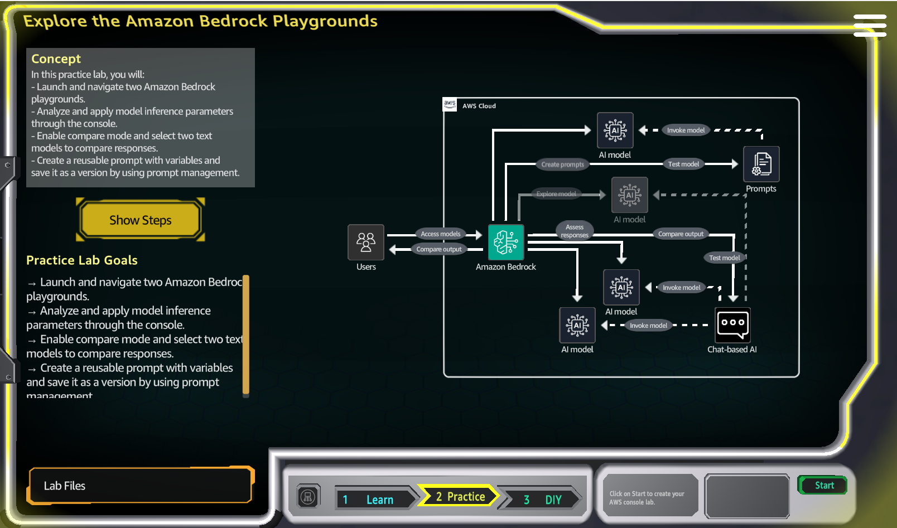

---

# 02 — 🔎 Explore the Amazon Bedrock Model Catalog

I opened the **Amazon Bedrock Model Catalog** to explore the available Foundation Models.

The catalog provides filters for things such as:

- Providers
- Input modalities
- Output modalities
- Built-in tools

The screenshots show models from multiple providers, including Amazon, Anthropic, Meta and others.

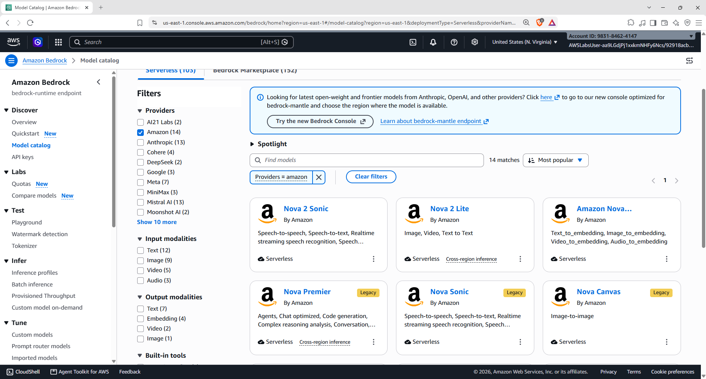

### 💡 What I learned

Amazon Bedrock provides access to multiple Foundation Models through a common AWS service, allowing developers to evaluate models based on the requirements of their application.

---

# 03 — 🧠 Explore Amazon Nova 2 Lite

I opened the model details page for **Amazon Nova 2 Lite**.

The model page provides information such as:

- Model overview
- Provider
- Categories
- Input modalities
- Output modalities
- Model ID
- Playground access

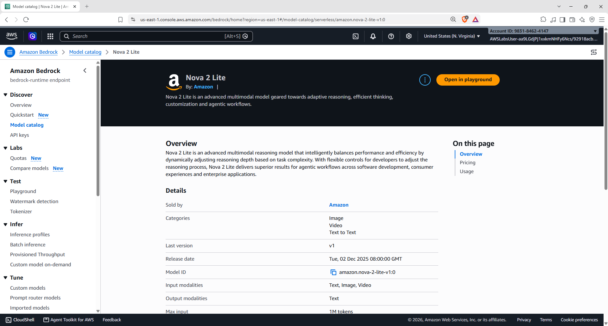

### 🔍 Why this matters

Before using a Foundation Model, it is useful to understand what types of inputs and outputs it supports and whether it fits the application's requirements.

---

# 04 — 🎛️ Configure the Model in Playground

I opened the Amazon Bedrock Playground and configured the selected model.

The Playground exposes settings such as:

- System prompts
- Model reasoning
- Length
- Maximum output tokens
- Stop sequences
- Temperature
- Top P
- Top K
- Guardrails

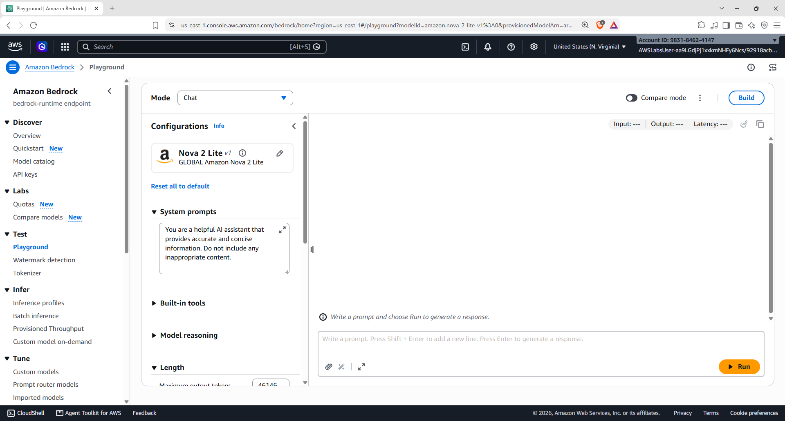

---

# 05 — 🌡️ Explore Inference Parameters

The Playground provides controls for model inference behaviour.

The practice included reviewing parameters such as:

```text
Temperature
Top P
Top K
Maximum Output Tokens
Stop Sequences
```

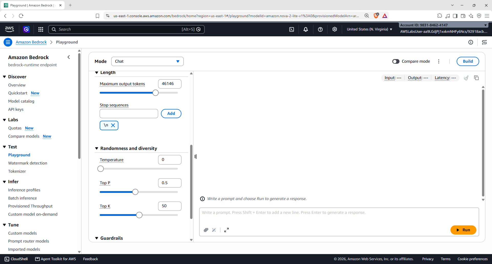

### 🧠 Simple understanding

| Parameter | Purpose |
|---|---|
| 🌡️ **Temperature** | Controls randomness/diversity in generated output |
| 🎯 **Top P** | Controls token selection using cumulative probability |
| 🔢 **Top K** | Limits token selection to the top K candidates |
| 📏 **Maximum Output Tokens** | Controls the maximum generated output length |
| 🛑 **Stop Sequences** | Defines text sequences that can stop generation |

> These controls can change how the same prompt is answered by a model.

---

# 06 — 💬 Run a Prompt and Review the Response

I tested a prompt in the Playground and reviewed the generated response.

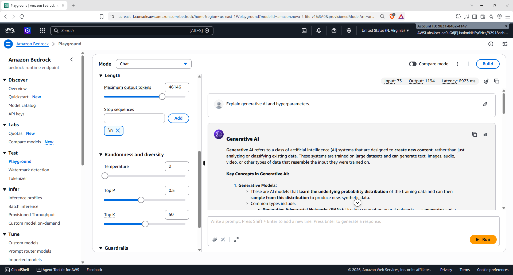

The Playground provides the generated output along with information related to the request and response.

---

# 07 — 🧠 Explore Model Reasoning

The Playground also provides model reasoning controls.

I tested a reasoning-oriented configuration and reviewed the resulting response.


### 💡 What I observed

Different model configurations can affect how the model approaches a task and the type of response that is generated.

---

# 08 — ⚖️ Compare Foundation Models

The practice then moved into comparing model outputs.

I selected another model and configured it for comparison with the previously selected model.


The comparison interface allows responses from different models to be viewed side-by-side.

---

# 09 — 🆚 Compare Model Configuration

I configured the comparison model and reviewed its settings.

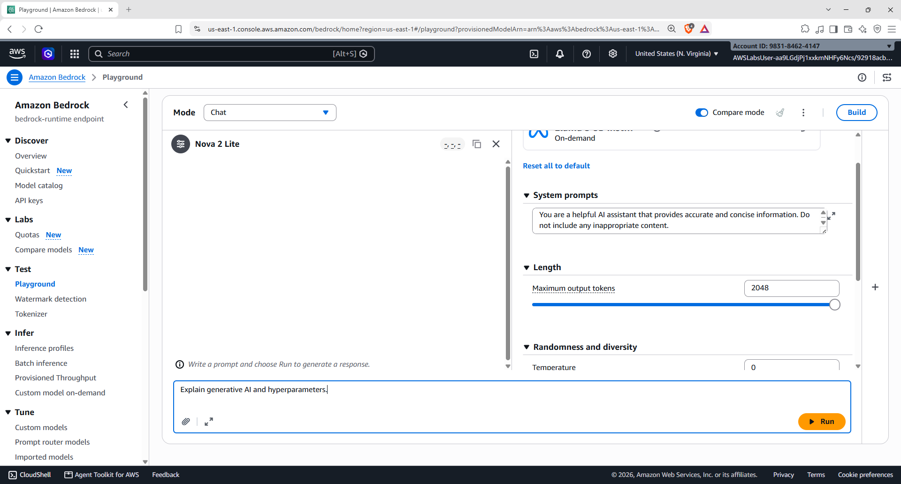

This makes it easier to evaluate how different Foundation Models respond to the same prompt.

---

# 10 — 📊 Compare Model Responses

The models were then compared using the same or similar prompt.


### 🔍 Why model comparison is useful

Different models can produce different results for the same task.

Model selection can therefore depend on factors such as:

- Response quality
- Task requirements
- Supported modalities
- Reasoning capability
- Output characteristics
- Cost and performance requirements

---

# 11 — 🧪 Compare a Second Model Response

I continued the comparison by testing another model response.

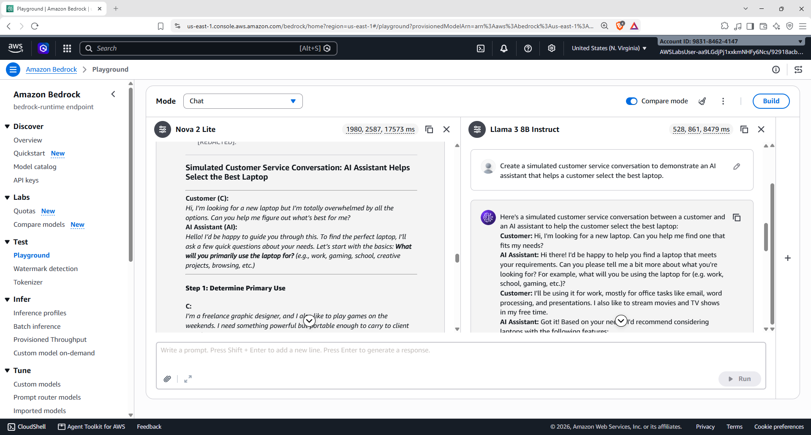

The goal was to observe how model outputs can vary when working with different Foundation Models.

---

# 12 — ✨ Prompt Quality Comparison

I also tested a more specific prompt and compared the generated result.

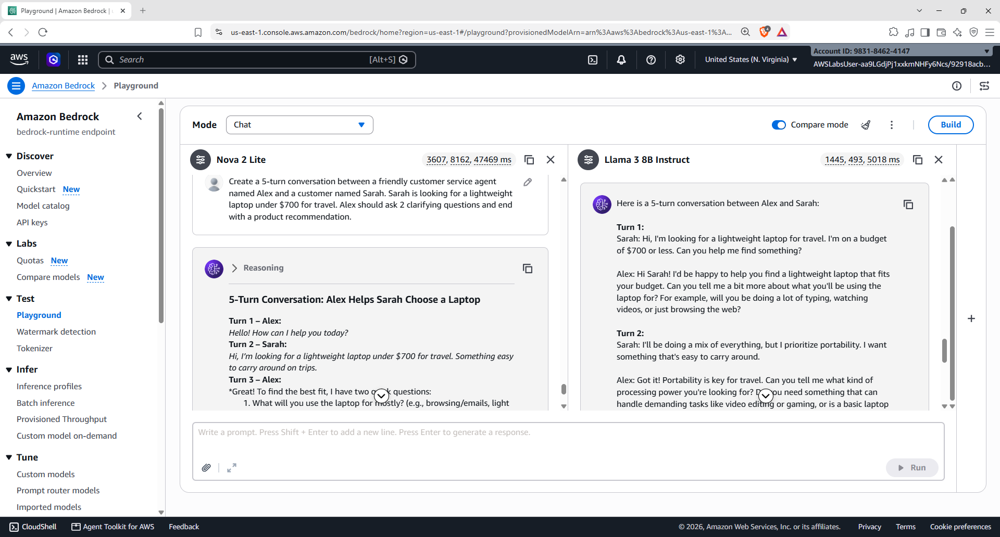

### 🧠 Key learning

The quality of the generated response is influenced not only by the model but also by the instructions provided through the prompt.

This makes **prompt design** an important part of building Generative AI applications.

---

# 13 — 📝 Open Prompt Management

After working with the Playground, I moved to **Amazon Bedrock Prompt Management**.

The Prompt Management page provides a workflow to:

```text
Create a Prompt
      ↓
Test the Prompt
      ↓
Use the Prompt
```

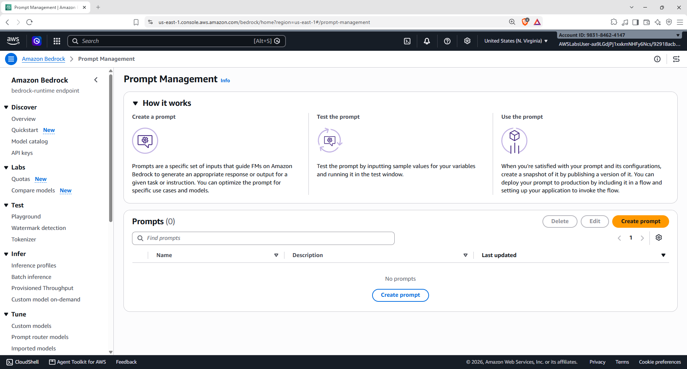

### 💡 Why Prompt Management?

Instead of keeping prompts only inside application code, reusable prompts can be created and managed through the Bedrock console.

---

# 14 — ➕ Create a Reusable Prompt

I created a prompt named:

```text
CustomerServiceDemo
```

The prompt was designed around a customer-service conversation scenario.


### 🎯 Prompt objective

The prompt is designed to simulate a customer-service interaction where an AI assistant helps a customer choose a laptop based on their requirements.

---

# 15 — ⚙️ Configure the Prompt

Inside the Prompt Builder, I configured the prompt and selected **Amazon Nova 2 Lite** as the model.

The configuration also included inference settings such as:

- Maximum output tokens
- Temperature
- Top P
- Top K
- Model configuration

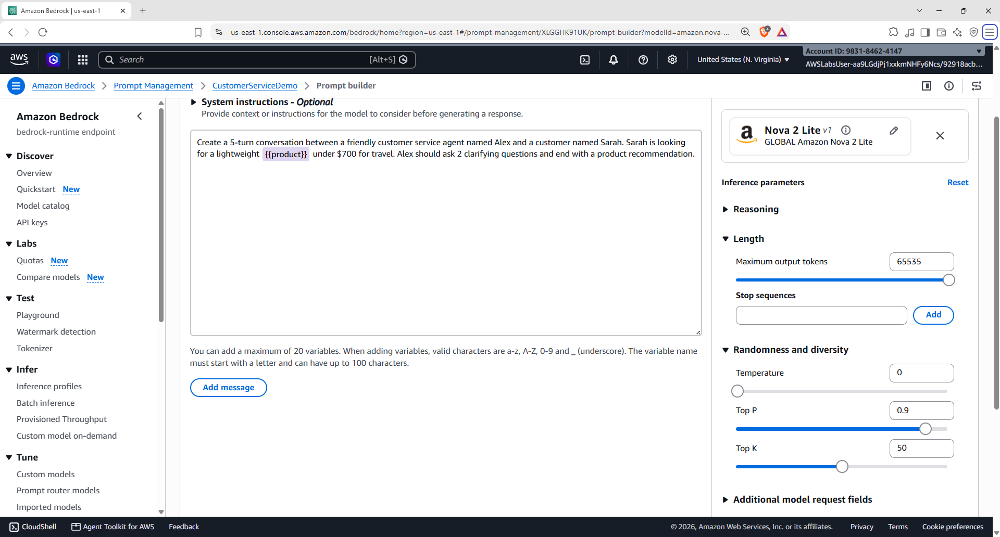

---

# 16 — 🔤 Add a Prompt Variable

The prompt was designed with a variable so the same prompt can be reused with different product values.

The test variable used in the practice was:

```text
product = laptop
```

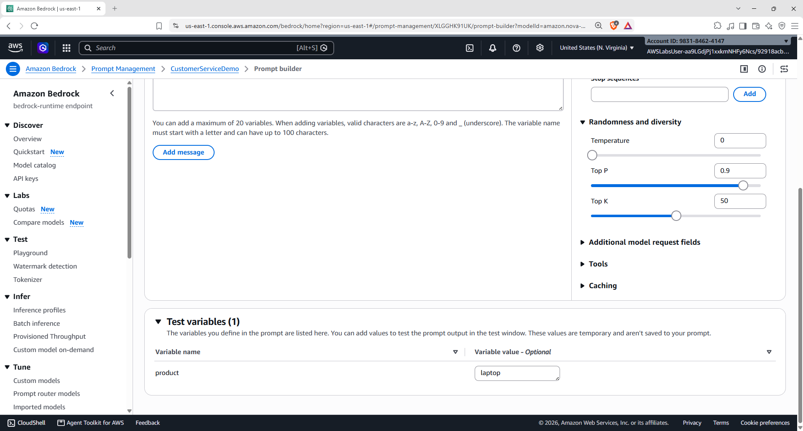

### 💡 Why variables are useful

Instead of creating a completely new prompt for every product, the same prompt structure can accept different values.

For example:

```text
product = laptop
product = smartphone
product = tablet
product = monitor
```

This makes the prompt more reusable.

---

# 17 — 🧪 Test the Prompt

I tested the prompt using the configured variable and reviewed the generated customer-service conversation.

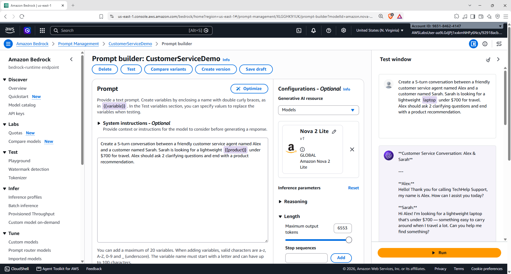

The test window allows the prompt to be evaluated before using it in an application.

---

# 18 — 📌 Create and Review a Prompt Version

Finally, I created a version of the prompt.

The version details page shows information including:

- Version name
- Prompt name
- Creation date
- Last updated information
- Prompt ARN
- Prompt configuration

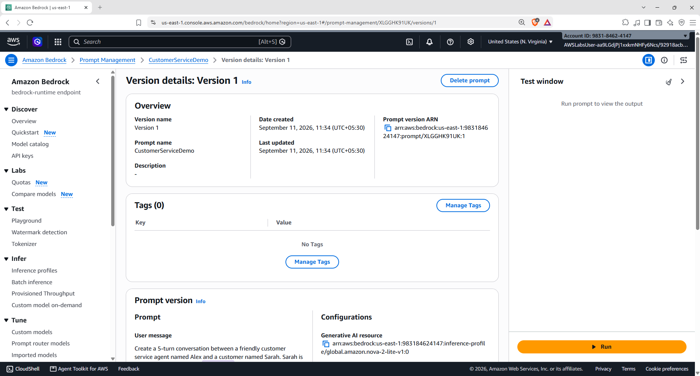

### 🧠 Why versioning matters

Prompt behaviour can change as prompts are refined.

Versioning helps maintain a specific version of a prompt configuration instead of treating every modification as an uncontrolled change.

---

# 🧩 End-to-End Practice Flow

```text
                  Amazon Bedrock
                        │
          ┌─────────────┴─────────────┐
          ▼                           ▼
     Model Catalog               Prompt Management
          │                           │
          ▼                           ▼
   Select Foundation Model       Create Prompt
          │                           │
          ▼                           ▼
       Playground              Add Instructions
          │                           │
          ▼                           ▼
 Inference Parameters            Add Variables
          │                           │
          ▼                           ▼
      Run Prompt                  Test Prompt
          │                           │
          ▼                           ▼
    Compare Models              Create Version
          │
          ▼
   Evaluate Responses
```

---

# 🧠 What I Learned

| Concept | Hands-on Practice |
|---|---|
| ☁️ **Amazon Bedrock** | Navigated the Bedrock console and Playground |
| 🧠 **Foundation Models** | Explored models in the Model Catalog |
| 🧪 **Playground** | Tested prompts and generated responses |
| 🌡️ **Temperature** | Explored randomness/diversity settings |
| 🎯 **Top P** | Explored probability-based token selection |
| 🔢 **Top K** | Explored top-token selection |
| 📏 **Output Tokens** | Configured maximum response length |
| 🛑 **Stop Sequences** | Reviewed generation stopping controls |
| 🧠 **Model Reasoning** | Tested reasoning-related settings |
| ⚖️ **Model Comparison** | Compared responses from different models |
| 📝 **Prompt Management** | Created and managed a reusable prompt |
| 🔤 **Prompt Variables** | Tested a variable-based prompt |
| 🧪 **Prompt Testing** | Tested the prompt before use |
| 📌 **Prompt Versioning** | Created and reviewed a prompt version |

---

# 🛠️ Skills Practiced

`AWS` `Amazon Bedrock` `Generative AI` `Foundation Models` `Prompt Engineering` `Prompt Management` `Model Inference` `Model Comparison` `AI/ML` `Cloud Computing` `AWS Cloud Quest`

---

## 📚 Learning Source

**AWS Cloud Quest — Generative AI Practitioner**

This README documents my personal hands-on practice and the steps performed during the Cloud Quest activity.

---

<p align="center">
  <b>☁️ Explore → Experiment → Compare → Build → Document</b>
</p>
