# 🧠 Amazon Bedrock Knowledge Bases — Enterprise Knowledge Assistant | AWS Cloud Quest

<p align="center">
  
  
  
  
</p>

<p align="center">
  <b>AWS Cloud Quest — Generative AI Practitioner</b><br>
  Building and testing an Amazon Bedrock Knowledge Base using Amazon S3, embeddings and Amazon OpenSearch Serverless.
</p>

---

## 📌 Overview

This folder documents my **hands-on practice from AWS Cloud Quest — Generative AI Practitioner** focused on **Amazon Bedrock Knowledge Bases**.

The Cloud Quest activity is based on the scenario **“Create an Enterprise Knowledge Assistant.”** The objective is to build a knowledge assistant that can answer business questions using company data instead of relying only on the information already available inside a Foundation Model.

The practice architecture connects Amazon S3 as the source, Amazon Bedrock Knowledge Bases as the retrieval layer, an embedding model, Amazon OpenSearch Serverless as the vector store, and a Foundation Model for response generation.

---

# 🎯 Practice Objectives

- 📂 Upload company data to **Amazon S3**
- 🧠 Create an **Amazon Bedrock Knowledge Base**
- 🔐 Configure the required IAM role
- 📚 Connect an S3 data source to the Knowledge Base
- 🔢 Select an embedding model
- 🗄️ Configure **Amazon OpenSearch Serverless** as the vector store
- 🔄 Synchronize the Knowledge Base with source data
- 🤖 Select a Foundation Model for testing
- 🔎 Test retrieval-augmented responses
- 🧩 Test complex queries and query breakdown
- 🚫 Test behaviour when required information is missing
- ✅ Complete the Cloud Quest Practice section

---

# 🧭 What Problem Are We Solving?

A Foundation Model may not have access to a company's latest private information.

Instead of relying only on model knowledge:

```text
User
 ↓
Foundation Model
 ↓
Answer based only on model knowledge
```

we can build a knowledge-grounded workflow:

```text
User
 ↓
Amazon Bedrock Knowledge Base
 ↓
Retrieve relevant company information
 ↓
Foundation Model
 ↓
Grounded Answer
```

This is the core idea behind **Retrieval-Augmented Generation (RAG)**.

---

# 🏗️ Architecture

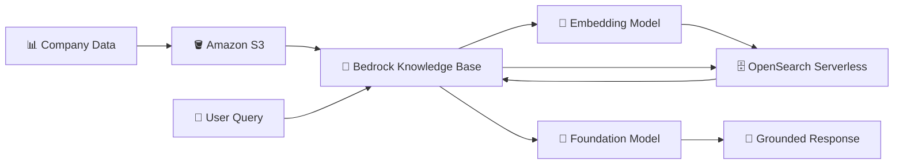
```mermaid
flowchart LR
    A[📊 Company Data] --> B[🪣 Amazon S3]
    B --> C[🧠 Bedrock Knowledge Base]
    C --> D[🔢 Embedding Model]
    D --> E[🗄️ OpenSearch Serverless]
    F[👤 User Query] --> C
    C --> E
    E --> C
    C --> G[🤖 Foundation Model]
    G --> H[💬 Grounded Response]
```

| Component | Role |
|---|---|
| 🪣 **Amazon S3** | Stores the source company data |
| 🧠 **Amazon Bedrock Knowledge Bases** | Manages the retrieval workflow |
| 🔢 **Embedding Model** | Converts source content into vector representations |
| 🗄️ **Amazon OpenSearch Serverless** | Stores and searches vector embeddings |
| 🤖 **Foundation Model** | Generates the final natural-language response |
| 🔎 **RAG** | Retrieves relevant information and provides it as context to the model |

---

# 01 — 🎯 Review the Cloud Quest Scenario

The Cloud Quest activity is titled:

> **Create an Enterprise Knowledge Assistant**

The Practice Lab focuses on uploading documents to Amazon S3, enabling models in Amazon Bedrock, creating an Amazon Bedrock Knowledge Base, using Amazon OpenSearch Serverless as a vector store, and testing the Knowledge Base with questions based on the uploaded company data.

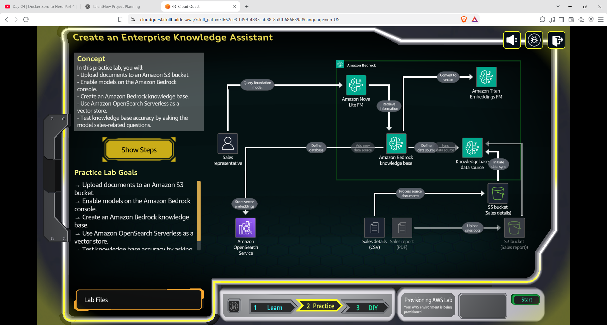

---

# 02 — 💡 Understand the Quest Idea

The activity introduces the idea of building an enterprise knowledge assistant using company data and retrieval.

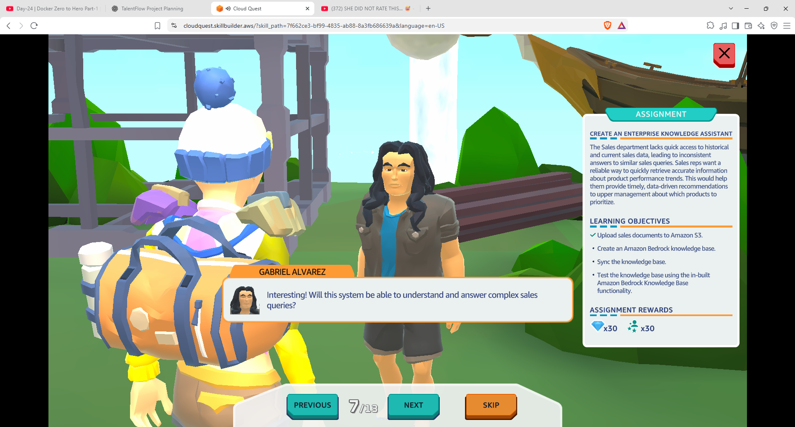

### High-level flow

```text
Company Documents
       ↓
     Amazon S3
       ↓
Knowledge Base
       ↓
Vector Search
       ↓
Relevant Information
       ↓
Foundation Model
       ↓
Answer
```

---

# 03 — 🪣 Review Amazon S3 Buckets

I opened the Amazon S3 console and reviewed the available buckets. The S3 bucket is used as the source location for the sales/product data used by the Knowledge Base.

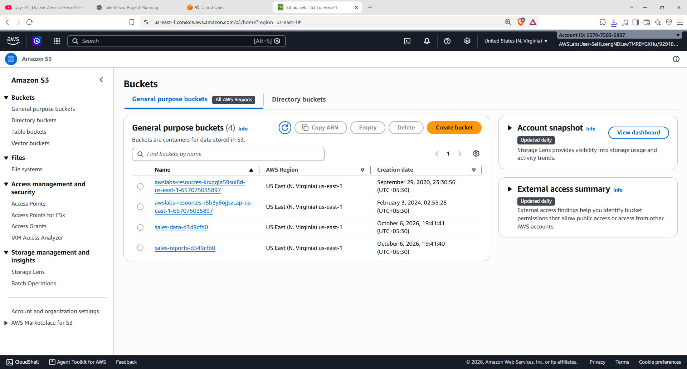

---

# 04 — 📤 Upload the Sales Dataset

The practice provided the dataset:

```text
sales_data.zip
```

I uploaded the dataset to the S3 bucket.

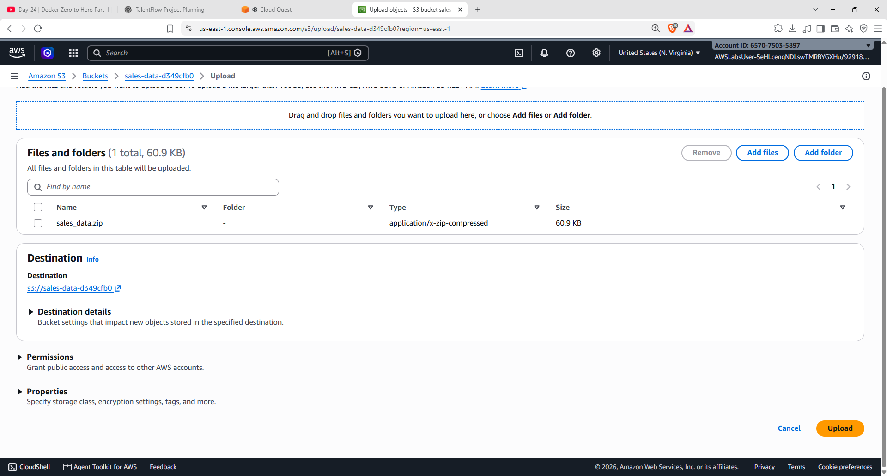

---

# 05 — ✅ Verify the S3 Upload

The S3 upload status showed that the file was successfully uploaded.

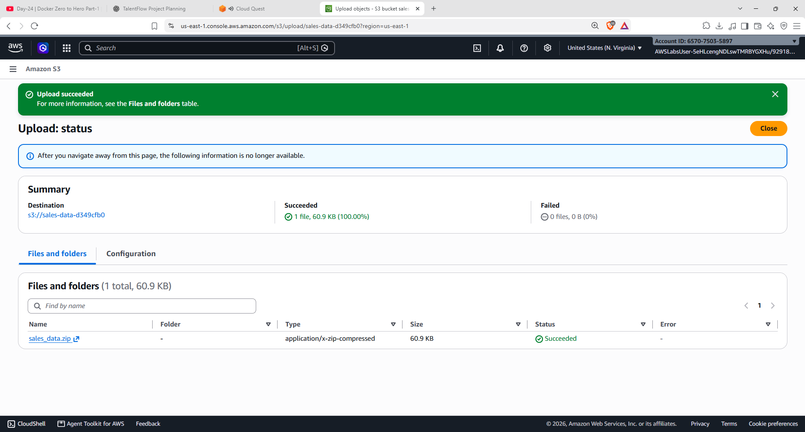

```text
sales_data.zip
      ↓
Amazon S3
      ↓
Knowledge Base Data Source
```

---

# 06 — ⚙️ Prepare the Data

The practice environment includes an automated extraction step for the uploaded ZIP data.

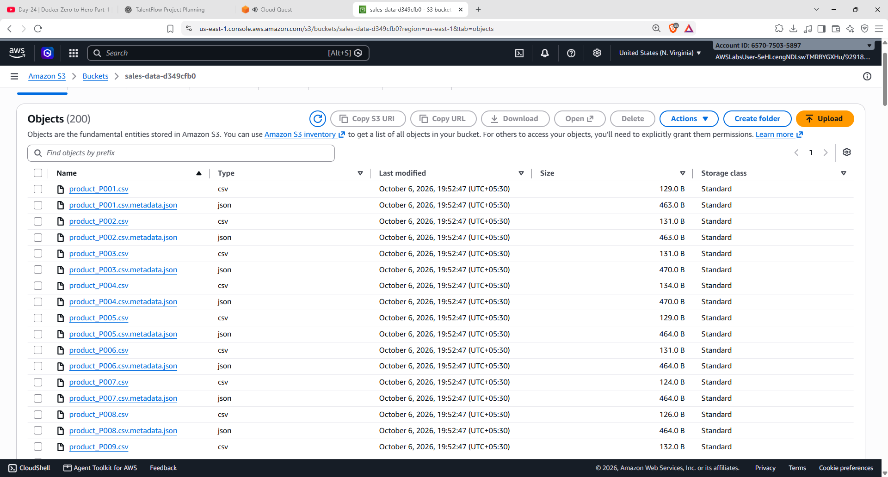

This prepares the source files so they can be consumed by the Knowledge Base.

---

# 07 — 🗄️ Review Amazon OpenSearch Serverless

I opened the **Amazon OpenSearch Serverless** console.

OpenSearch Serverless is used as the vector store for the Knowledge Base.

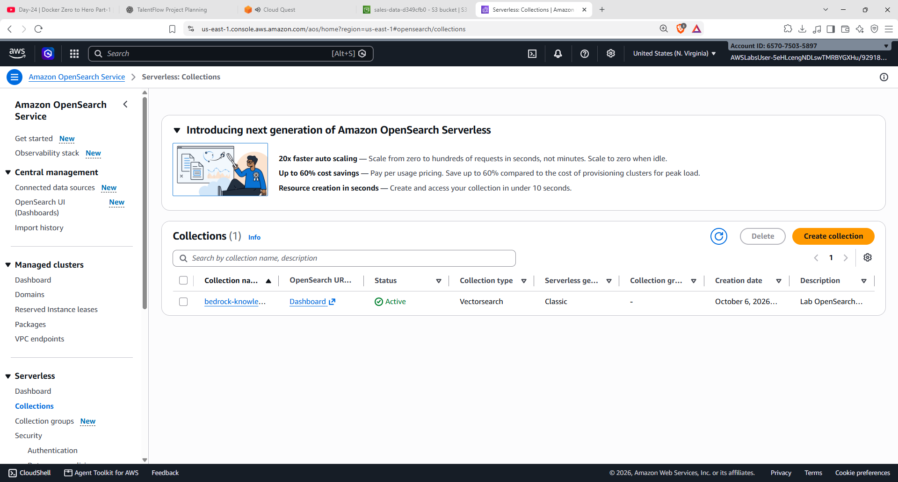

### Vector-store concept

```text
Documents
   ↓
Embeddings
   ↓
Vector Store
   ↓
Similarity Search
```

---

# 08 — 🔎 Review the Knowledge Base Index

The OpenSearch collection contains the index used by the Knowledge Base.

```text
bedrock-knowledge-base-index
```

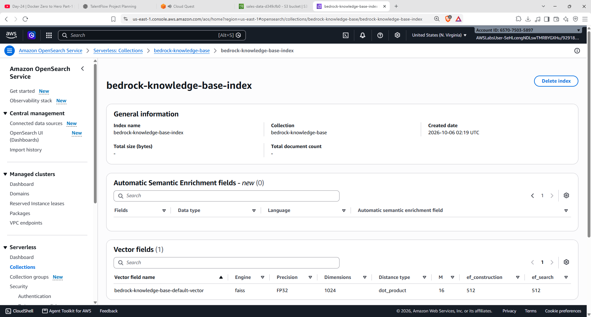

The index provides the storage and search layer for vectors generated from the source data.

---

# 09 — ☁️ Open Amazon Bedrock Knowledge Bases

I opened **Amazon Bedrock → Knowledge Bases**.

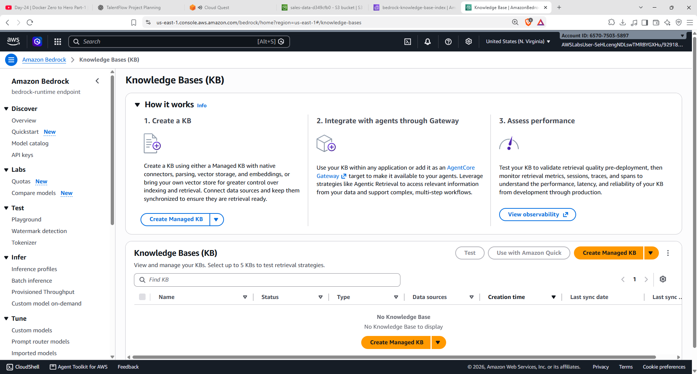

The Knowledge Bases console provides the workflow for creating a managed Knowledge Base and connecting it with data sources and retrieval systems.

---

# 10 — 🧩 Select the Vector Store

During Knowledge Base creation, I selected the vector-store configuration using the existing vector store.

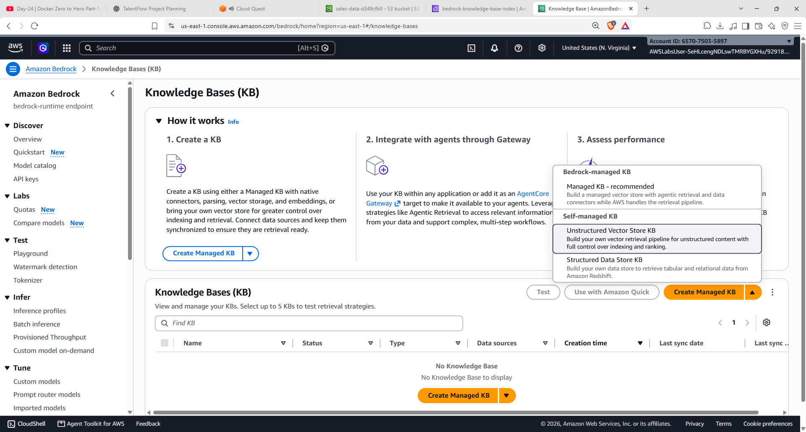

```text
S3 Documents
     ↓
Embedding Model
     ↓
Vectors
     ↓
OpenSearch Serverless
     ↓
Similarity Search
```

---

# 11 — 🔐 Configure Knowledge Base Name and IAM Role

I provided the Knowledge Base configuration and selected the IAM role required by Amazon Bedrock.

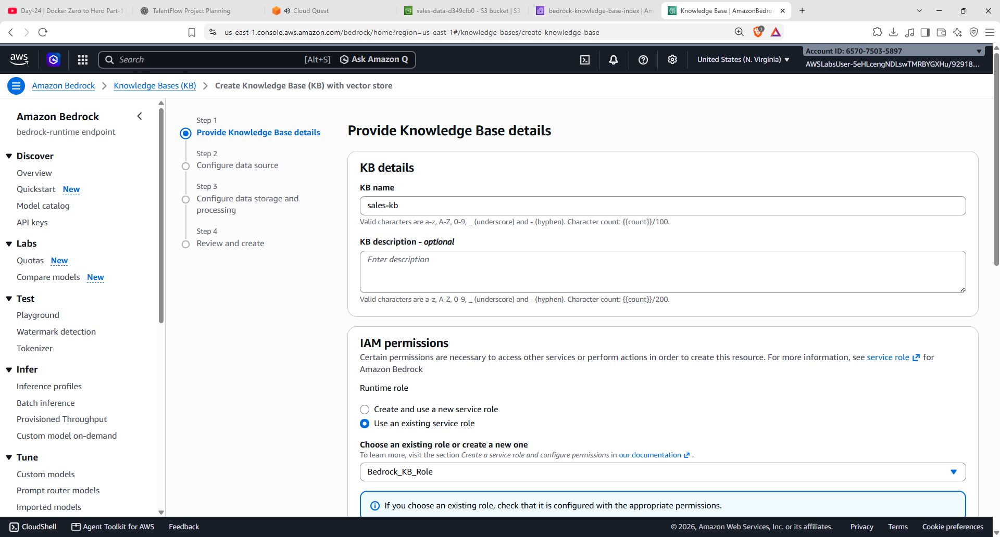

The Knowledge Base needs appropriate permissions to interact with the configured AWS resources.

---

# 12 — 📂 Configure the S3 Data Source

I configured Amazon S3 as the Knowledge Base data source and connected it to the uploaded sales dataset.

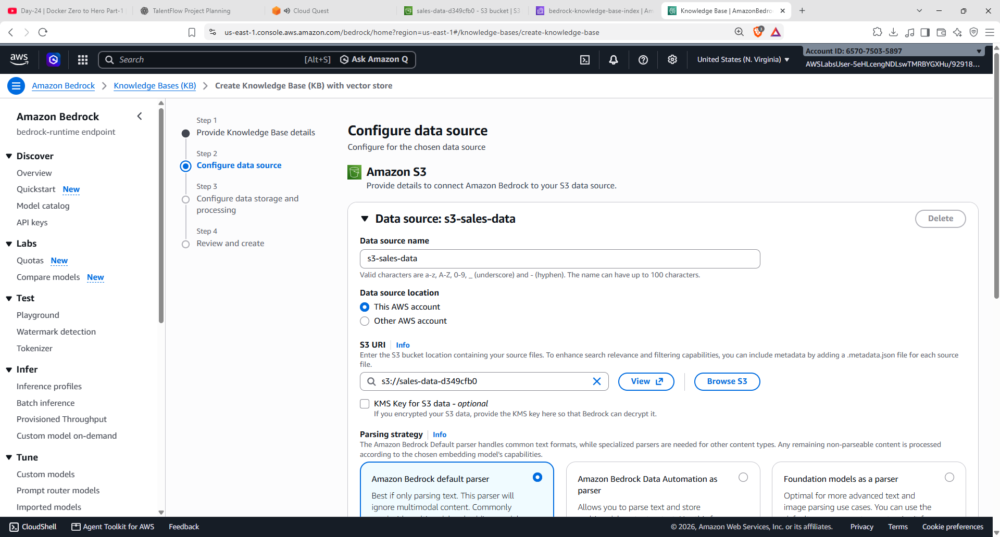

```text
Amazon S3
    ↓
Knowledge Base
    ↓
Document Processing
    ↓
Embeddings
```

---

# 13 — 🔢 Select the Embedding Model

The Knowledge Base requires an embedding model to convert text into vector representations.

The practice screen shows **Amazon Titan Text Embeddings** options.

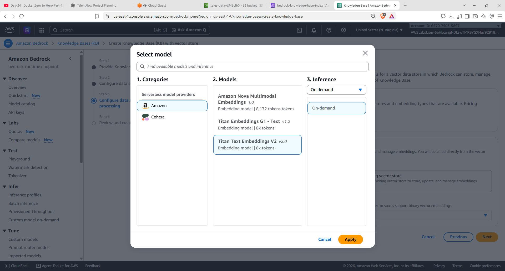

### Simplified example

```text
"Product 001 costs $500"
             ↓
       Embedding Model
             ↓
       [0.12, -0.45, ...]
             ↓
        Vector Store
```

---

# 14 — ⚙️ Configure the Embedding Model

I reviewed the embedding-model configuration, including the embedding type and vector dimensions.

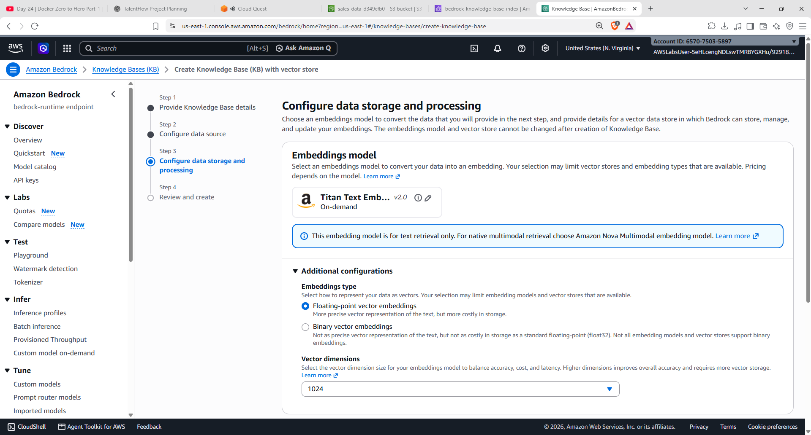

```text
Text
 ↓
Embedding Model
 ↓
Vector
 ↓
Vector Database
```

---

# 15 — 🗄️ Configure the Vector Store

I configured the Knowledge Base to use the existing **Amazon OpenSearch Serverless** vector store.

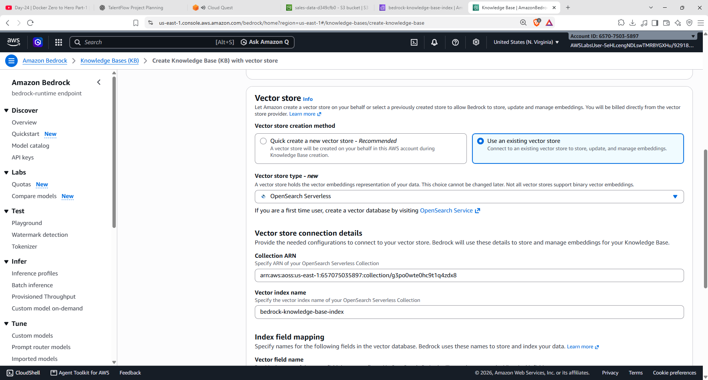

The configuration included the OpenSearch Serverless collection, vector index and vector-store connection details.

---

# 16 — 🧩 Configure Field Mapping

I configured the fields required by the vector store, including the vector field and metadata fields.

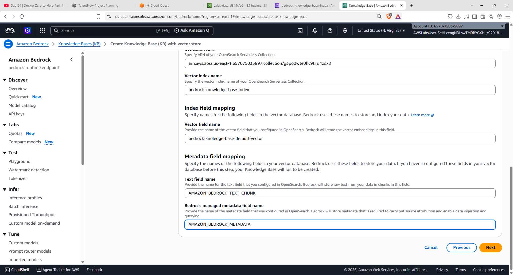

```text
Knowledge Base
      ↓
Vector Field
      ↓
OpenSearch Index

Metadata
      ↓
Metadata Field
      ↓
OpenSearch Index
```

---

# 17 — ⏳ Wait for the Knowledge Base to Become Available

After completing the configuration, I reviewed the Knowledge Base status.

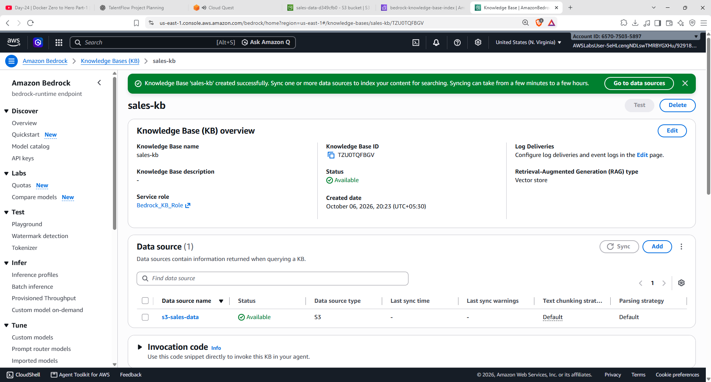

```text
Create
  ↓
Configure
  ↓
Provision
  ↓
Available ✅
```

---

# 18 — 🔄 Add / Sync the Sales Data

The sales data source was added to the Knowledge Base.

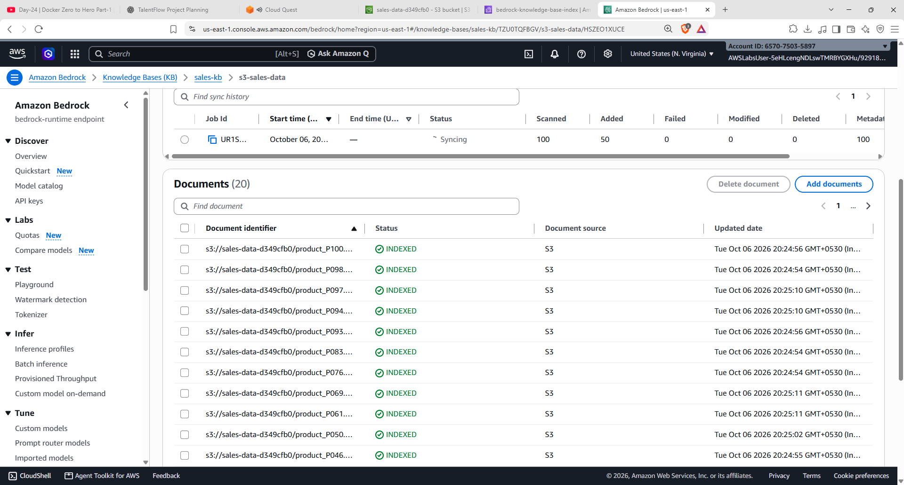

The Knowledge Base can now process the source documents and make their information available for retrieval.

---

# 19 — 🧪 Open the Knowledge Base Test Interface

I opened the Knowledge Base testing interface to test natural-language questions against the connected data.

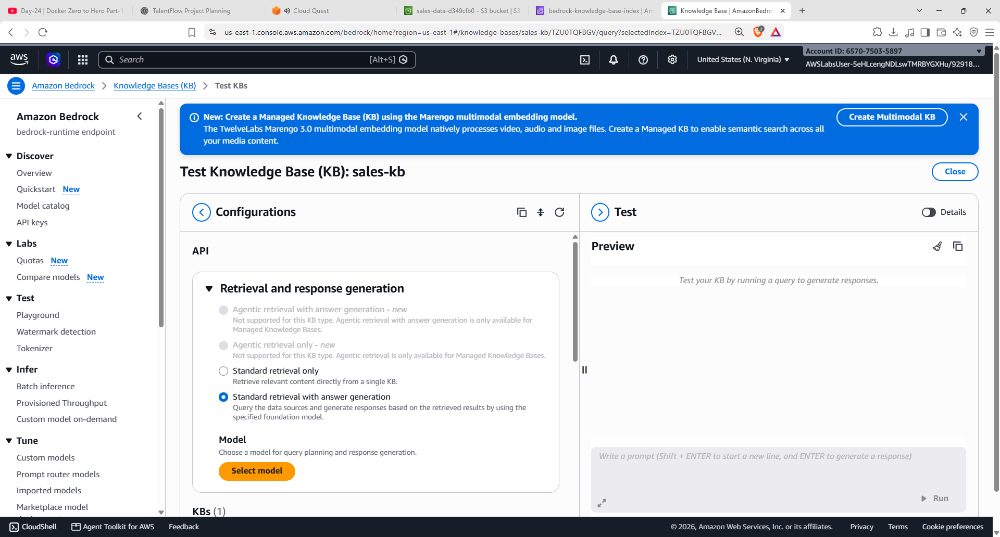

```text
User Question
      ↓
Knowledge Base
      ↓
Retrieve Relevant Chunks
      ↓
Foundation Model
      ↓
Generated Answer
```

---

# 20 — 🤖 Select a Foundation Model

I selected a Foundation Model for the Knowledge Base test. The screenshot shows Amazon Nova model options.

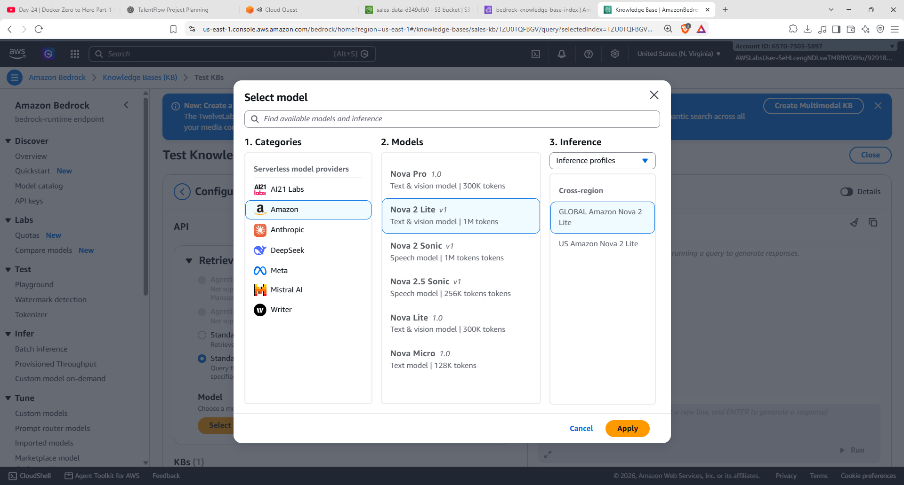

The Foundation Model generates the final natural-language response using information retrieved from the Knowledge Base.

---

# 21 — 🔎 Test Retrieval and Response Generation

I submitted a question related to the sales/product dataset. The Knowledge Base retrieved relevant source chunks and used them to generate an answer.

The test interface also displayed the retrieved source information used for the response.

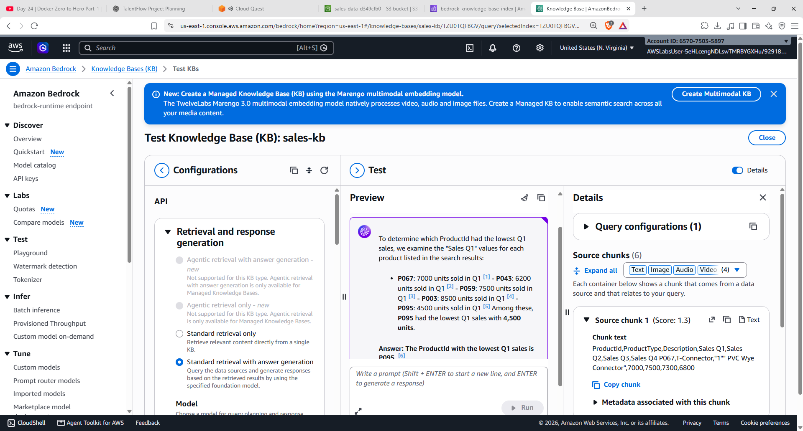

### RAG flow

```text
Question
   ↓
Knowledge Base
   ↓
Vector Search
   ↓
Relevant Chunks
   ↓
Foundation Model
   ↓
Answer
```

---

# 22 — 🧠 Test Complex Queries

The activity also demonstrated how a more complex question can be broken down into smaller queries.

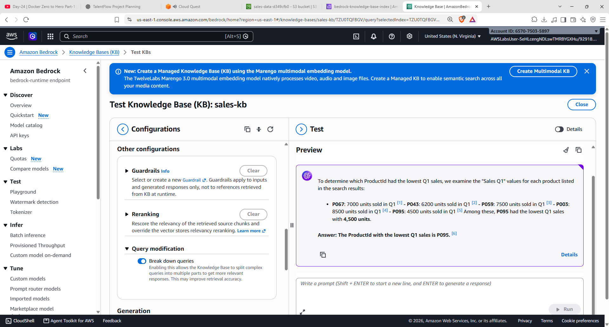

```text
Complex Question
      ↓
Break into smaller queries
      ↓
Retrieve relevant information
      ↓
Combine information
      ↓
Generate final answer
```

---

# 23 — 📊 Review the Response After Query Breakdown

After query breakdown, the Knowledge Base returned information from the relevant source data and generated a response.

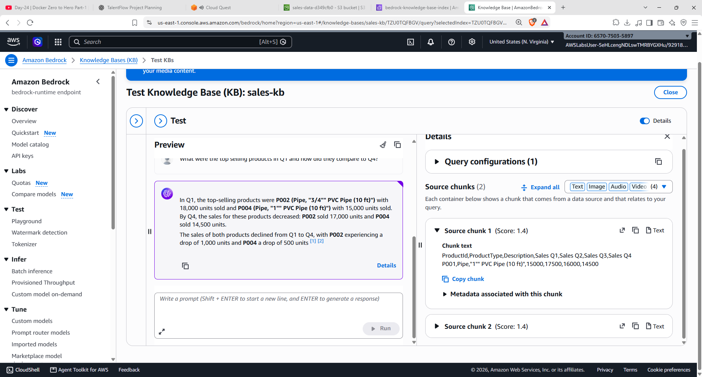

This demonstrates how retrieval can support questions that require combining information from multiple parts of the dataset.

---

# 24 — 🚫 Test Missing Information

I also tested a question where the required information was not available in the Knowledge Base.

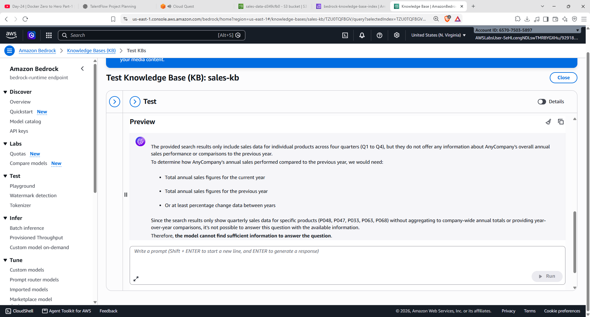

### Important behaviour

```text
User Question
      ↓
Search Knowledge Base
      ↓
Relevant information found?
      │
   ┌──┴──┐
   │     │
  YES    NO
   │     │
   ▼     ▼
Answer  No reliable answer
```

This test demonstrates the importance of having relevant information in the connected knowledge source.

---

# 25 — 🏆 Practice Completed

The final Cloud Quest screen confirmed successful completion of the Practice section.

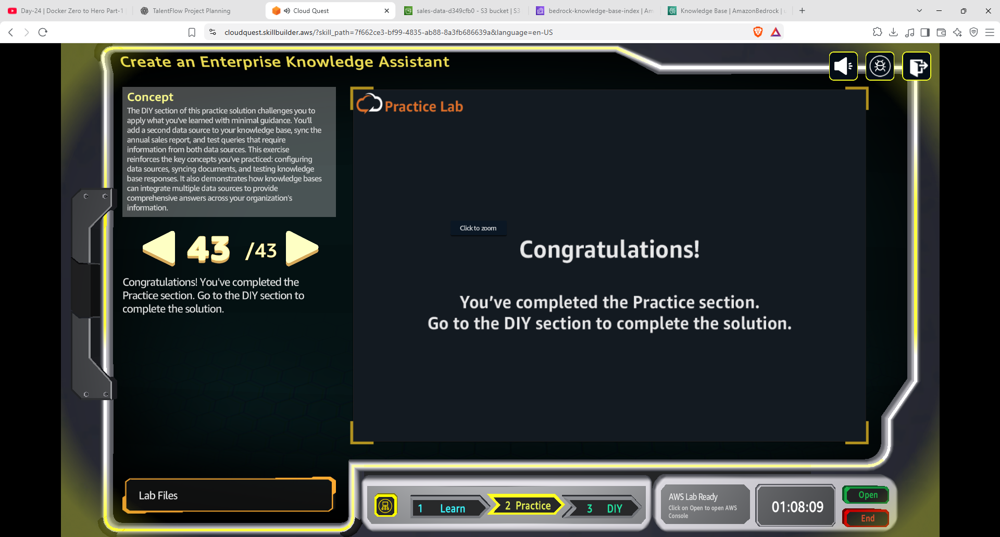

The activity displayed:

> **Congratulations! You've completed the Practice section. Go to the DIY section to complete the solution.**

---

# 🔄 End-to-End RAG Architecture

### Data ingestion path

```text
sales_data.zip
      ↓
Amazon S3
      ↓
Knowledge Base Data Source
      ↓
Document Processing
      ↓
Embedding Model
      ↓
Vector Embeddings
      ↓
OpenSearch Serverless
```

### Query path

```text
User Question
      ↓
Knowledge Base
      ↓
Query Embedding
      ↓
Vector Similarity Search
      ↓
Relevant Chunks
      ↓
Foundation Model
      ↓
Grounded Response
```

---

# 🧠 What I Learned

| Concept | Hands-On Practice |
|---|---|
| 🧠 **Amazon Bedrock Knowledge Bases** | Created and tested a Knowledge Base |
| 🪣 **Amazon S3** | Used S3 as the source for company data |
| 🔢 **Embeddings** | Configured an embedding model |
| 🗄️ **Vector Store** | Used Amazon OpenSearch Serverless |
| 🔎 **Vector Search** | Retrieved relevant information from stored embeddings |
| 📚 **RAG** | Used retrieved company information to ground responses |
| 🤖 **Foundation Models** | Selected a model for response generation |
| 🔐 **IAM Role** | Configured the required Knowledge Base permissions |
| 🔄 **Data Synchronization** | Added and processed the source data |
| 🧪 **Knowledge Base Testing** | Tested questions against the company dataset |
| 🧩 **Query Breakdown** | Tested complex questions using smaller retrieval queries |
| 🚫 **Missing Data Handling** | Tested behaviour when information was unavailable |
| ☁️ **AWS Integration** | Connected S3, Bedrock and OpenSearch Serverless |

---

# 🔑 Key Takeaway

The biggest concept from this practice is the difference between **model knowledge** and **retrieved company knowledge**.

Instead of expecting a Foundation Model to already know private or updated company information:

```text
Company Data
     ↓
Amazon S3
     ↓
Knowledge Base
     ↓
Embeddings
     ↓
Vector Store
     ↓
Retrieve Relevant Data
     ↓
Foundation Model
     ↓
Grounded Answer
```

This is the core idea behind **Retrieval-Augmented Generation (RAG)**.

The practice also demonstrated that the quality of the final answer depends on the quality and availability of the underlying knowledge source.

---

# 🛠️ Skills Practiced

`AWS` `Amazon Bedrock` `Knowledge Bases` `RAG` `Retrieval-Augmented Generation` `Embeddings` `Vector Databases` `Amazon OpenSearch Serverless` `Amazon S3` `Foundation Models` `Amazon Titan Embeddings` `Amazon Nova` `IAM` `Semantic Search` `Cloud Quest` `Generative AI`

---

## 📚 Learning Source

**AWS Cloud Quest — Generative AI Practitioner**

Activity:

**Create an Enterprise Knowledge Assistant**

This README documents my personal hands-on practice and the sequence completed during the Cloud Quest activity.

---

<p align="center">
  <b>📚 Store → Embed → Retrieve → Generate → Grounded Answer 🤖</b>
</p>
