# 🎮 Amazon Bedrock + Amazon EC2 — Generate a Tic-Tac-Toe Webpage | AWS Cloud Quest

<p align="center">
  
  
  
  
</p>

<p align="center">
  <b>AWS Cloud Quest — Generative AI Practitioner</b><br>
  Using Amazon Bedrock to generate a playable Tic-Tac-Toe webpage and deploying it on an Amazon EC2 instance.
</p>

---

## 📌 Overview

This folder documents my **DIY hands-on activity from AWS Cloud Quest — Generative AI Practitioner**.

The objective was to use **Amazon Bedrock** to generate a simple, playable **Tic-Tac-Toe game as an HTML file**, then update the webpage content on an **Amazon EC2 instance** using **AWS Systems Manager Session Manager**.

The Cloud Quest solution diagram shows the integration between Amazon Bedrock, a web application running on Amazon EC2, and AWS Systems Manager Session Manager. fileciteturn21file0L2-L8

### 🎯 Core workflow

```text
Amazon Bedrock
      ↓
Foundation Model
      ↓
Generate Tic-Tac-Toe HTML
      ↓
Amazon EC2
      ↓
Session Manager
      ↓
Update Webpage
      ↓
Test in Browser
      ↓
✅ Cloud Quest Validation
```

---

# 🎯 DIY Objective

The DIY task required me to:

- 🤖 Use **Amazon Bedrock** to generate a Tic-Tac-Toe game in an HTML file.
- 📝 Use a specific prompt to generate the webpage.
- 📏 Set the maximum output tokens to **5120**.
- 📄 Copy the generated code.
- 🖥️ Update the webpage content on the EC2 instance.
- 🔐 Use **AWS Systems Manager Session Manager** to access the instance.
- 💾 Save the updated webpage.
- 🌐 Test the game through the EC2 instance URL.
- ✅ Validate the completed activity in Cloud Quest.

### Prompt used

```text
Generate a playable, basic tic-tac-toe game with table, cells, and borders as an html file without any explanation
```

### Target file

```text
tictactoe.html
```

---

# 🧭 Architecture

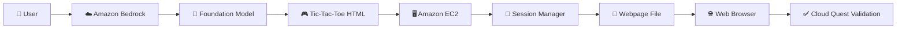

---

# 01 — 🎯 Review the DIY Objective

The Cloud Quest DIY screen describes the goal of generating a **tic-tac-toe game in an HTML file** using Amazon Bedrock and then updating the EC2-hosted webpage through Session Manager.

The solution diagram shows:

```text
User
 │
 ├──────────────► Amazon Bedrock
 │                      │
 │                      ▼
 │                 AI Model
 │
 ▼
Web Application
 │
 ▼
Amazon EC2
 │
 ▼
AWS Systems Manager Session Manager
```

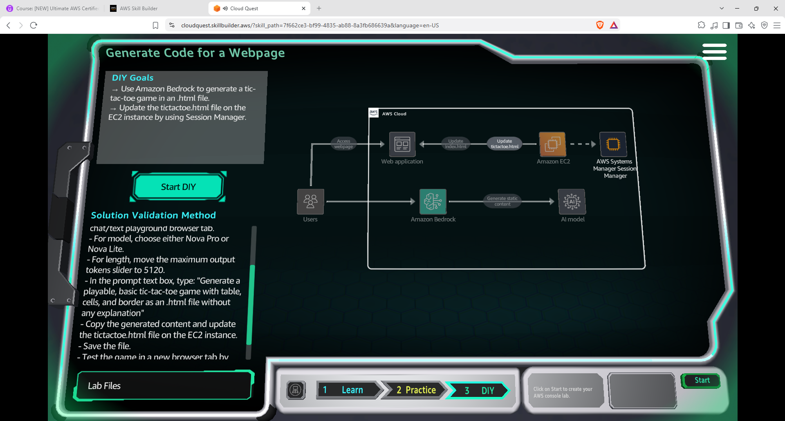

---

# 02 — 🧠 Explore Amazon Bedrock Models

I opened the **Amazon Bedrock Model Catalog** to review the available Foundation Models.

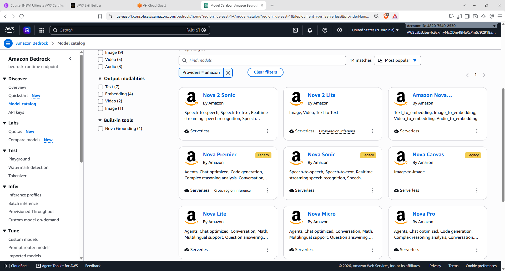

For this activity, the model is used specifically for **code generation**.

```text
Requirement
    ↓
Foundation Model
    ↓
Generated HTML
```

---

# 03 — 🔎 Select a Foundation Model

I opened the model selection interface from the Bedrock Playground.

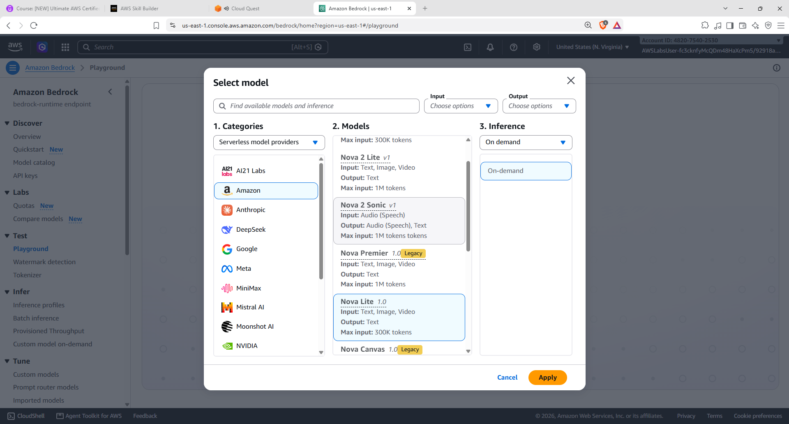

### Model selection workflow

```text
Use Case
   ↓
Choose Model
   ↓
Configure Model
   ↓
Enter Prompt
   ↓
Generate Output
```

---

# 04 — ⚙️ Configure the Playground

The Bedrock Playground was configured for the code-generation task.

The activity specifies a maximum output token setting of:

```text
5120
```

The prompt was entered into the Playground.

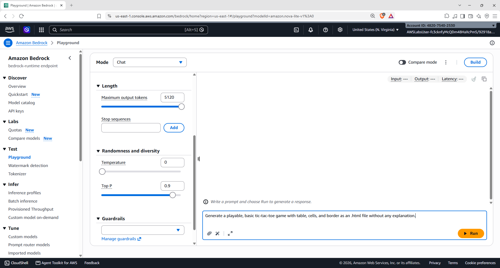

### Prompt

```text
Generate a playable, basic tic-tac-toe game with table, cells, and borders as an html file without any explanation
```

The prompt gives the model a clear target: generate a playable game, use HTML, include table/cells/borders, and return the requested code without additional explanation.

---

# 05 — 🖥️ Open the EC2 Instance

After generating the webpage code with Bedrock, I opened the **Amazon EC2** console.

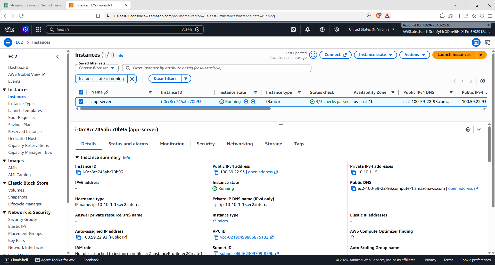

### Role of EC2

```text
Amazon Bedrock
     │
     │ generates code
     ▼
HTML file
     │
     ▼
Amazon EC2
     │
     ▼
Web Application
```

---

# 06 — 🔐 Connect to EC2 Using Session Manager

I opened the EC2 **Connect to instance** page and selected **Session Manager**.

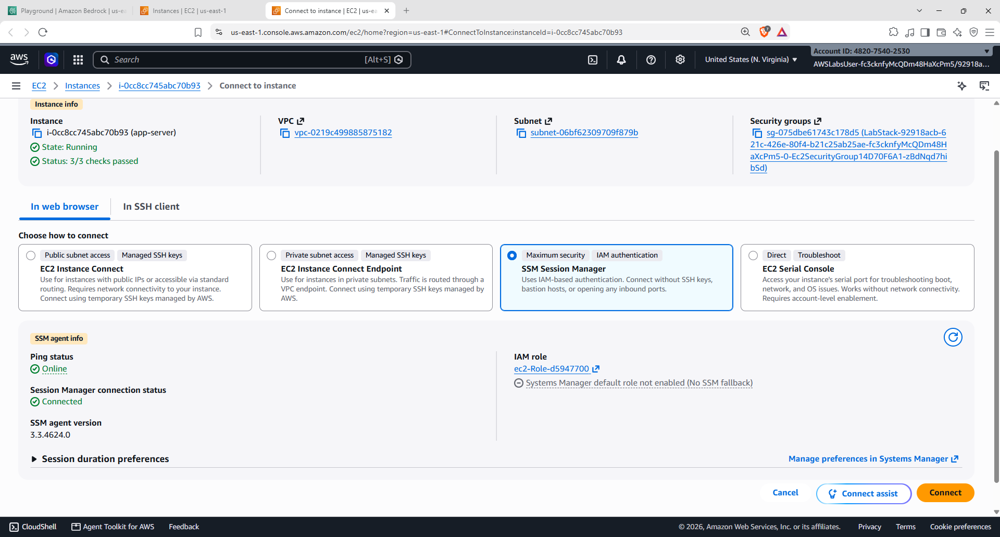

```text
AWS Console
    ↓
EC2 Instance
    ↓
Connect
    ↓
Session Manager
    ↓
EC2 Shell
```

---

# 07 — 📂 Inspect the Web Directory

After connecting to the instance, I inspected the web directory and reviewed the existing files.

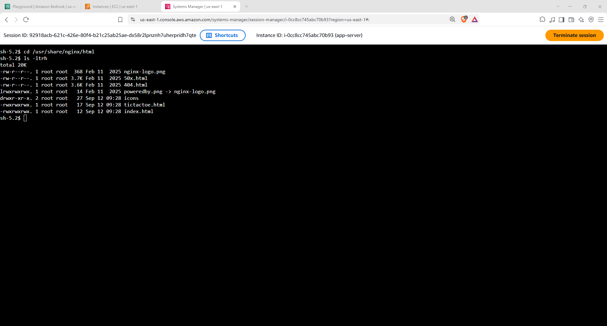

The directory contained the existing webpage content that could be modified for the Cloud Quest task.

---

# 08 — 🌐 Check the Existing Webpage

Before replacing the content, I checked the existing webpage hosted on the EC2 instance.

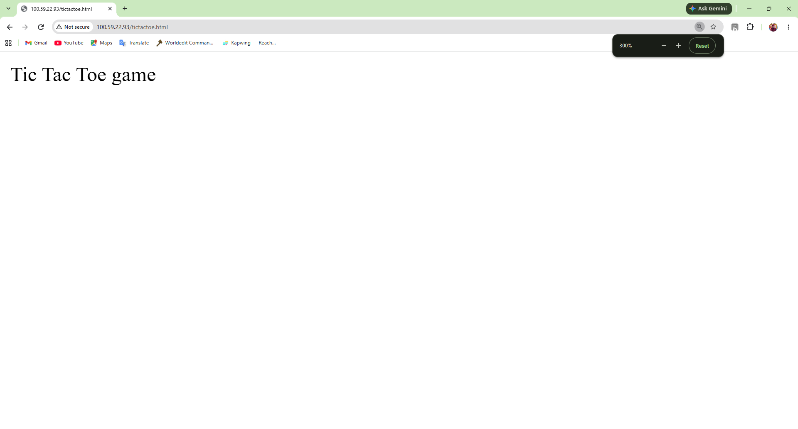

This provided a baseline before applying the Bedrock-generated Tic-Tac-Toe webpage.

---

# 09 — 🔄 Replace the Webpage Content

I replaced the existing webpage content with the HTML generated by Amazon Bedrock.


### Deployment flow

```text
Bedrock Generated HTML
          ↓
       Copy Code
          ↓
   EC2 Session Manager
          ↓
    Update Webpage File
          ↓
        Save File
```

---

# 10 — 🎮 Test the New Tic-Tac-Toe Webpage

After updating the webpage, I opened the EC2-hosted webpage in the browser.

The generated page displayed a **Tic-Tac-Toe game board** containing cells for `X` and `O`.


---

# 11 — 🧩 Overall Architecture

The complete activity can be represented as:

```text
                           👤 User
                             │
                             ▼
                    Amazon Bedrock
                             │
                     Foundation Model
                             │
                             ▼
                  Tic-Tac-Toe HTML Code
                             │
                             ▼
                    Amazon EC2 Instance
                             │
                    ┌────────┴────────┐
                    │                 │
                    ▼                 ▼
              Session Manager     Web Server
                    │                 │
                    ▼                 ▼
              Update HTML        Host Website
                                      │
                                      ▼
                                  🌐 Browser
                                      │
                                      ▼
                              🎮 Tic-Tac-Toe
```

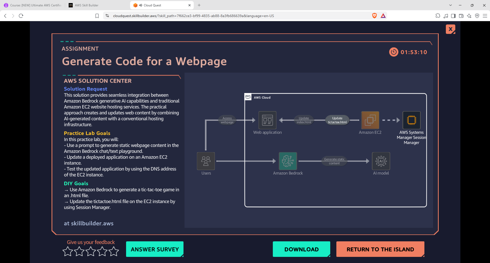

---

# 12 — 🧪 Validate the Generated Webpage

The Cloud Quest validation uses the generated webpage filename:

```text
tictactoe.html
```

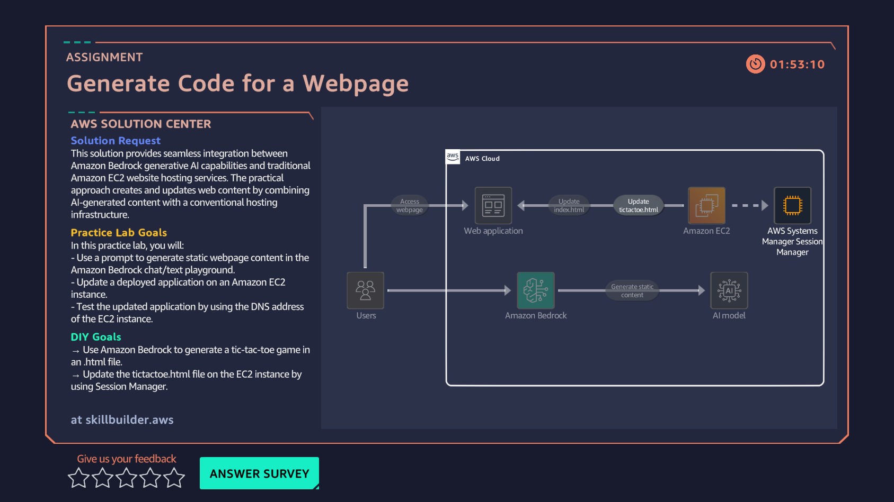

---

# 13 — ✅ Successful Completion

The final Cloud Quest screen confirmed that the webpage had been successfully updated with the Tic-Tac-Toe game content.

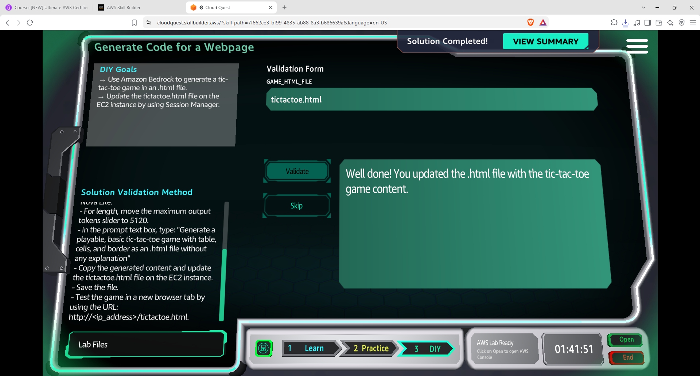

### Final result

```text
Prompt
  ↓
Amazon Bedrock
  ↓
Generated Tic-Tac-Toe HTML
  ↓
EC2 Instance
  ↓
Session Manager
  ↓
Updated Webpage
  ↓
Browser Test
  ↓
✅ Cloud Quest Completed
```

---

# 🧠 What I Learned

| Concept | Hands-On Practice |
|---|---|
| ☁️ **Amazon Bedrock** | Used Bedrock for Generative AI code generation |
| 🧠 **Foundation Models** | Selected a model from the Bedrock Model Catalog |
| ✍️ **Prompt Engineering** | Created a focused code-generation prompt |
| 💻 **AI Code Generation** | Generated a Tic-Tac-Toe webpage in HTML |
| 📏 **Output Token Control** | Configured maximum output tokens |
| 🖥️ **Amazon EC2** | Worked with a running web application |
| 🔐 **Session Manager** | Accessed the EC2 instance through AWS Systems Manager |
| 📂 **Web Files** | Inspected and updated webpage files |
| 🔄 **Application Update** | Replaced the existing webpage content |
| 🌐 **Web Testing** | Tested the generated webpage from the EC2-hosted application |
| 🎮 **Generative AI Application** | Turned a natural-language requirement into a working webpage |

---

# 🔑 Key Takeaway

This activity demonstrated how Generative AI can be integrated into a practical cloud-development workflow:

```text
Requirement
    ↓
Prompt
    ↓
Foundation Model
    ↓
Generated Code
    ↓
Cloud Compute
    ↓
Web Application
    ↓
User-Facing Result
```

The important part was not only generating HTML with Amazon Bedrock, but also taking the generated output and using it within an **EC2-hosted application**.

---

# 🛠️ Skills Practiced

`AWS` `Amazon Bedrock` `Foundation Models` `Generative AI` `Prompt Engineering` `AI Code Generation` `Amazon EC2` `AWS Systems Manager` `Session Manager` `HTML` `Web Hosting` `Cloud Computing` `AWS Cloud Quest`

---

## 📚 Learning Source

**AWS Cloud Quest — Generative AI Practitioner**

This README documents my personal DIY implementation and the steps completed during the Cloud Quest activity.

---

<p align="center">
  <b>🤖 Prompt → Generate → Deploy → Test → Validate 🎮</b>
</p>
