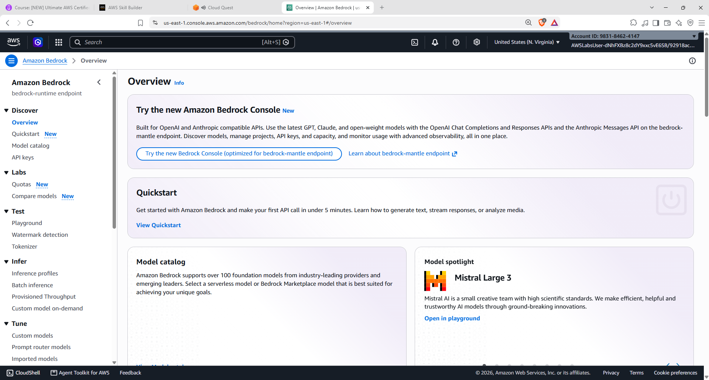
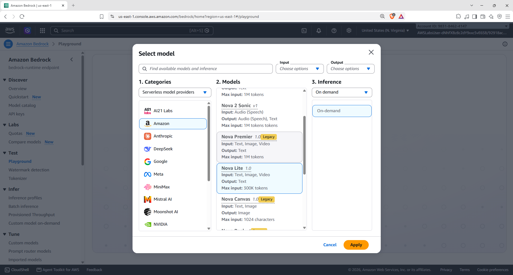
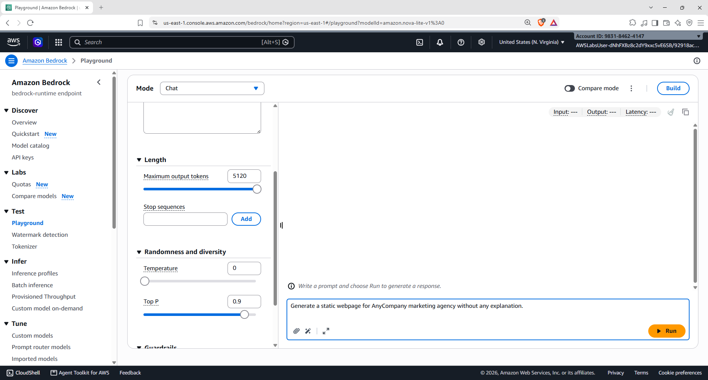
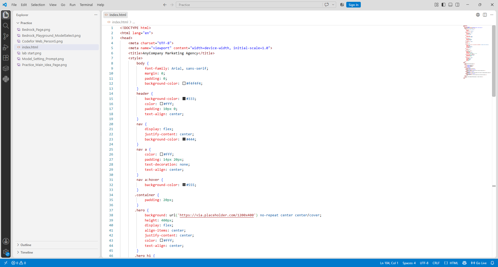
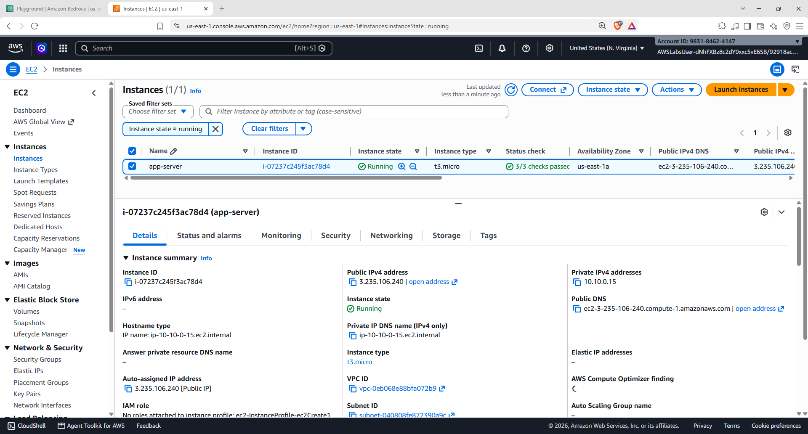
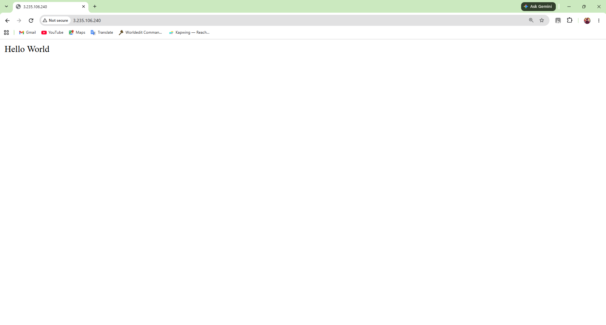
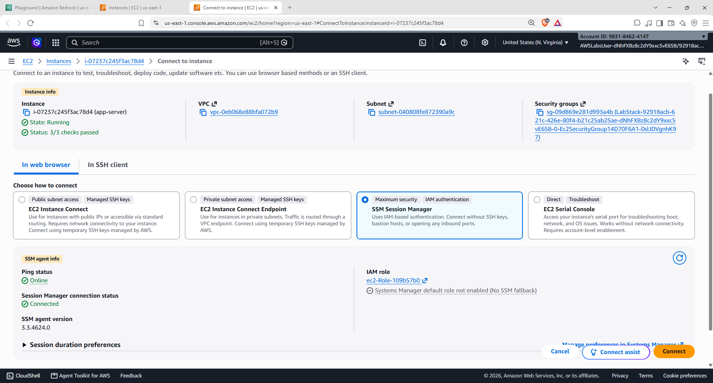
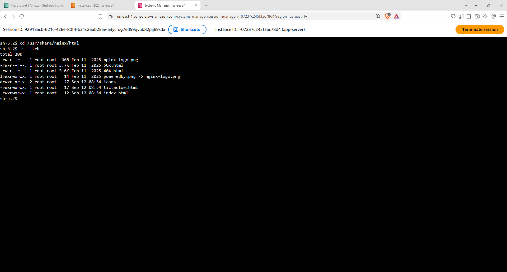
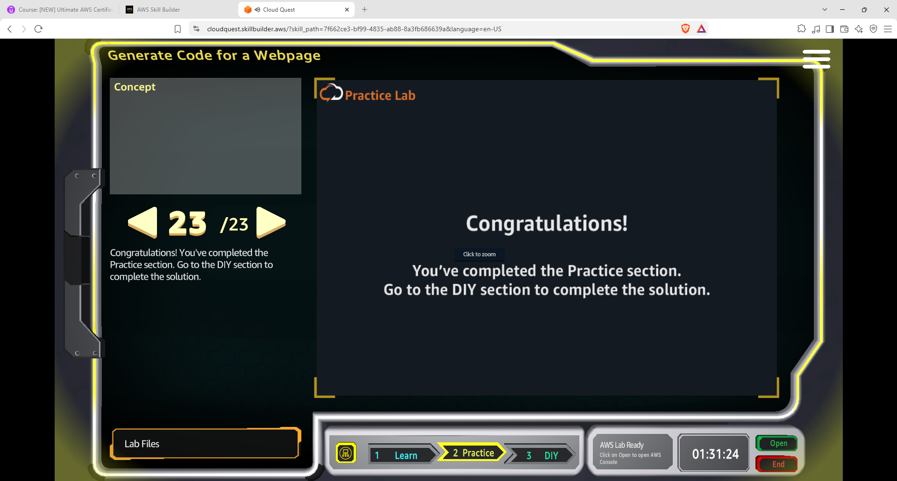

# 🤖 Amazon Bedrock + Amazon EC2 — Generate Code for a Webpage | AWS Cloud Quest

<p align="center">
  
  
  
  
</p>

<p align="center">
  <b>AWS Cloud Quest — Generative AI Practitioner</b><br>
  Using Amazon Bedrock to generate webpage code and deploying the generated content on an Amazon EC2 instance.
</p>

---

## 📌 Overview

This folder documents my **hands-on practice from AWS Cloud Quest — Generative AI Practitioner** focused on using **Amazon Bedrock to generate code for a webpage** and then using an **Amazon EC2 instance** to host and test the generated webpage.

The activity combines:

```text
Amazon Bedrock
      ↓
Generative AI / Code Generation
      ↓
HTML / CSS
      ↓
Amazon EC2
      ↓
Web Server
      ↓
Browser
```

---

# 🎯 Practice Objectives

The practice activity focused on:

- 🤖 Using **Amazon Bedrock** to generate webpage code
- 🧠 Selecting a Foundation Model from the Bedrock Playground
- ✍️ Writing a prompt for webpage generation
- 📄 Reviewing generated HTML/CSS
- 🖥️ Working with an Amazon EC2 instance
- 🔐 Connecting to the EC2 instance using **AWS Systems Manager Session Manager**
- 📂 Reviewing files on the EC2 instance
- 🔄 Replacing the existing webpage content with the Bedrock-generated code
- 🌐 Testing the updated webpage through the EC2 instance's public DNS
- ✅ Completing the Cloud Quest practice activity

---

# 🧭 Practice Flow

```mermaid
flowchart LR
    A[🎯 Cloud Quest Practice] --> B[☁️ Amazon Bedrock]
    B --> C[🧠 Select Foundation Model]
    C --> D[✍️ Write Webpage Prompt]
    D --> E[🤖 Generate HTML/CSS]
    E --> F[🖥️ Amazon EC2]
    F --> G[🔐 Session Manager]
    G --> H[📂 Locate Website Files]
    H --> I[🔄 Replace Existing Content]
    I --> J[🌐 Open EC2 Public DNS]
    J --> K[✅ Verify Generated Webpage]
```



---

# 01 — 🎯 Understand the Practice Task

The Cloud Quest scenario introduces a task to **generate code for a webpage** using Generative AI.

The practice workflow is:

1. Use Amazon Bedrock to generate webpage code.
2. Update the deployed application running on an Amazon EC2 instance.
3. Test the updated application through the EC2 instance's DNS address.


---

# 02 — 🧪 Open the Practice Lab

The Cloud Quest practice section is titled **Generate Code for a Webpage**.

The activity connects a web application running on Amazon EC2 with Amazon Bedrock and a Foundation Model.


The practice lab then provides the guided sequence of steps for completing the task.


---

# 03 — ☁️ Open Amazon Bedrock

I opened the **Amazon Bedrock** console.

The Bedrock console provides access to Foundation Models and playgrounds where prompts can be tested.



### 💡 Key concept

In this activity, Amazon Bedrock is used for **Generative AI-based code generation**.

```text
Natural Language Requirement
          ↓
    Amazon Bedrock
          ↓
    Foundation Model
          ↓
     HTML / CSS
```

---

# 04 — 🧠 Select a Foundation Model

Inside the Bedrock Playground, I opened the model selection interface.

The model selection screen provides model providers and available models that can be used for the task.



### Model selection workflow

```text
Use Case
   ↓
Select Foundation Model
   ↓
Provide Prompt
   ↓
Generate Output
```

---

# 05 — ✍️ Configure the Prompt

I configured the Playground and entered a prompt requesting code for a static webpage.

The prompt was used to instruct the model to generate a webpage for the required use case.



This demonstrates how a natural-language requirement can be converted into application code using a Generative AI model.

---

# 06 — 📄 Review the Generated Code

The generated output was reviewed as webpage code.

The supplied HTML file contains:

- HTML document structure
- Responsive viewport configuration
- Header
- Navigation
- Hero section
- Services section
- About section
- Contact section
- Footer
- CSS styling

The webpage title is:

```text
AnyCompany Marketing Agency
```

and the navigation contains:

```text
Services
About
Contact
```

The provided HTML source also defines the hero text **“Your Success, Our Mission”**, along with the Services, About Us and Contact Us sections. 



---

# 07 — 🧩 Understand the Generated Webpage

The generated webpage follows this structure:

```text
AnyCompany Marketing Agency
│
├── Navigation
│   ├── Services
│   ├── About
│   └── Contact
│
├── Hero
│   └── Your Success, Our Mission
│
├── Services
│
├── About Us
│
├── Contact Us
│
└── Footer
```

The HTML source defines the header, navigation, hero section, Services, About and Contact sections, followed by the footer. 

---

# 08 — 🖥️ Open Amazon EC2

After generating the webpage code, I moved to the **Amazon EC2** console.

The EC2 console showed the running instance used by the practice environment.



### 💡 Why EC2?

In this practice, EC2 provides the compute environment where the existing web application is running.

The generated webpage code is then used to update the application running on the instance.

---

# 09 — 🌐 Check the Existing Webpage

I opened the EC2 instance's public address to check the existing webpage.

The initial page displayed:

```text
Hello World
```



This provides a baseline before replacing the existing webpage content.

---

# 10 — 🔐 Connect Using Systems Manager Session Manager

I opened the **Connect to instance** workflow and selected **Session Manager**.



### 💡 Why Session Manager?

AWS Systems Manager Session Manager provides a way to access the EC2 instance through the AWS console without requiring a traditional SSH connection.

For this practice, Session Manager was used to access the instance's command-line environment.

---

# 11 — 💻 Inspect the Web Directory

After connecting through Session Manager, I inspected the files on the EC2 instance.

The directory contained the existing website files, including:

```text
index.html
```

along with other website assets.



### Workflow

```text
Session Manager
      ↓
EC2 Shell
      ↓
Navigate to Web Directory
      ↓
List Website Files
      ↓
Locate index.html
```

---

# 12 — 🔄 Replace the Existing Webpage Content

The existing `index.html` content was replaced with the webpage code generated using Amazon Bedrock.


### Before

```text
Hello World
```

### After

```text
AnyCompany Marketing Agency
        +
Services
        +
About
        +
Contact
```

### Integration point

```text
Amazon Bedrock
      │
      ▼
Generated HTML/CSS
      │
      ▼
EC2 Web Directory
      │
      ▼
index.html
      │
      ▼
Web Server
```

---

# 13 — 🤖 Review the Bedrock-Generated Webpage

After replacing the original webpage content, the generated HTML was available on the EC2-hosted application.


---

# 14 — 🌐 Verify the Final Webpage

I opened the EC2 instance's public DNS address again after replacing the webpage content.

The browser now displayed the generated **AnyCompany Marketing Agency** webpage instead of the original Hello World page.

The webpage includes:

```text
AnyCompany Marketing Agency

Services    About    Contact

Your Success, Our Mission

Our Services
About Us
Contact Us

© 2023 AnyCompany Marketing Agency
```



---

# 🧩 End-to-End Architecture

```text
                         👤 User
                           │
                           ▼
                  Amazon Bedrock
                           │
                    Foundation Model
                           │
                           ▼
                   Generated HTML/CSS
                           │
                           ▼
                    Amazon EC2 Instance
                           │
                    ┌──────┴──────┐
                    │             │
                    ▼             ▼
              Session Manager   Web Server
                    │             │
                    ▼             ▼
               index.html    Public DNS
                                  │
                                  ▼
                              🌐 Browser
                                  │
                                  ▼
                     AnyCompany Marketing
                            Agency
```

---

# 🧠 What I Learned

| Concept | Hands-On Practice |
|---|---|
| ☁️ **Amazon Bedrock** | Used Bedrock for Generative AI code generation |
| 🧠 **Foundation Models** | Selected a model for webpage generation |
| ✍️ **Prompt Engineering** | Converted a webpage requirement into a model prompt |
| 💻 **Code Generation** | Generated HTML/CSS using a Foundation Model |
| 🖥️ **Amazon EC2** | Worked with a running web application |
| 🔐 **Systems Manager Session Manager** | Connected to the EC2 instance |
| 📂 **Web Directory** | Inspected website files on the EC2 instance |
| 🔄 **Application Update** | Replaced the existing `index.html` |
| 🌐 **Web Hosting** | Verified the generated webpage through EC2 |
| 🤖 **GenAI + Cloud Integration** | Connected AI-generated code with a cloud-hosted application |

---

# 🔑 Key Takeaway

This practice demonstrated a simple but practical Generative AI workflow:

```text
Describe What You Want
        ↓
Ask a Foundation Model
        ↓
Generate Application Code
        ↓
Update the Application
        ↓
Test the Result
```

Amazon Bedrock was used as the Generative AI layer, while Amazon EC2 provided the environment where the generated webpage was deployed and tested.

---

# 🛠️ Skills Practiced

`AWS` `Amazon Bedrock` `Foundation Models` `Generative AI` `Prompt Engineering` `Code Generation` `Amazon EC2` `AWS Systems Manager` `Session Manager` `Linux` `HTML` `CSS` `Web Hosting` `Cloud Computing` `AWS Cloud Quest`

---

## 📚 Learning Source

**AWS Cloud Quest — Generative AI Practitioner**

This README documents my personal hands-on practice and the steps completed during the Cloud Quest activity.

---

<p align="center">
  <b>☁️ Prompt → Generate → Deploy → Test → Learn</b>
</p>
