# 🛡️ Amazon Bedrock Guardrails — Secure Conversational AI | AWS Cloud Quest

<p align="center">
  
  
  
  
</p>

<p align="center">
  <b>AWS Cloud Quest — Generative AI Practitioner</b><br>
  Creating, configuring, testing and validating an Amazon Bedrock Guardrail for a financial-advice use case.
</p>

---

## 📌 Overview

This folder documents my **DIY hands-on activity from AWS Cloud Quest — Generative AI Practitioner** focused on **Amazon Bedrock Guardrails**.

The Cloud Quest assignment is **Secure Conversational AI with Guardrails**. The DIY objective was to create a new guardrail that blocks **financial investment advice**, test the guardrail, create a version, and validate that the configured policy works correctly.

The Cloud Quest solution diagram shows a conversational AI flow where the user prompt passes through an Amazon Bedrock Guardrail before the final response is returned. The guardrail includes controls such as **Denied Topics, Content Filters, PII Redaction and Word Filters**. fileciteturn23file0L2-L11

---

# 🎯 DIY Objectives

The activity required me to:

- 🛡️ Create a new Amazon Bedrock Guardrail
- 🚫 Configure a denied topic for financial investment advice
- 🧪 Test the guardrail using a Foundation Model
- 🔎 Verify that the restricted request is blocked
- 📦 Create a guardrail version
- ✅ Validate the guardrail through Cloud Quest

### Target behaviour

```text
User asks for financial investment advice
                ↓
        Amazon Bedrock
                ↓
        🛡️ Guardrail
                ↓
      Denied Topic Detection
                ↓
             BLOCK 🚫
                ↓
       Safe / Blocked Response
```

---

# 🧭 End-to-End Workflow

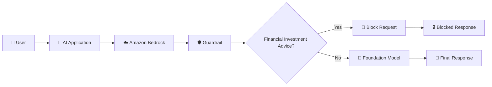

---

# 01 — 🎯 Review the DIY Objective

The Cloud Quest DIY introduction defines two main goals:

```text
DIY Goals
│
├── Create a new guardrail to block financial investment advice
└── Test the new guardrail
```

The solution architecture shows a user request passing through a Foundation Model and Amazon Bedrock Guardrails, with safety controls including denied topics, content filters, PII redaction and word filters.

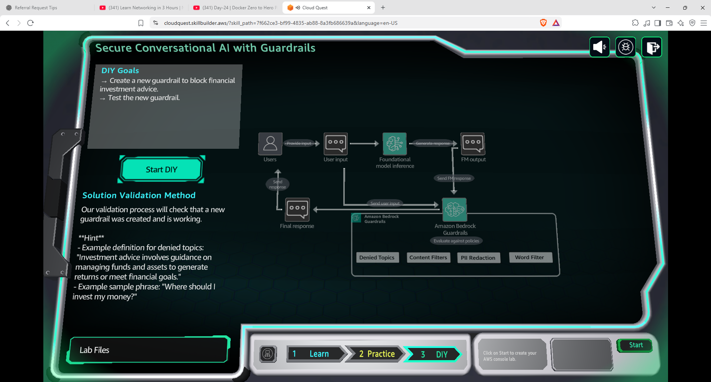

---

# 02 — ☁️ Open Amazon Bedrock Guardrails

I opened the **Amazon Bedrock Guardrails** section in the AWS Console.

The Guardrails page provides options to:

- Create a guardrail
- Test a guardrail
- Deploy a guardrail

At the beginning of the activity, there were no existing guardrails in the environment.

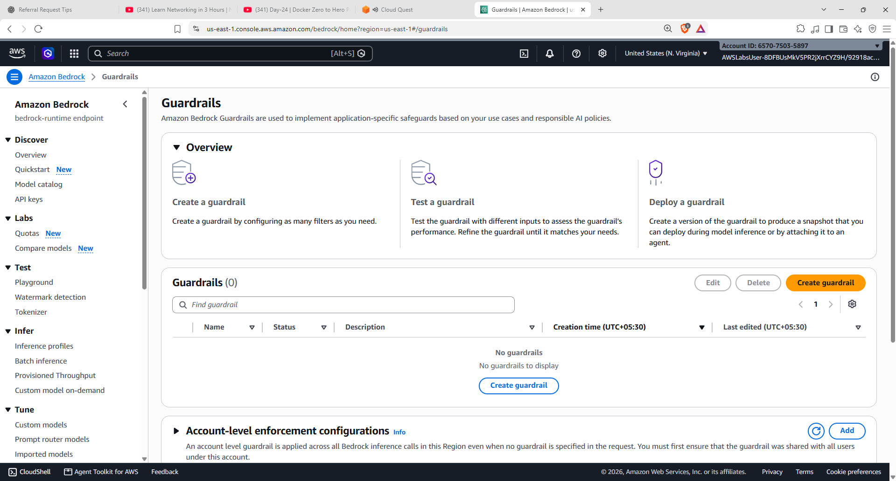

---

# 03 — 🛡️ Create the Guardrail

I started the **Create Guardrail** workflow and provided the required guardrail details.

The guardrail was named:

```text
fin-guardrails
```

The create workflow also provides configuration areas for the guardrail description and blocked-response message.


---

# 04 — ⚙️ Configure Harmful Content Filters

I configured the harmful-content filters provided by Amazon Bedrock Guardrails.

The interface allows harmful categories to be enabled and controlled for prompts and responses.

The configured categories include:

- Hate
- Insults
- Sexual
- Violence

The filters were configured with **Block** actions.

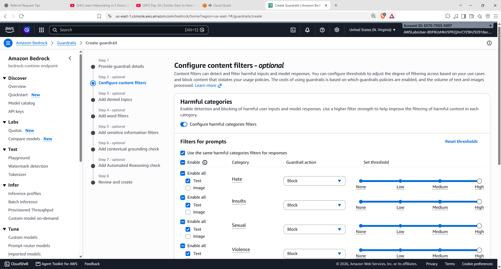

### Concept

```text
User Prompt
    ↓
Content Filter
    ↓
Category Detection
    ↓
Configured Threshold
    ↓
Allow / Block
```

---

# 05 — 🚫 Add the Denied Topic

The main requirement of this DIY activity was to prevent the AI assistant from providing **financial investment advice**.

I added the denied topic:

```text
Financial investment advice
```

The topic was defined around investment advice involving managing funds and assets to generate returns or meet financial goals.

The input action was configured as:

```text
Block
```

and the output action was also configured as:

```text
Block
```

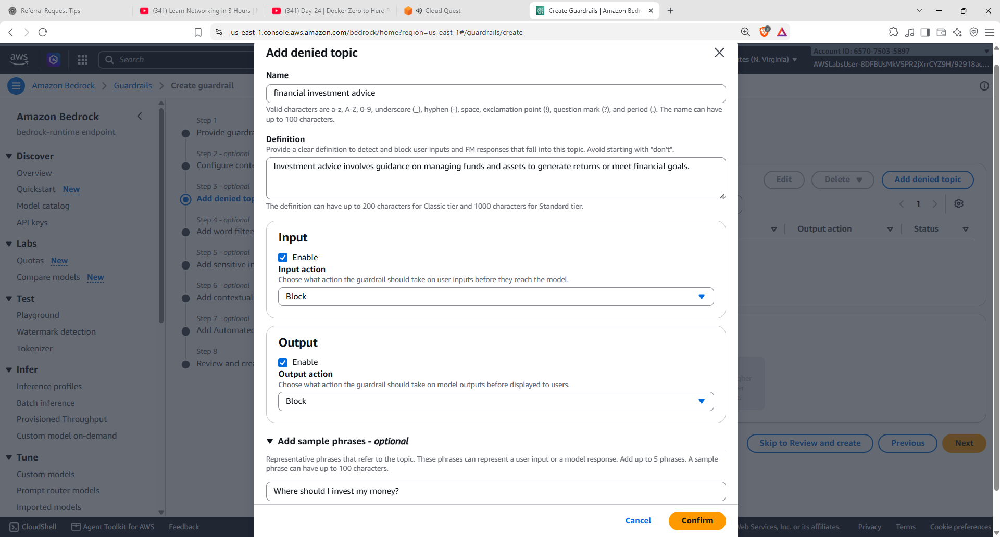

### Denied Topic Flow

```text
User Request
      ↓
Topic Classification
      ↓
Financial Investment Advice?
      ↓
     YES
      ↓
    BLOCK 🚫
```

---

# 06 — 🔎 Review the Denied Topic

After adding the denied topic, the guardrail configuration displayed the configured topic and actions.

```text
Topic:
Financial investment advice

Input Action:
Block

Output Action:
Block
```

The configuration also showed the Word Filters section, with no words or phrases added for this activity.


---

# 07 — 📝 Review and Create

After configuring the guardrail details, harmful-content filters and denied topic, I reviewed the configuration before creating the guardrail.

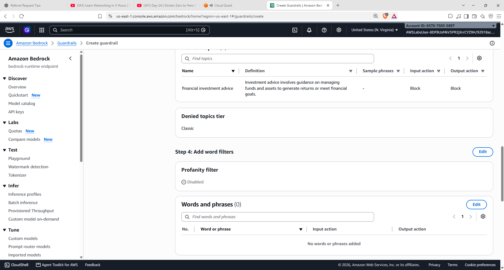

### Configuration flow

```text
Guardrail Details
       +
Content Filters
       +
Denied Topic
       ↓
Final Review
       ↓
Create Guardrail
```

---

# 08 — 🧪 Select a Model for Testing

After creating the guardrail, I opened the testing interface.

A Foundation Model was selected for testing the guardrail. The screenshot shows **Amazon Nova 2 Lite** selected for the test.

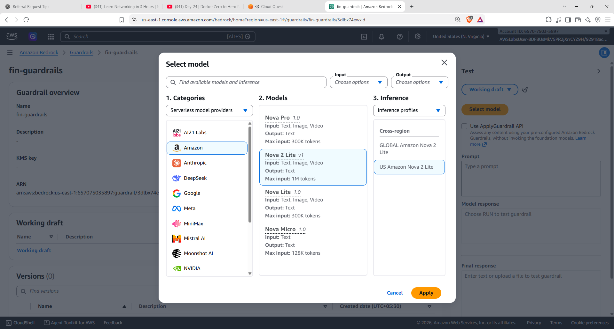

### Test workflow

```text
Select Guardrail
       ↓
Select Foundation Model
       ↓
Enter Prompt
       ↓
Run Test
       ↓
Review Guardrail Action
```

---

# 09 — 🚫 Test the Guardrail

I tested the guardrail using a prompt requesting financial investment advice.

The test demonstrated that the request was detected as the configured denied topic and blocked.

```text
Financial Investment Advice
            ↓
          Detected
            ↓
          Blocked 🚫
```

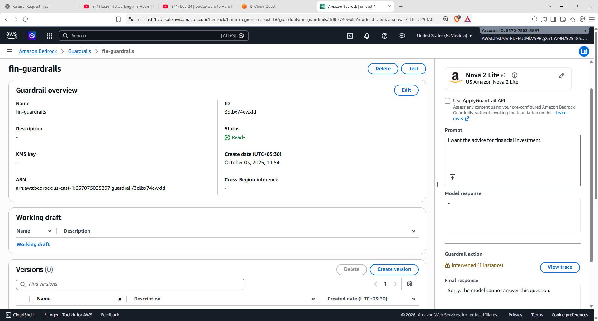

The guardrail prevented the restricted request from proceeding normally and returned the configured blocked response.

---

# 10 — 📦 Create a Guardrail Version

After testing the configuration, I created a version of the guardrail.

The versioned configuration represents the tested guardrail policy.

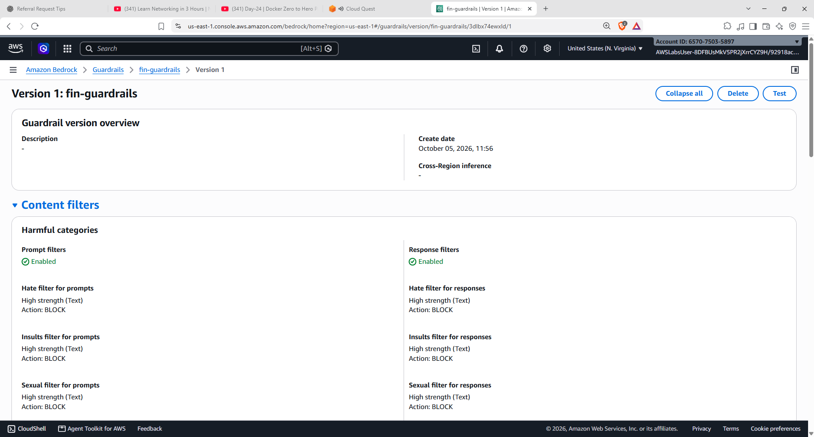

### Versioning workflow

```text
Working Draft
      ↓
Configure
      ↓
Test
      ↓
Validate
      ↓
Create Version
      ↓
Version 1
```

---

# 11 — 🧩 Overall Architecture

```text
                         👤 User
                           │
                           ▼
                    💬 AI Application
                           │
                           ▼
                    ☁️ Amazon Bedrock
                           │
                           ▼
                    🛡️ Guardrail
                           │
        ┌──────────────────┼──────────────────┐
        ▼                  ▼                  ▼
  Content Filters    Denied Topics      Other Controls
        │                  │
        │                  ▼
        │          Financial Investment
        │               Advice
        │                  │
        │                  ▼
        │               BLOCK 🚫
        │
        └──────────────────┬─────────────────┘
                           ▼
                    Allowed Request
                           │
                           ▼
                  🧠 Foundation Model
                           │
                           ▼
                     💬 Response
```

---

# 12 — 🧪 Validate the DIY

After creating and testing the guardrail, I returned to the Cloud Quest DIY validation screen.

The validation form required the **Guardrail ID**.

The validation result confirmed:

```text
Success!
Your guardrail exists and is properly configured
to block investment advice.
```

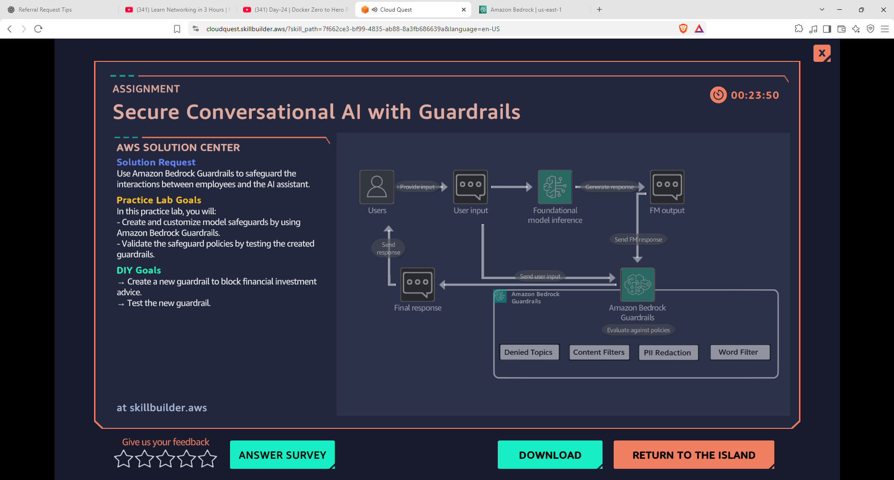

---

# 13 — 🏆 Successful Completion

The final Cloud Quest screen confirmed successful completion of the DIY activity.

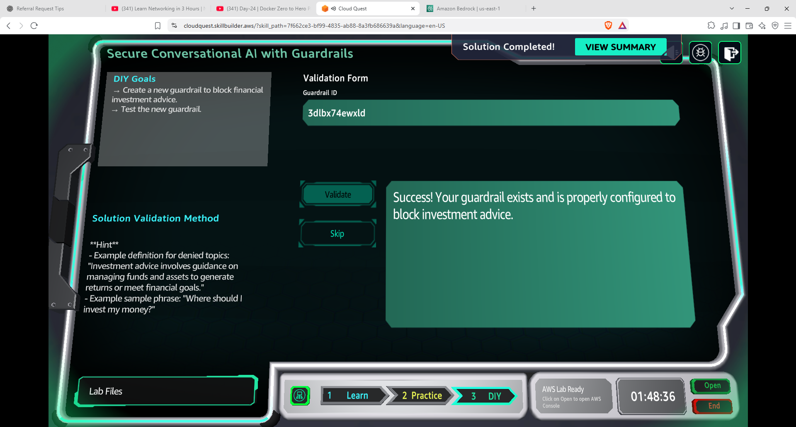

### Final workflow

```text
Create Guardrail
      ↓
Configure Safety Controls
      ↓
Add Financial Investment Advice
      ↓
Set Input / Output → Block
      ↓
Select Foundation Model
      ↓
Test Guardrail
      ↓
Request Detected
      ↓
Response Blocked 🚫
      ↓
Create Version
      ↓
Cloud Quest Validation
      ↓
✅ SUCCESS
```

---

# 🧠 What I Learned

| Concept | Hands-On Practice |
|---|---|
| 🛡️ **Amazon Bedrock Guardrails** | Created a guardrail for a conversational AI use case |
| 🚫 **Denied Topics** | Added financial investment advice as a denied topic |
| 🔒 **Input Blocking** | Configured blocked behaviour for incoming requests |
| 🔒 **Output Blocking** | Configured blocked behaviour for model output |
| ⚙️ **Content Filters** | Configured harmful-content categories |
| 🧪 **Guardrail Testing** | Tested the guardrail with Amazon Nova 2 Lite |
| 🚫 **Blocked Response** | Verified that the restricted request was blocked |
| 📦 **Guardrail Versioning** | Created a guardrail version |
| ✅ **Cloud Quest Validation** | Validated the Guardrail ID and policy configuration |
| 🤖 **Responsible AI** | Practiced applying policy controls around a GenAI application |

---

# 🔑 Key Takeaway

A Foundation Model may be capable of answering many types of questions, but an enterprise AI application may need **business-specific policies and safety controls** around it.

This activity demonstrated:

```text
Foundation Model
       +
Guardrail
       ↓
Controlled AI Application
```

For this use case:

```text
Employee / User Question
       ↓
Amazon Bedrock Guardrail
       ↓
Is it financial investment advice?
       │
   ┌───┴───┐
   │       │
  YES      NO
   │       │
   ▼       ▼
BLOCK    Model
 🚫     Response
```

The main practical takeaway is that **Amazon Bedrock Guardrails can be configured to enforce application-specific safety and policy requirements around a Generative AI interaction**.

---

# 🛠️ Skills Practiced

`AWS` `Amazon Bedrock` `Amazon Bedrock Guardrails` `Generative AI` `Responsible AI` `AI Safety` `Content Filters` `Denied Topics` `Foundation Models` `Amazon Nova 2 Lite` `Guardrail Testing` `Guardrail Versioning` `AWS Cloud Quest` `Cloud Computing`

---

## 📚 Learning Source

**AWS Cloud Quest — Generative AI Practitioner**

Activity:

**Secure Conversational AI with Guardrails**

This README documents my personal DIY implementation and the sequence completed during the Cloud Quest activity.

---

<p align="center">
  <b>🛡️ Configure → Test → Block → Version → Validate 🤖</b>
</p>
