# 🛡️ Amazon Bedrock Guardrails — Secure Conversational AI | AWS Cloud Quest

<p align="center">
  
  
  
  
</p>

<p align="center">
  <b>AWS Cloud Quest — Generative AI Practitioner</b><br>
  Creating, configuring, testing and versioning an Amazon Bedrock Guardrail for a conversational AI application.
</p>

---

## 📌 Overview

This folder documents my **hands-on practice from AWS Cloud Quest — Generative AI Practitioner** focused on **Amazon Bedrock Guardrails**.

The activity is based on the Cloud Quest assignment **“Secure Conversational AI with Guardrails”**. The objective is to create and customize guardrails, configure safety policies, test the guardrail against different inputs, and create a version of the guardrail.

The Cloud Quest practice flow demonstrates creating a guardrail, configuring content filters and denied topics, testing it with a Foundation Model, reviewing blocked results, and creating a guardrail version. The final Cloud Quest screen confirms completion of the Practice section. fileciteturn22file0L2-L15

---

# 🎯 Practice Objectives

The activity focused on:

- 🛡️ Creating an **Amazon Bedrock Guardrail**
- ⚙️ Configuring harmful-content filters
- 🚫 Adding a denied topic
- 📝 Providing a guardrail description and blocked-response message
- 🧪 Testing the guardrail with a Foundation Model
- 🔎 Reviewing why a response was blocked
- 🔐 Reviewing profanity and PII-related controls
- 📦 Creating a version of the guardrail
- ✅ Completing the Cloud Quest Practice section

### Core idea

```text
User Prompt
     ↓
Amazon Bedrock
     ↓
Guardrail
     ↓
Safety Policies
     ↓
┌─────────────────────┐
│ Allowed?            │
│                     │
│ YES → Model Response│
│ NO  → Blocked       │
└─────────────────────┘
```

---

# 🧭 Guardrail Workflow

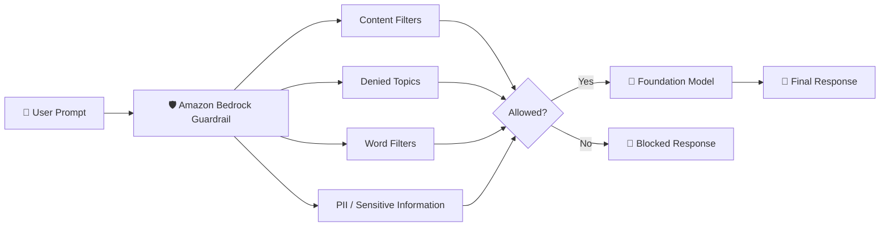

---

# 01 — 🎯 Review the Assignment

The Cloud Quest assignment is titled:

> **Secure Conversational AI with Guardrails**

The scenario describes an **AnyCompany HR department** that wants a chat-based AI assistant to answer employee questions.

The assistant is expected to provide:

- Professional responses
- Policy-compliant responses
- Protection for confidential personnel matters
- Employee data privacy
- Consistent benefits and policy responses

The learning objectives shown in the assignment are to create and customize safe guards using **Amazon Bedrock Guardrails** and test/validate the guardrail policies.

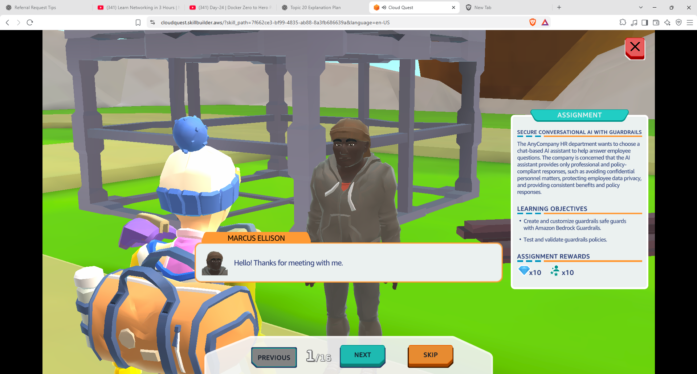

---

# 02 — 🧪 Start the Practice Lab

The Cloud Quest Practice section introduces the activity as **Secure Conversational AI with Guardrails**.

The practice environment explains that the activity involves creating and customizing model safeguards using Amazon Bedrock Guardrails and validating the configured safeguards.

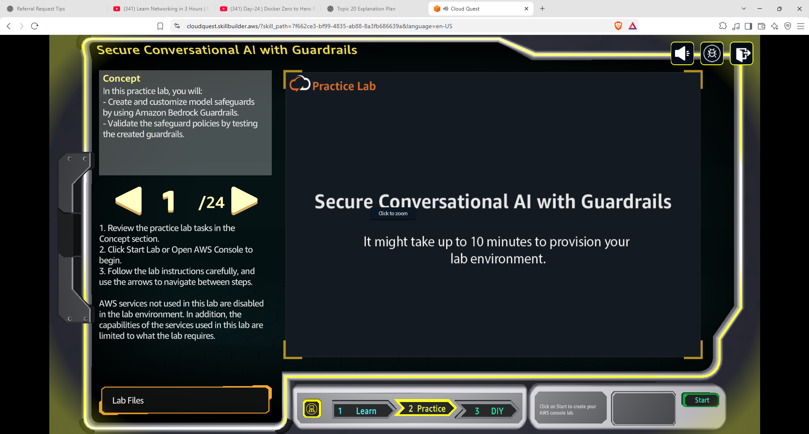

---

# 03 — ☁️ Open Amazon Bedrock Guardrails

I opened the **Amazon Bedrock Guardrails** section in the AWS Console.

The Guardrails page provides options to:

```text
Create a guardrail
      ↓
Test a guardrail
      ↓
Deploy a guardrail
```

At the beginning of the activity, there were no existing guardrails in the environment.

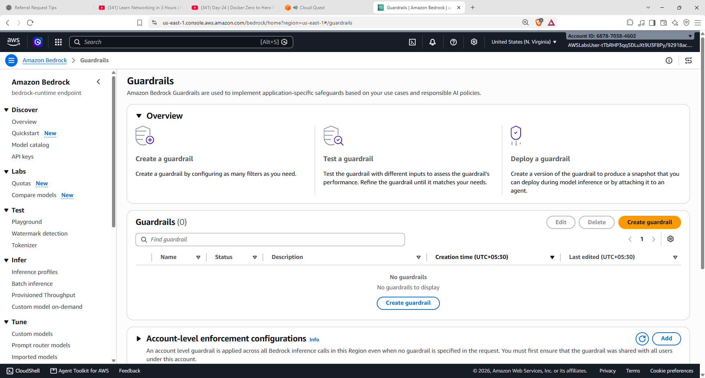

---

# 04 — 🛡️ Create a Guardrail

I started the **Create Guardrail** workflow.

The first step is to provide the basic guardrail details.

The guardrail was named:

```text
hr-guardrails
```

A description and a message for blocked prompts/responses can also be configured.

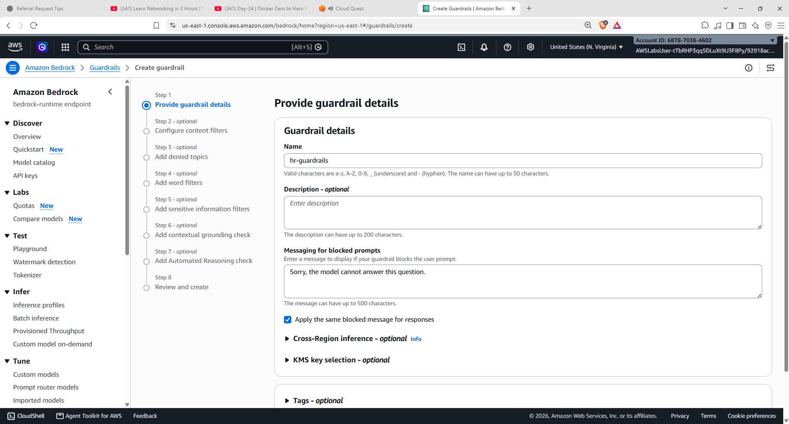

### Basic configuration

```text
Guardrail Name
    ↓
hr-guardrails

Blocked Message
    ↓
Custom message shown when content is blocked
```

---

# 05 — ⚙️ Configure Harmful Content Filters

Next, I configured the **harmful-content filters**.

Amazon Bedrock Guardrails provides configurable filters for harmful categories.

The practice interface allows different categories to be configured separately for prompts and responses.

The activity used blocking controls for categories including:

- Hate
- Insults
- Sexual
- Violence

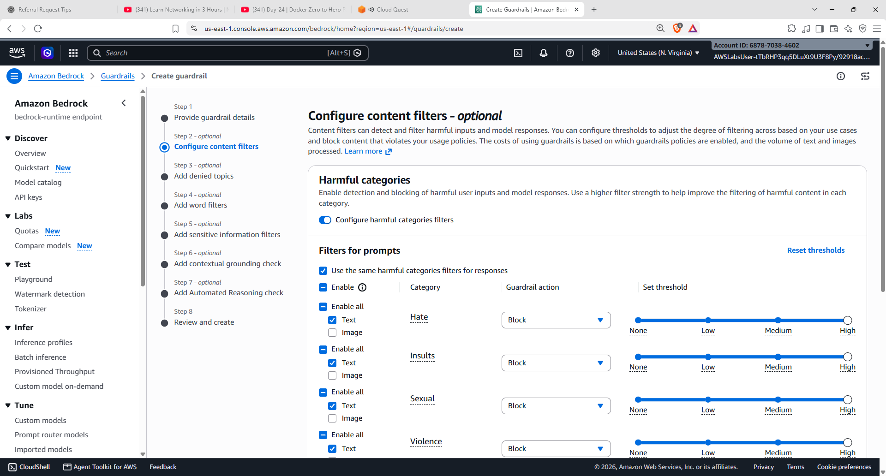

### Concept

```text
User Input
    ↓
Harmful Content Detection
    ↓
Threshold / Action
    ↓
Allow or Block
```

The goal is to prevent inappropriate or unsafe content from passing through the conversational AI workflow.

---

# 06 — 🚫 Add a Denied Topic

I added a **Denied Topic** to the guardrail.

The topic was configured as:

```text
Legal Advice
```

The topic definition described legal advice as advice involving interpretations of laws or recommendations on legal proceedings.

The input and output actions were configured to:

```text
Block
```

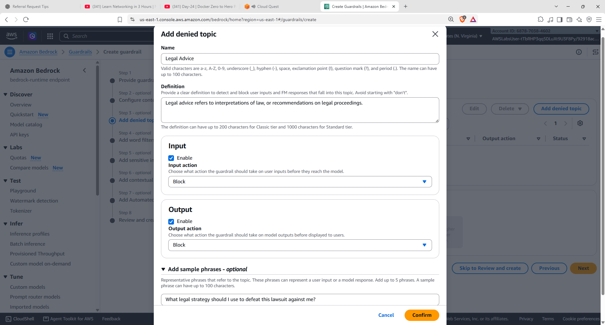

### Denied-topic workflow

```text
User Prompt
     ↓
Does it match a denied topic?
     ↓
   YES
     ↓
  BLOCK 🚫
```

This is useful when a business wants an AI assistant to avoid specific categories of requests.

---

# 07 — 📝 Review and Create the Guardrail

After configuring the guardrail details, harmful-content filters and denied topics, I reached the **Review and create** screen.

The configuration was reviewed before creating the guardrail.


### Configuration reviewed

```text
Guardrail Details
       +
Content Filters
       +
Denied Topics
       ↓
Review
       ↓
Create
```

---

# 08 — ✅ Guardrail Created

The guardrail was successfully created.

The guardrail overview displayed:

```text
Name: hr-guardrails
Status: Ready
```

The Guardrail page also provided options to test the guardrail and create versions.

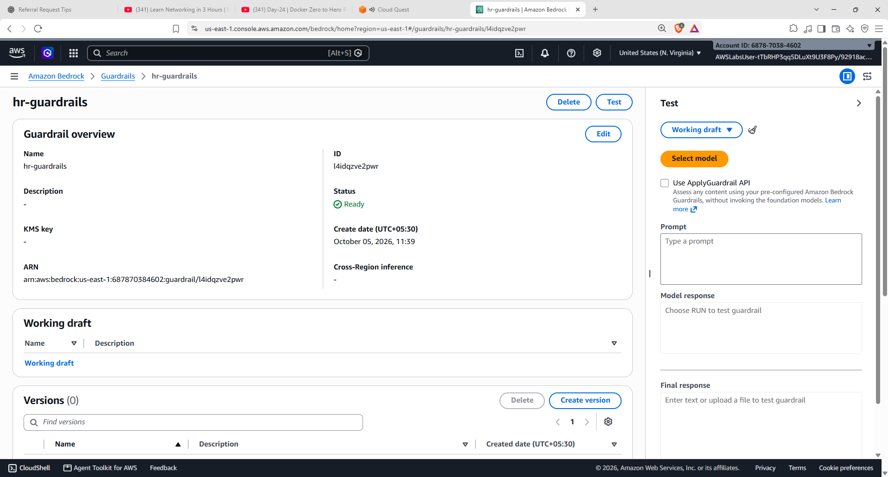

---

# 09 — 🧪 Open Guardrail Testing

I opened the testing interface for the newly created guardrail.

The testing screen allows a model to be selected and a prompt to be submitted against the guardrail.

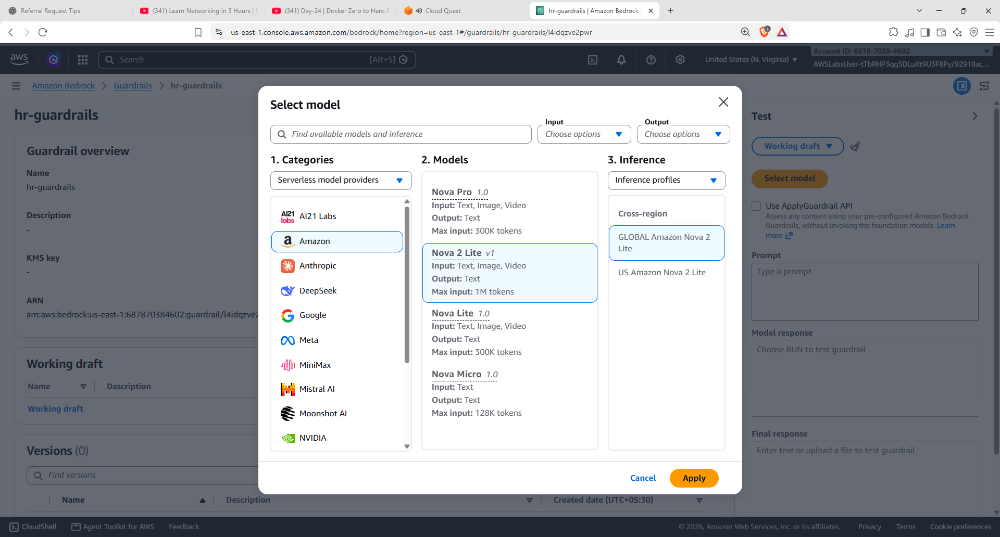

### Test flow

```text
Select Guardrail
       ↓
Select Foundation Model
       ↓
Enter Prompt
       ↓
Run Test
       ↓
Review Guardrail Result
```

---

# 10 — 🧠 Select a Foundation Model

A Foundation Model was selected from the model-selection interface for testing the guardrail.

The model selection screen provides available models and input/output configurations.


The purpose of the model here is to provide a realistic conversational AI response that can then be evaluated by the guardrail policies.

---

# 11 — 🚫 Test a Denied Topic

I tested the guardrail using a prompt related to the denied topic.

The test demonstrated that the **Legal Advice** topic was detected and blocked.

The test result showed:

```text
Denied Topic
     ↓
Legal Advice
     ↓
Detected
     ↓
Blocked 🚫
```

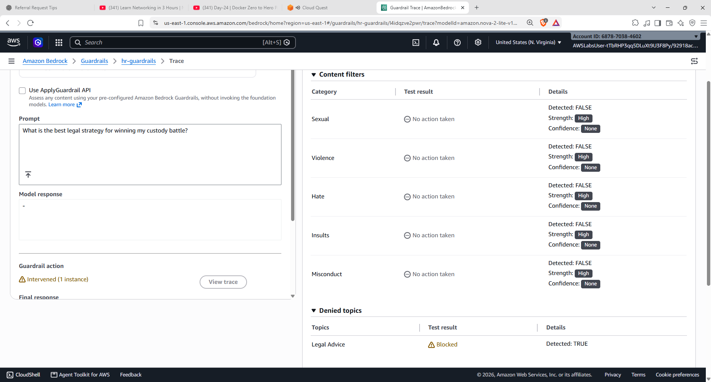

### Why this matters

A guardrail can prevent an application from responding to topics that the organization has explicitly decided should not be handled by the AI assistant.

---

# 12 — 🔎 Review Profanity and PII Controls

I reviewed the additional safety controls available in the guardrail.

The review included areas such as:

- Profanity filters
- Sensitive information / PII filters
- Contextual grounding

The interface provides configuration areas for sensitive information categories and related policies.

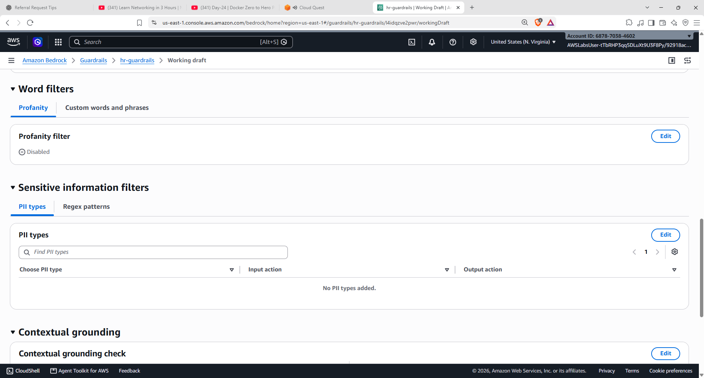

### Safety layers

```text
                 Guardrail
                    │
        ┌───────────┼───────────┐
        ▼           ▼           ▼
   Content      Denied       Sensitive
   Filters      Topics       Information
        │           │           │
        └───────────┼───────────┘
                    ▼
              Safer AI Output
```

---

# 13 — 📦 Review the Working Draft

The guardrail working draft displayed the configured content filters.

The review showed prompt and response filters enabled for categories such as:

```text
Hate
Insults
Sexual
```

with blocking actions configured.

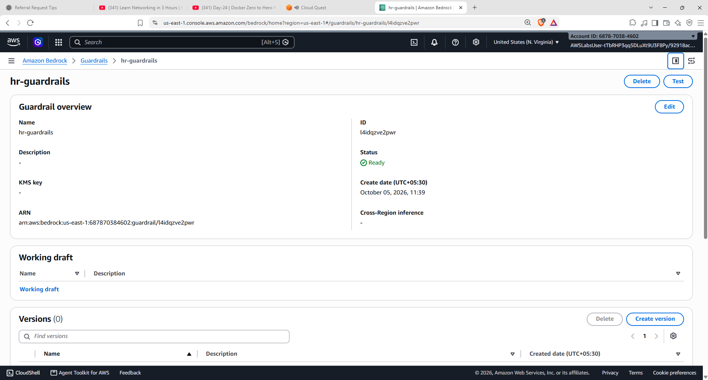

The working draft acts as the current editable configuration before creating a version.

---

# 14 — 🧪 Validate Guardrail Behaviour

The test result demonstrated how the guardrail evaluates the prompt.

The content-filter results showed categories such as:

```text
Sexual
Violence
Hate
Insults
Misconduct
```

with the corresponding detection results.

The denied-topic section showed:

```text
Topic: Legal Advice
Test result: Blocked
```


This confirms that the denied-topic policy was actively applied during the test.

---

# 15 — 📝 Review Guardrail Configuration

After testing, I reviewed the guardrail configuration again.

The guardrail overview showed the created guardrail and its working draft.


The working draft represents the configuration that can be tested and then versioned.

---

# 16 — 🧾 Create a Guardrail Version

After validating the configuration, I created a version of the guardrail.

The version page displayed:

```text
Version 1
```

The version contains the configured content-filter policies and represents a versioned configuration of the guardrail.

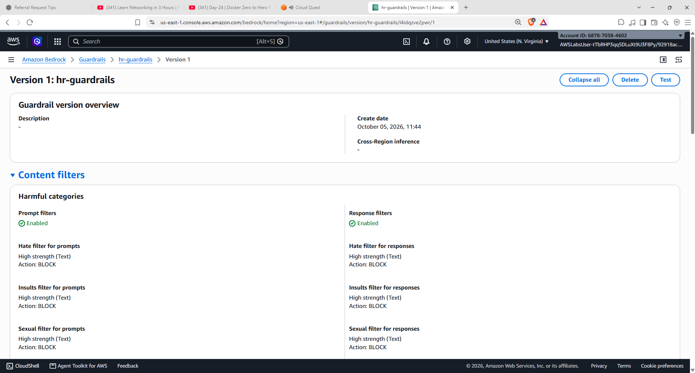

### Versioning workflow

```text
Working Draft
      ↓
Test
      ↓
Validate
      ↓
Create Version
      ↓
Version 1
```

---

# 17 — 🔐 Review Version Configuration

I opened the created version and reviewed its configuration.

The version retained the configured content-filter settings for prompts and responses.


This demonstrates the separation between:

```text
Working Draft
      ↓
Editable configuration

Version
      ↓
Versioned configuration
```

---

# 18 — 🏁 Practice Completed

The Cloud Quest Practice section was completed successfully.

The final Cloud Quest screen displayed:

> **Congratulations! You've completed the Practice section. Go to the DIY section to complete the solution.**

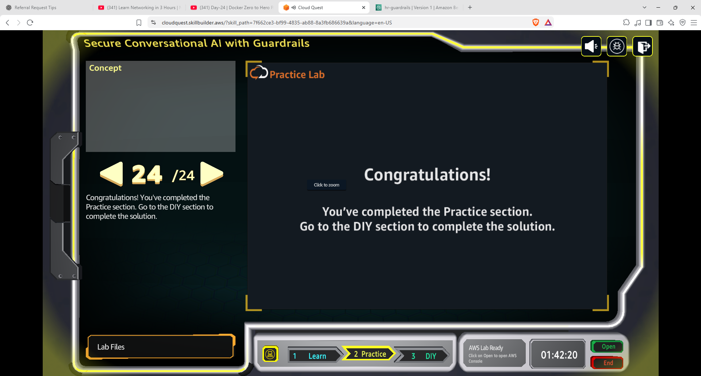

---

# 🧩 End-to-End Architecture

```text
                         👤 Employee
                              │
                              ▼
                    💬 HR AI Assistant
                              │
                              ▼
                     Amazon Bedrock
                              │
                              ▼
                    🛡️ Guardrail
                              │
          ┌───────────────────┼───────────────────┐
          ▼                   ▼                   ▼
   Harmful Content      Denied Topics       Sensitive Info
      Filters                                / PII Controls
          │                   │                   │
          └───────────────────┼───────────────────┘
                              ▼
                         Validation
                              │
                       ┌──────┴──────┐
                       │             │
                       ▼             ▼
                    Allowed       Blocked
                       │             │
                       ▼             ▼
               Foundation Model   Safe Block
                       │
                       ▼
                 💬 AI Response
```

---

# 🧠 What I Learned

| Concept | Hands-On Practice |
|---|---|
| 🛡️ **Amazon Bedrock Guardrails** | Created a guardrail for a conversational AI use case |
| ⚙️ **Content Filters** | Configured harmful-content filtering |
| 🚫 **Denied Topics** | Added Legal Advice as a denied topic |
| 🔒 **Blocking Actions** | Configured blocked behaviour for restricted content |
| 🧪 **Guardrail Testing** | Tested the guardrail using a Foundation Model |
| 🔎 **Test Results** | Reviewed detected and blocked categories |
| 🔐 **PII / Sensitive Information** | Reviewed sensitive-information filtering controls |
| 📝 **Working Draft** | Reviewed the editable guardrail configuration |
| 📦 **Versioning** | Created Version 1 of the guardrail |
| 🤖 **Responsible AI** | Practiced applying safety controls to a GenAI application |

---

# 🔑 Key Takeaway

A Foundation Model can generate powerful responses, but an enterprise AI application often needs an additional safety layer.

This practice demonstrated the basic idea:

```text
User
 ↓
AI Application
 ↓
Amazon Bedrock Guardrails
 ↓
Safety / Policy Checks
 ↓
 ┌───────────────┐
 │               │
 ▼               ▼
Allowed        Blocked
 │               │
 ▼               ▼
Model          Safe Response
Response
```

The key learning from this activity was that **Guardrails can be configured around a Generative AI application to enforce safety and policy requirements**, rather than relying only on the model itself.

---

# 🛠️ Skills Practiced

`AWS` `Amazon Bedrock` `Bedrock Guardrails` `Generative AI` `Responsible AI` `AI Safety` `Content Filtering` `Denied Topics` `PII Protection` `Foundation Models` `Prompt Testing` `Guardrail Versioning` `AWS Cloud Quest` `Cloud Computing`

---

## 📚 Learning Source

**AWS Cloud Quest — Generative AI Practitioner**

Practice activity:

**Secure Conversational AI with Guardrails**

This README documents my personal hands-on practice and the sequence completed during the Cloud Quest activity.

---

<p align="center">
  <b>🛡️ Configure → Test → Validate → Version → Secure 🤖</b>
</p>
