# 🌊 Amazon S3 — DIY Static Website Hosting | AWS Cloud Quest

<p align="center">
  
  
  
</p>

<p align="center">
  <b>AWS Cloud Quest — Generative AI Practitioner</b><br>
  DIY hands-on implementation of an Amazon S3 static website.
</p>

---

## 📌 Overview

This folder documents my **DIY hands-on implementation from AWS Cloud Quest — Generative AI Practitioner**.

The task was to take an existing website stored in an **Amazon S3 bucket**, make the required object and access changes, enable **static website hosting**, and verify that the website was accessible through the S3 website endpoint.

The Cloud Quest solution flow shows the website files being hosted from an S3 bucket, with the bucket policy providing the required access and the website endpoint serving the static content. The final validation confirms the completed S3 website configuration. 

> 🎯 **DIY Goal:** Recreate the required static website configuration in Amazon S3 and validate the result.

---

## 🏗️ What I Built

```text
                         🌐 Internet
                              │
                              ▼
                    Amazon S3 Website Endpoint
                              │
                              ▼
                     🪣 S3 Static Website
                              │
                 ┌────────────┴────────────┐
                 ▼                         ▼
            waves.html                 error.html
            (Index Page)               (Error Page)
                 │
                 ├── JavaScript
                 ├── CSS
                 └── Website Assets
```

### Core AWS service

**Amazon S3**

Used for:

- Storing website files
- Configuring bucket access
- Managing object names
- Enabling static website hosting
- Serving the static website through the S3 website endpoint

---

# 🧭 DIY Task Flow

```mermaid
flowchart LR
    A[🎯 DIY Task] --> B[🪣 Open S3 Bucket]
    B --> C[📦 Review Website Objects]
    C --> D[✏️ Rename Website Files]
    D --> E[🔐 Configure Public Access]
    E --> F[📜 Review Bucket Policy]
    F --> G[🔒 Review Encryption]
    G --> H[🌐 Enable Static Website Hosting]
    H --> I[🚀 Verify Website Endpoint]
    I --> J[✅ Cloud Quest Validation]
```

---

# 🧪 Step-by-Step Implementation

## 01 — 🎯 Understand the DIY Task

The Cloud Quest DIY screen provides the objective and a solution-validation method.

The task is to:

- Rename the required website files.
- Configure the S3 bucket for static website hosting.
- Review the bucket access configuration.
- Verify that the website works through the S3 website endpoint.

The solution diagram shown in the Cloud Quest task connects:

```text
City Residents
      │
      ▼
City Web Portal
      │
      ▼
Amazon S3 Bucket
      │
      ├── Website files
      └── Bucket Policy
```

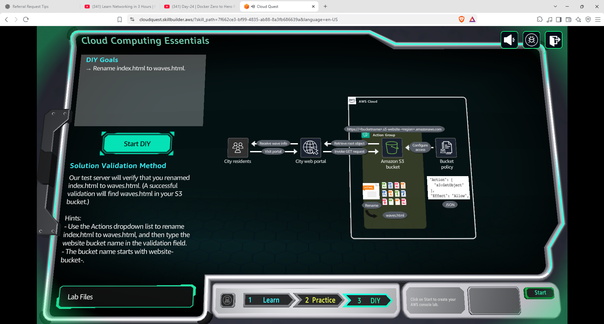

---

## 02 — 🪣 Open Amazon S3

I opened the **Amazon S3 console** and reviewed the available general-purpose buckets.

The bucket used for this exercise follows the Cloud Quest naming pattern beginning with:

```text
website-
```

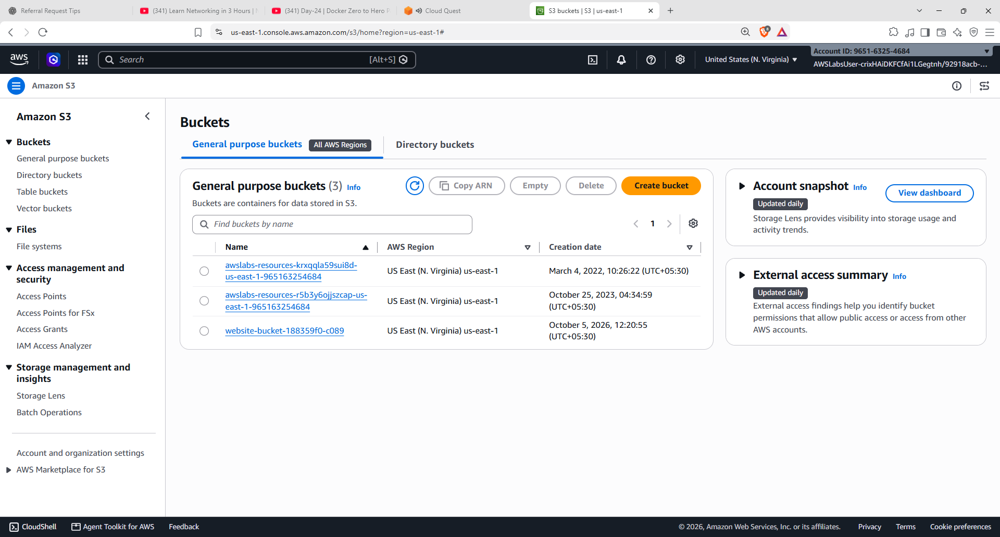

### 💡 Concept

An S3 bucket is a container for objects. In this exercise, the objects represent the files required by a static website.

---

## 03 — 📦 Review the Website Objects

After opening the target bucket, I reviewed the website files stored inside it.

The bucket contained files including:

```text
index.html
text.html
main.js
styles.css
error.css
waves.css
```

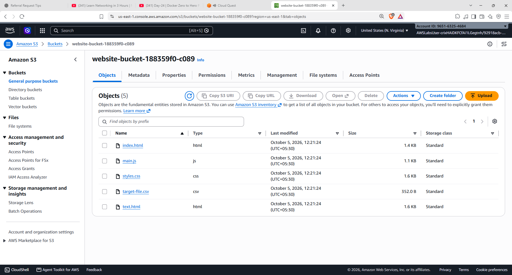

### 💡 Why this matters

For static website hosting, the HTML, CSS, JavaScript and other assets can be stored as S3 objects.

The important part of this DIY task was to modify the required HTML object names before configuring the website.

---

## 04 — 🌊 Rename `index.html` → `waves.html`

The first required object rename was:

```text
index.html
    ↓
waves.html
```

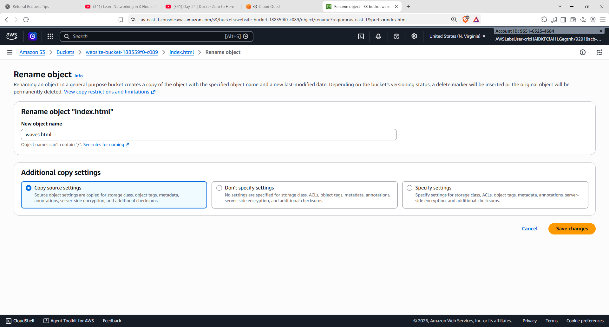

### 🧠 What I learned

An S3 object is identified by its **object key**.

Changing the filename changes the object's key.

In this exercise, `waves.html` becomes the page configured as the website's **index document**.

---

## 05 — ⚠️ Rename `text.html` → `error.html`

The second required object rename was:

```text
text.html
    ↓
error.html
```

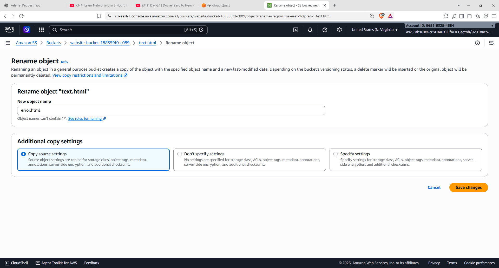

### 🧠 Why?

The static website configuration can specify an **error document**.

For this DIY task:

```text
Index document → waves.html
Error document → error.html
```

This allows S3 static website hosting to know which HTML file to serve for the main page and which file to use when an error occurs.

---

## 06 — 🔐 Configure Public Access

I reviewed the bucket's **Block Public Access** settings.

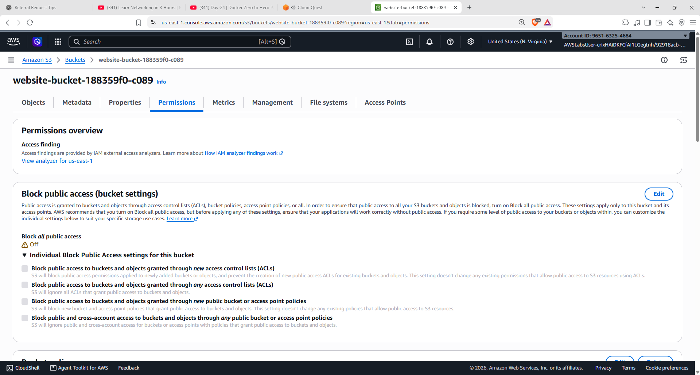

### 💡 Concept

Amazon S3 provides Block Public Access controls to help prevent unintended public exposure of buckets and objects.

For this specific Cloud Quest exercise, the website needs to be accessible publicly through the S3 website endpoint, so the required public-access configuration must be applied.

> ⚠️ **Security note:** Public access should only be enabled when the architecture actually requires it. For real-world workloads, always evaluate whether the content truly needs to be public.

---

## 07 — 📜 Review the Bucket Policy

Next, I reviewed the **bucket policy** attached to the S3 bucket.

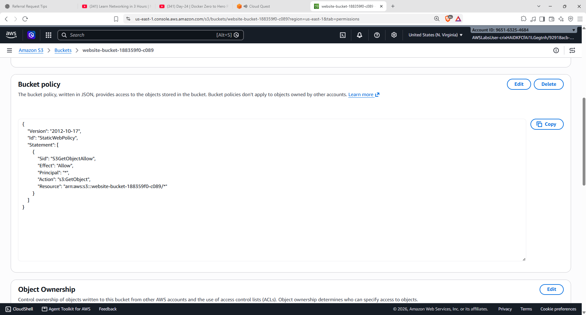

The policy shown in the exercise grants the required permission to retrieve objects from the website bucket.

A key permission for static website content is:

```json
"s3:GetObject"
```

### 🔎 Policy concept

An S3 bucket policy defines:

```text
Principal → Who
Action    → What they can do
Resource  → Which S3 resource
```

For a public static website, object retrieval permissions are required so website visitors can request the files.

---

## 08 — 🔒 Review Default Encryption

I reviewed the bucket's **Default Encryption** configuration.

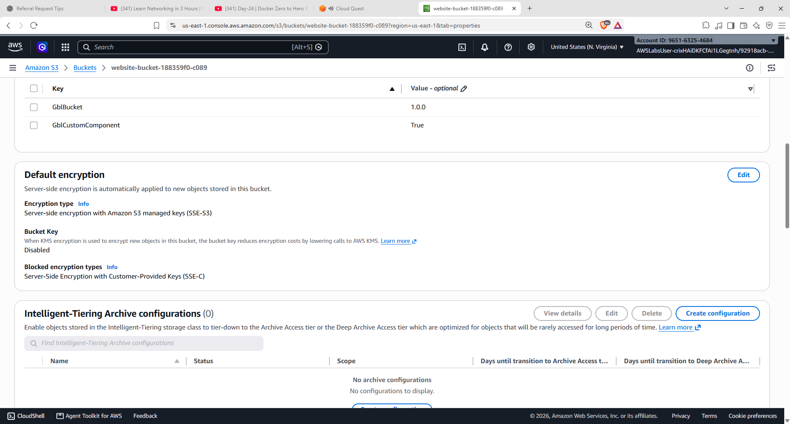

The configuration shown in the exercise uses:

```text
Encryption type:
Server-side encryption with Amazon S3 managed keys (SSE-S3)
```

### 💡 Concept

S3 server-side encryption protects objects at rest.

With **SSE-S3**, Amazon S3 manages the encryption process and the associated encryption keys.

---

## 09 — 🌐 Enable Static Website Hosting

I opened the bucket's **Static Website Hosting** configuration.

The configuration used in this DIY task was:

```text
Static website hosting → Enabled
Hosting type          → Host a static website

Index document        → waves.html
Error document        → error.html
```

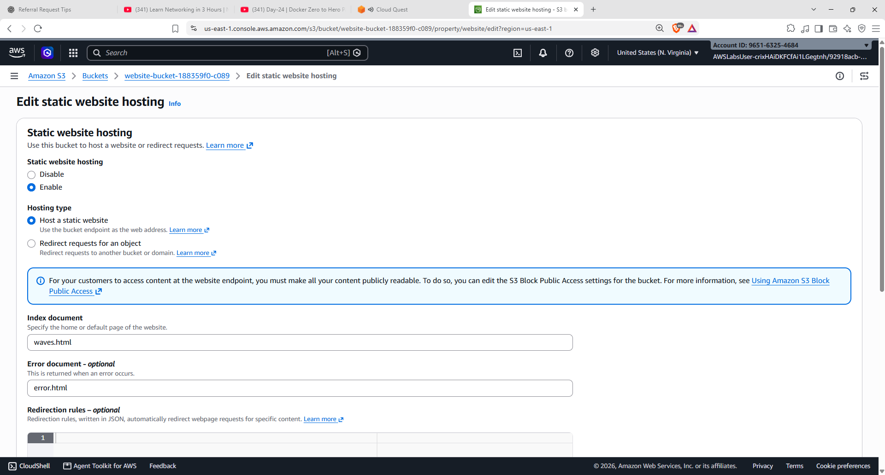

### 🧠 Website flow

```text
Visitor
   │
   ▼
S3 Website Endpoint
   │
   ├── / → waves.html
   │
   └── Error → error.html
```

This is the key configuration that turns the S3 bucket into a static website endpoint.

---

## 10 — 🚀 Verify S3 Website Hosting

After saving the configuration, I verified that **static website hosting was enabled**.

The S3 console displayed the bucket website endpoint.

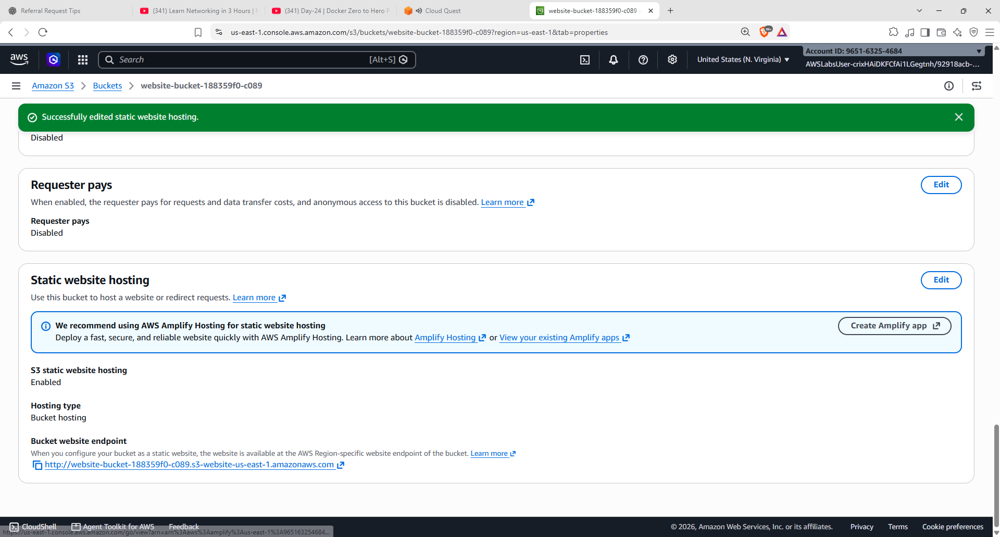

### Result

```text
S3 Bucket
   │
   ▼
Static Website Hosting
   │
   ▼
Website Endpoint
```

---

## 11 — 🖥️ Open the Website

I opened the S3 website endpoint in the browser.

The hosted website successfully displayed the **Beach Wave Conditions** page.

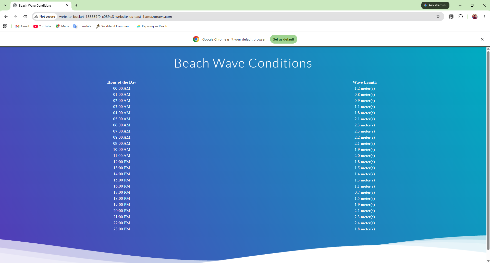

### 🌊 Final Website

The website contains:

- Beach Wave Conditions heading
- Time-based wave information
- Wave-length values
- Static HTML/CSS presentation

This confirms that the S3 static website configuration is working.

---

## 12 — 📝 Cloud Quest Assignment Result

The Cloud Quest assignment screen summarizes the completed solution.

It shows the S3 static website architecture and the configuration used for the exercise.

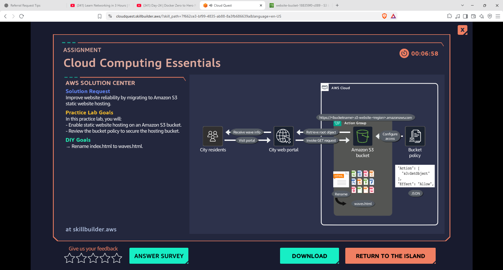

---

## 13 — ✅ Validate the Solution

Finally, I returned to the Cloud Quest validation screen and provided the bucket name.

The solution was successfully validated.

The validation message confirms that the static website was created using an Amazon S3 bucket and that the required index file was renamed to `waves.html`.

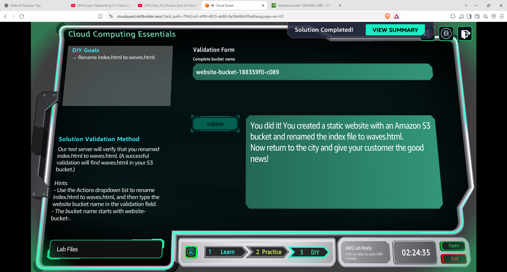

---

# 🧠 What I Learned

| Concept | Hands-on Practice |
|---|---|
| 🪣 **Amazon S3** | Used S3 as the storage layer for a static website |
| 📦 **S3 Objects** | Reviewed and modified website objects |
| ✏️ **Object Keys** | Renamed `index.html` and `text.html` |
| 🌊 **Index Document** | Configured `waves.html` as the website entry point |
| ⚠️ **Error Document** | Configured `error.html` for website errors |
| 🔐 **Block Public Access** | Reviewed public-access controls |
| 📜 **Bucket Policy** | Reviewed permissions required for website access |
| 🔒 **SSE-S3** | Reviewed default server-side encryption |
| 🌐 **Static Website Hosting** | Enabled S3 static website hosting |
| 🚀 **Website Endpoint** | Verified the website through the S3 endpoint |
| ✅ **Solution Validation** | Validated the completed Cloud Quest task |

---

# 🔐 Security Takeaways

This exercise also helped me understand an important S3 trade-off:

### Public website access

A publicly accessible S3 static website requires the appropriate access configuration.

However:

> **Public access should never be enabled simply because it is convenient.**

Before using a similar setup in a real environment, I would review:

- 🔒 Block Public Access configuration
- 📜 Bucket policy permissions
- 🎯 Least-privilege access
- 📦 Which objects actually need to be public
- 🔐 Encryption configuration
- 🌐 Whether CloudFront should be used in front of S3

For production architectures, the access model should be designed based on the application's security requirements rather than copied directly from a training lab.

---

# 🏗️ Final Architecture

```text
                         🌐 User
                           │
                           ▼
                ┌─────────────────────┐
                │ S3 Website Endpoint │
                └──────────┬──────────┘
                           │
                           ▼
                 ┌──────────────────┐
                 │   Amazon S3      │
                 │     Bucket       │
                 └────────┬─────────┘
                          │
             ┌────────────┼────────────┐
             ▼            ▼            ▼
        waves.html    error.html    Other Assets
        (Index)       (Error)       CSS / JS
             │
             ▼
       🌊 Static Website
```

---

# 🛠️ AWS Skills Practiced

`AWS` `Amazon S3` `Cloud Computing` `S3 Objects` `S3 Bucket Policy` `S3 Security` `SSE-S3` `Static Website Hosting` `AWS Cloud Quest` `Hands-On Learning`

---

## 📚 Learning Source

**AWS Cloud Quest — Generative AI Practitioner**

This README documents my personal DIY implementation and the steps completed during the Cloud Quest activity.

---

<p align="center">
  <b>☁️ Learn → Practice → Build → Validate → Document</b>
</p>
