# ☁️ Amazon S3 — Static Website Hosting | AWS Cloud Quest

<p align="center">
  
  
  
</p>

<p align="center">
  <b>Hands-on practice from AWS Cloud Quest — Generative AI Practitioner</b><br>
  Building and hosting a static website using Amazon S3.
</p>

---

## 📌 Overview

This repository contains my **hands-on practice and DIY work from AWS Cloud Quest — Generative AI Practitioner**.

In this lab, I worked with **Amazon S3** to:

- Create and inspect an S3 bucket
- Review objects stored inside the bucket
- Rename an object
- Configure public access settings
- Review a bucket policy
- Review default server-side encryption
- Enable **Static Website Hosting**
- Configure the index and error documents
- Access the hosted website through the S3 website endpoint

> 🎯 **Goal:** Understand how Amazon S3 can be configured to host a simple static website and how the related access/security settings work.

---

## 🧭 Lab Flow

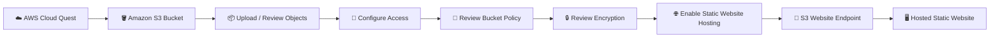

---

## 🗂️ Repository Structure

```text
AIF_CloudQuest_Hands-On/
│
└── S3/
    ├── README.md
    │
    └── images/
        ├── Practice_Task.png
        ├── S3_Homepage.png
        ├── Website_Bucket_Page.png
        ├── renaming_object_to_error.png
        ├── Block_All_Public_Access_OFF.png
        ├── Bucket_Policy_Review.png
        ├── Properties_Default_Encryption_Review.png
        ├── Static_Website_Hosting_Set.png
        ├── Bucket_Hosting_Review.png
        ├── Website_Hosted.png
        └── Congratulation_Page.png
```

---

# 🧪 Hands-On Walkthrough

## 01 — 📝 Understand the Practice Task

The Cloud Quest practice section introduces the objective and the steps required for the S3 exercise.

### Objective

- Enable **Static Website Hosting** on an Amazon S3 bucket.
- Review the bucket policy and access configuration.
- Verify that the static website can be accessed successfully.

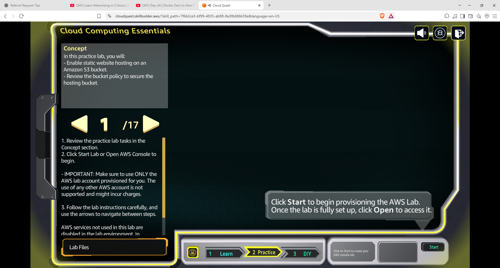

---

## 02 — 🪣 Open Amazon S3

The S3 console shows the available **general purpose buckets**.

From here, I selected the bucket used for the practice activity.

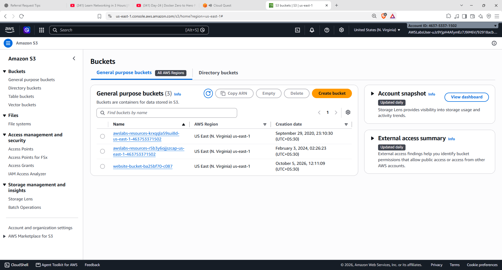

### 💡 What I learned

An Amazon S3 bucket acts as a container for objects such as:

- HTML files
- CSS files
- JavaScript files
- Images
- Other application assets

For a static website, these objects can be served as website content.

---

## 03 — 📦 Review Objects Inside the Bucket

After opening the bucket, I reviewed the objects available inside it.

The bucket contained the website files required for the static website.

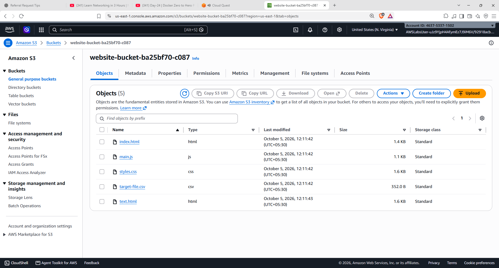

### Example website components

```text
index.html
error.html
main.js
styles.css
images / assets
```

> 💡 A static website does not require a traditional application server for these files. The browser can request the static assets directly.

---

## 04 — ✏️ Rename an Object

I opened the rename operation for one of the website objects.

The lab demonstrates how an S3 object can be renamed while preserving the required object settings.


### Key concept

In S3, objects are identified by their **object key**.

Changing the filename effectively changes the object's key.

For example:

```text
text.html
   ↓
error.html
```

This becomes relevant because the static website configuration can reference specific documents such as an **index document** and an **error document**.

---

## 05 — 🔐 Review Block Public Access

The bucket's **Block Public Access** configuration was reviewed and adjusted for the static website hosting requirement.

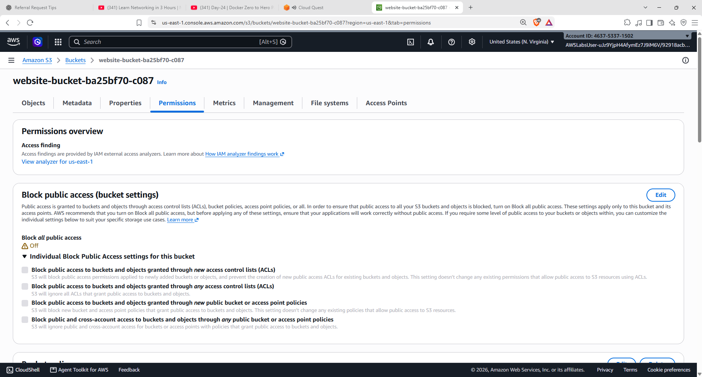

### ⚠️ Important security concept

Amazon S3 provides **Block Public Access** controls to help prevent unintended public exposure of S3 resources.

For a publicly accessible S3 static website, the required public-access configuration must be considered carefully.

> 🔒 **Best practice:** Only allow the minimum public access required for the intended architecture. Do not disable public-access protections on production buckets without understanding the security implications.

---

## 06 — 📜 Review the Bucket Policy

The bucket policy was reviewed to understand how access to objects is controlled.

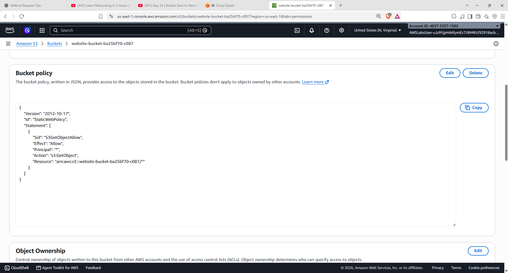

### 🔎 What to look for

The policy determines:

- **Who** can access the resource
- **What action** they can perform
- **Which resource** the permission applies to

For example, a static website configuration may require permission to retrieve objects using:

```text
s3:GetObject
```

The resource can be scoped to the objects inside the specific bucket.

> ⚠️ Public `s3:GetObject` access means objects can be retrieved by users who can reach the website. This should only be used when public content is actually intended.

---

## 07 — 🔒 Review Default Encryption

The bucket properties were checked to review the default encryption configuration.

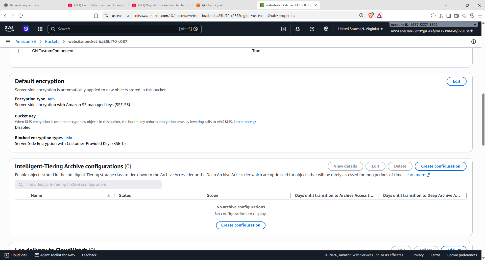

### 💡 Key concept

Amazon S3 supports **server-side encryption** for objects stored in S3.

The lab configuration shows **SSE-S3**, where Amazon S3 manages the encryption keys for the encryption process.

This helps protect data at rest without requiring the application to implement its own encryption mechanism.

---

## 08 — 🌐 Enable Static Website Hosting

The bucket's **Static Website Hosting** configuration was opened.

The website was configured with:

- **Hosting type:** Host a static website
- **Index document:** `index.html`
- **Error document:** `error.html`

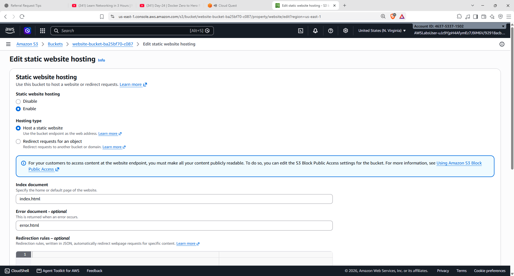

### 🧠 Why are these documents important?

When someone opens the website root, S3 uses the configured **index document** as the starting page.

If a requested page cannot be found, the configured **error document** can be returned.

```text
Website Request
      │
      ▼
 index.html
      │
      ├── Page found → Serve page
      │
      └── Page not found → error.html
```

---

## 09 — 🚀 Verify Website Hosting

After saving the configuration, the S3 properties showed that **static website hosting was enabled**.

The S3 console also displayed the website endpoint that can be used to access the hosted content.

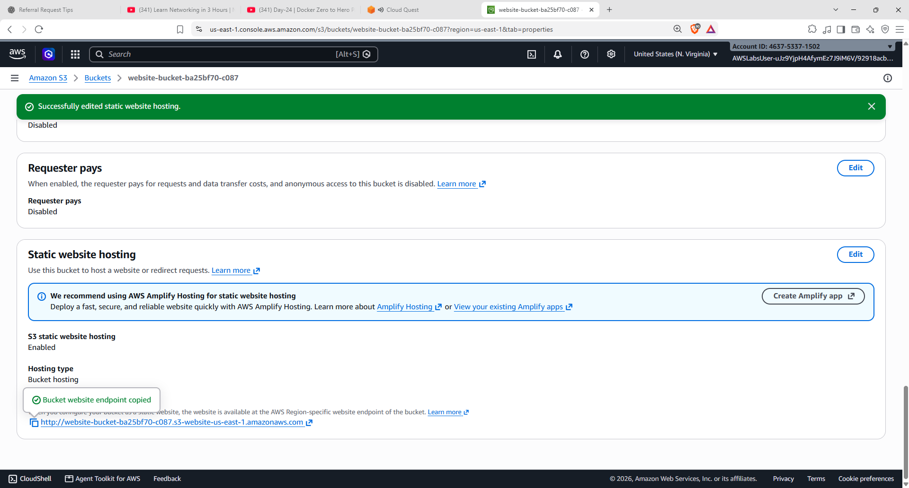

### Result

```text
S3 Bucket
    │
    ▼
Static Website Hosting
    │
    ▼
S3 Website Endpoint
```

---

## 10 — 🖥️ Open the Hosted Website

The website was successfully opened through the S3 website endpoint.

The practice website displayed **Beach Wave Conditions** with the associated data.

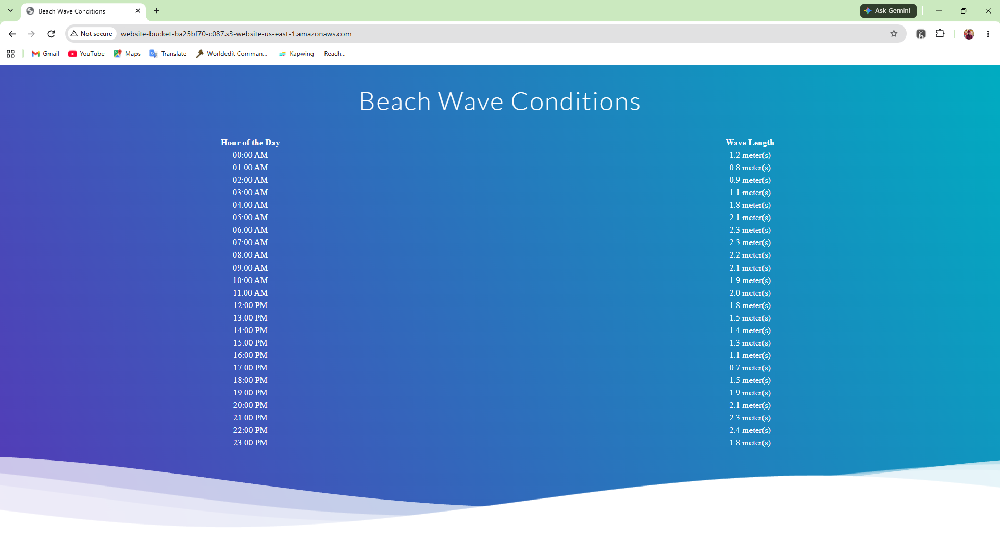

### 🎉 Final Architecture

```text
                 Internet
                    │
                    ▼
           S3 Website Endpoint
                    │
                    ▼
            Amazon S3 Bucket
                    │
          ┌─────────┼─────────┐
          ▼         ▼         ▼
       HTML       CSS       JavaScript
          │
          ▼
     Static Website
```

---

## 11 — ✅ Cloud Quest Completion

The final Cloud Quest screen confirms that the practice section was completed successfully.

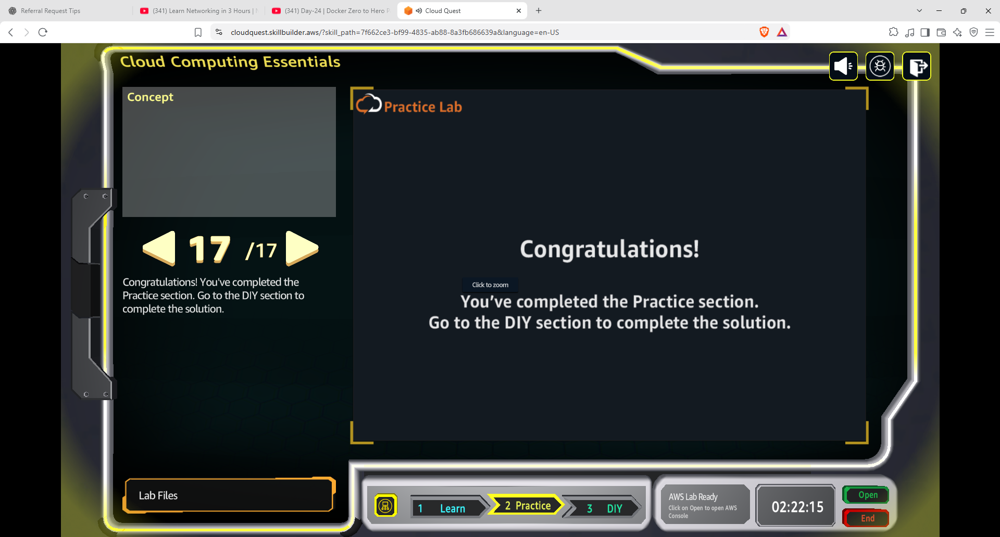

---

# 🧠 What I Learned

| Concept | What I practiced |
|---|---|
| 🪣 **S3 Bucket** | Working with buckets and stored objects |
| 📦 **S3 Objects** | Reviewing and managing website files |
| 🔑 **Object Keys** | Understanding object names/paths |
| 🔐 **Block Public Access** | Understanding S3 public-access controls |
| 📜 **Bucket Policy** | Reviewing resource-based permissions |
| 🔒 **SSE-S3** | Understanding default server-side encryption |
| 🌐 **Static Website Hosting** | Hosting static website content through S3 |
| 📄 **Index Document** | Configuring the website's default page |
| ⚠️ **Error Document** | Configuring the page returned for errors |
| 🚀 **Website Endpoint** | Accessing the hosted static website |

---

# 🔐 Security Takeaways

> **Public static website ≠ public bucket by default.**

When configuring S3 for website hosting, access settings must be intentionally designed.

### Things I would check before using this architecture in a real environment:

- ✅ Enable appropriate **Block Public Access** protections
- ✅ Follow **least-privilege** access policies
- ✅ Avoid exposing private or sensitive objects
- ✅ Review bucket policies carefully
- ✅ Keep encryption enabled
- ✅ Consider alternative architectures such as **CloudFront + S3** for production workloads

---

# 🏗️ Skills Practiced

`AWS` `Amazon S3` `Cloud Computing` `IAM & Access Control` `S3 Bucket Policies` `Server-Side Encryption` `Static Website Hosting` `Cloud Quest` `Hands-On Learning`

---

## 📚 Learning Source

**AWS Cloud Quest — Generative AI Practitioner**

This page documents my personal hands-on practice and the steps I performed during the Cloud Quest activity.

---

<p align="center">
  <b>☁️ Learn → Practice → Build → Document</b>
</p>
