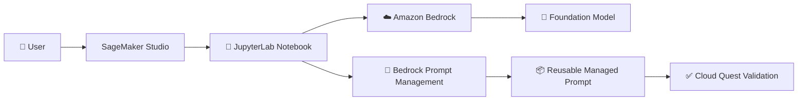
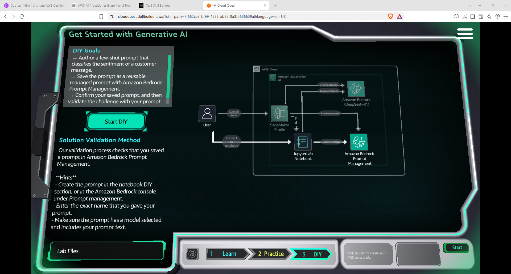
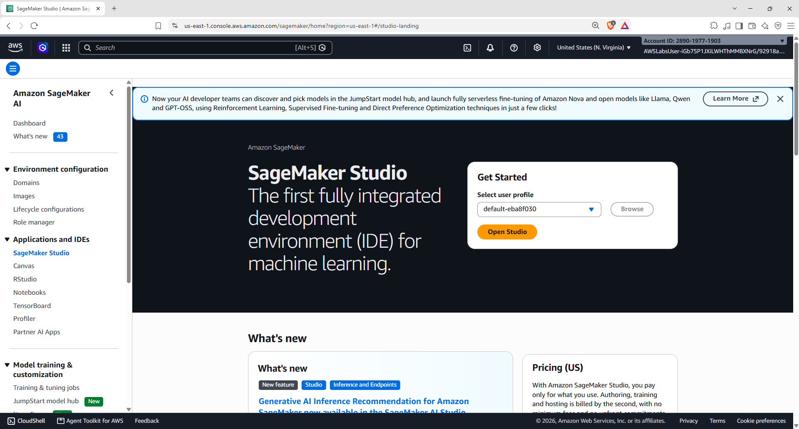
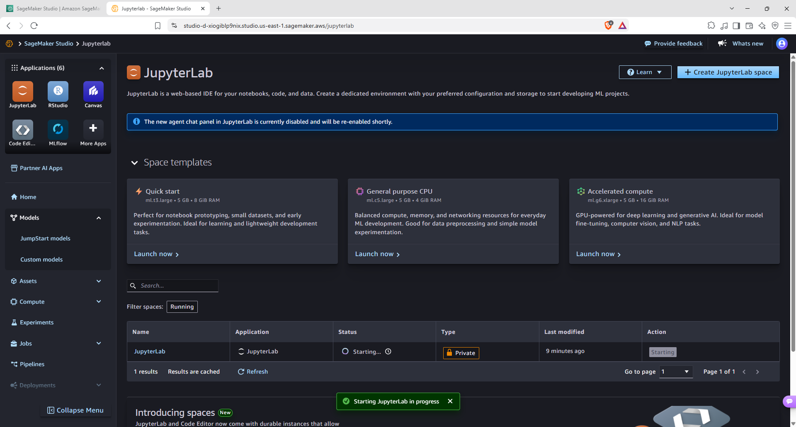
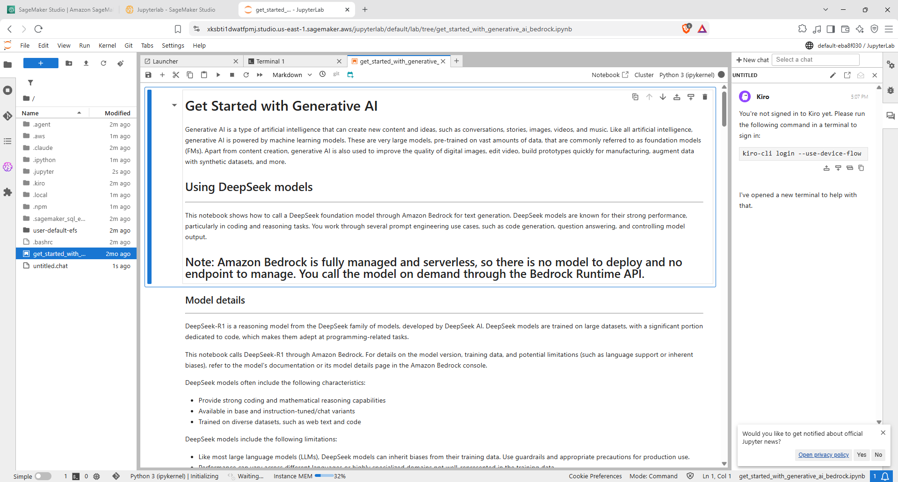
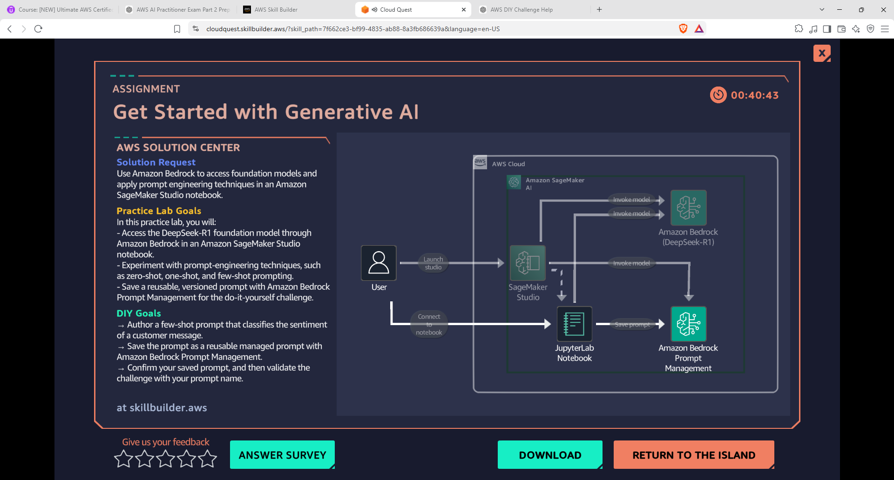
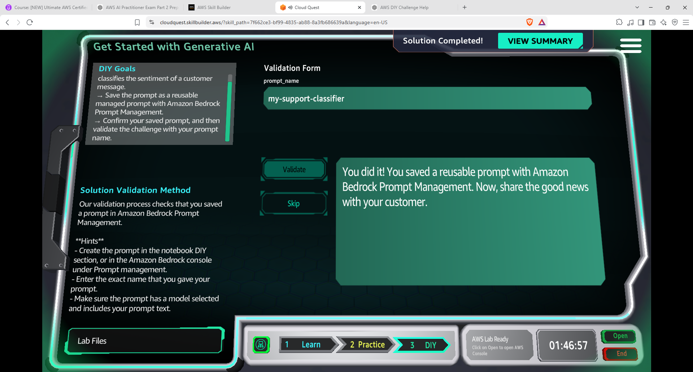

# 🤖 Amazon SageMaker + Amazon Bedrock — Prompt Management DIY | AWS Cloud Quest

<p align="center">
  
  
  
</p>

<p align="center">
  <b>AWS Cloud Quest — Generative AI Practitioner</b><br>
  Creating a reusable few-shot customer sentiment classifier using SageMaker Studio, JupyterLab and Amazon Bedrock Prompt Management.
</p>

---

## 📌 Overview

This folder documents my **DIY hands-on activity from AWS Cloud Quest — Generative AI Practitioner**.

The activity combines **Amazon SageMaker Studio**, **JupyterLab**, **Amazon Bedrock**, and **Bedrock Prompt Management**.

The goal was to create a reusable prompt that classifies the sentiment of a customer message, save it through Amazon Bedrock Prompt Management, and validate the saved prompt through Cloud Quest.

The Cloud Quest solution flow shows a user launching SageMaker Studio, connecting to a JupyterLab notebook, using an Amazon Bedrock foundation model, and saving a prompt through Amazon Bedrock Prompt Management. fileciteturn19file0L2-L8

---

# 🎯 DIY Objective

The Cloud Quest DIY task required me to:

- ✍️ Author a **few-shot prompt** for customer sentiment classification.
- 😊 Classify customer messages into:
  - `Positive`
  - `Negative`
  - `Neutral`
- 📦 Save the prompt as a reusable managed prompt using **Amazon Bedrock Prompt Management**.
- ✅ Validate the saved prompt and prompt name through Cloud Quest.

### Target workflow

```text
Customer Message
       │
       ▼
Few-Shot Prompt
       │
       ▼
Amazon Bedrock Foundation Model
       │
       ▼
Sentiment Classification
       │
       ├── Positive
       ├── Negative
       └── Neutral
       │
       ▼
Amazon Bedrock Prompt Management
       │
       ▼
Reusable Managed Prompt
```

---

# 🏗️ Architecture



---

# 01 — 🎯 Understand the DIY Task

The Cloud Quest DIY screen defines the objective as creating a **few-shot prompt that classifies the sentiment of a customer message**, saving that prompt as a reusable managed prompt with Amazon Bedrock Prompt Management, and then validating the prompt.

The task also provides a solution diagram showing the interaction between:

```text
User
 │
 ▼
Amazon SageMaker Studio
 │
 ├── JupyterLab Notebook
 │
 └── Amazon Bedrock
        │
        ├── Foundation Model
        │
        └── Prompt Management
```



---

# 02 — 🧑‍💻 Open Amazon SageMaker Studio

I opened the **Amazon SageMaker Studio** environment from the SageMaker console.

SageMaker Studio provides the development environment used for the activity.



### 💡 Role of SageMaker Studio

In this activity, SageMaker Studio acts as the workspace from which I accessed the JupyterLab environment and worked with the Generative AI notebook.

---

# 03 — 📓 Launch JupyterLab

From SageMaker Studio, I opened **JupyterLab**.

JupyterLab provides the notebook-based development environment used for the DIY activity.



### Workflow

```text
SageMaker Studio
       │
       ▼
   JupyterLab
       │
       ▼
Generative AI Notebook
```

---

# 04 — 🧠 Open the Generative AI Notebook

Inside JupyterLab, I opened the **Get Started with Generative AI** notebook.

The notebook explains the use of Amazon Bedrock foundation models and demonstrates how the model can be called from the notebook.

It also highlights an important architectural point:

> Amazon Bedrock is fully managed and serverless, so there is no model to deploy and no endpoint to manage. The model is called on demand through the Bedrock Runtime API.



---

# 05 — ✍️ Create the Few-Shot Sentiment Prompt

The DIY notebook contains the prompt configuration for the sentiment-classification task.

The prompt defines a customer sentiment classification assistant and instructs the model to classify messages into:

```text
Positive
Negative
Neutral
```

It also provides examples before asking the model to classify a new customer message.

### Example structure

```text
Example 1
Customer message → "I absolutely love this product!"
Sentiment → Positive

Example 2
Customer message → "The product is broken and the customer service was terrible."
Sentiment → Negative

Example 3
Customer message → "Why was my order delivered today?"
Sentiment → Neutral

--------------------------------

Now classify:

Customer message → {{message}}

Return only one word:
Positive, Negative, or Neutral.
```

This is a **few-shot prompt** because examples are provided to demonstrate the expected classification behaviour.


---

# 06 — 🔤 Define the Prompt Variable

The notebook defines an input variable for the customer message.

```text
INPUT_VARIABLES = ["message"]
```

The variable allows the same prompt structure to be reused with different customer messages.

### Reusable prompt concept

```text
                 ┌── Customer Message 1
                 ├── Customer Message 2
Reusable Prompt ─┼── Customer Message 3
                 └── Customer Message N
```

Instead of hard-coding one customer message into the prompt, the `message` variable acts as the dynamic input.

---

# 07 — 📦 Save the Prompt With Bedrock Prompt Management

The notebook then creates a managed prompt using Amazon Bedrock Prompt Management.

The saved prompt name used for the challenge was:

```text
my-support-classifier
```

The notebook workflow saves the prompt using the prompt text and input variable configuration.

### Conceptual flow

```text
Prompt Name
     +
Prompt Text
     +
Input Variables
     ↓
Amazon Bedrock Prompt Management
     ↓
Reusable Managed Prompt
```

---

# 08 — 🔗 Connect SageMaker, Bedrock and Prompt Management

The complete DIY workflow can be represented as:

```text
                 Amazon SageMaker Studio
                          │
                          ▼
                     JupyterLab
                          │
                          ▼
                 Python Notebook Code
                          │
                          ▼
                    Amazon Bedrock
                          │
                ┌─────────┴─────────┐
                ▼                   ▼
        Foundation Model     Prompt Management
                │                   │
                ▼                   ▼
       Sentiment Response    Saved Prompt
```

This demonstrates how a notebook-based development environment can interact with Amazon Bedrock services.

---

# 09 — 🧪 Validate the Prompt

After saving the prompt, I returned to Cloud Quest and entered the prompt name for validation.

The validation form used:

```text
prompt_name = my-support-classifier
```

The Cloud Quest validation confirmed that the reusable prompt had been successfully saved with Amazon Bedrock Prompt Management.



---

# 10 — ✅ Solution Completed

The Cloud Quest activity displayed the **Solution Completed** state after successful validation.



### Result

```text
Few-Shot Prompt
      ↓
Customer Sentiment Classification
      ↓
Reusable Managed Prompt
      ↓
Amazon Bedrock Prompt Management
      ↓
Cloud Quest Validation
      ↓
✅ Completed
```

---

# 🧠 What I Learned

| Concept | Hands-On Practice |
|---|---|
| 🧑‍💻 **SageMaker Studio** | Used Studio as the development environment |
| 📓 **JupyterLab** | Worked with a Generative AI notebook |
| ☁️ **Amazon Bedrock** | Accessed a foundation model through the notebook |
| 🧠 **Foundation Models** | Used a model for customer sentiment classification |
| ✍️ **Few-Shot Prompting** | Provided examples before the target input |
| 😊 **Sentiment Classification** | Classified messages as Positive, Negative or Neutral |
| 🔤 **Prompt Variables** | Used `message` as a reusable input variable |
| 📝 **Prompt Management** | Saved the prompt as a managed reusable prompt |
| 📦 **Managed Prompt** | Created `my-support-classifier` |
| 🔗 **Service Integration** | Connected SageMaker/JupyterLab with Bedrock |
| ✅ **Validation** | Validated the saved prompt through Cloud Quest |

---

# 🔑 Key Takeaway

This activity demonstrated that Generative AI application development can involve multiple AWS services working together.

```text
SageMaker Studio
      ↓
JupyterLab
      ↓
Python / Notebook
      ↓
Amazon Bedrock
      ↓
Foundation Model
      ↓
Few-Shot Prompt
      ↓
Customer Sentiment
      ↓
Bedrock Prompt Management
      ↓
Reusable Prompt
```

The main learning was not only about prompting the model, but also about turning the prompt into a **reusable managed component** through Amazon Bedrock Prompt Management.

---

# 🛠️ Skills Practiced

`AWS` `Amazon SageMaker AI` `SageMaker Studio` `JupyterLab` `Amazon Bedrock` `Bedrock Prompt Management` `Generative AI` `Foundation Models` `Prompt Engineering` `Few-Shot Prompting` `Sentiment Classification` `Python` `Cloud Computing` `AWS Cloud Quest`

---

## 📚 Learning Source

**AWS Cloud Quest — Generative AI Practitioner**

This README documents my personal DIY implementation and the steps completed during the Cloud Quest activity.

---

<p align="center">
  <b>☁️ Build → Prompt → Manage → Validate → Learn</b>
</p>
