# 🧠 Amazon SageMaker AI — Generative AI Practice | AWS Cloud Quest

<p align="center">
  
  
  
</p>

<p align="center">
  <b>AWS Cloud Quest — Generative AI Practitioner</b><br>
  Exploring SageMaker Studio, JupyterLab, Amazon Bedrock integration and prompt engineering.
</p>

---

## 📌 Overview

This folder documents my **hands-on practice from AWS Cloud Quest — Generative AI Practitioner** using **Amazon SageMaker AI**.

The practice activity focuses on using SageMaker Studio and its integrated development environment to access foundation models through Amazon Bedrock and experiment with prompt engineering techniques.

The Cloud Quest activity describes the practice as working with **Amazon SageMaker Studio**, **Amazon Bedrock**, foundation models and prompt engineering, including **zero-shot prompting, one-shot prompting and few-shot prompting**. fileciteturn18file0L2-L14

---

# 🎯 Practice Objective

The activity introduces a workflow where a developer can work inside **SageMaker Studio / JupyterLab** and use Amazon Bedrock to experiment with Generative AI models.

### Main areas practiced

- 🧑‍💻 SageMaker Studio
- 📓 JupyterLab
- ☁️ Amazon Bedrock integration
- 🧠 Foundation Models
- ✍️ Prompt Engineering
- 🎯 Zero-shot prompting
- 1️⃣ One-shot prompting
- 🔢 Few-shot prompting
- 🌡️ Temperature control
- 🧠 Model reasoning
- 🐍 Python-based model interaction

---

# 🧭 Practice Flow

```mermaid
flowchart LR
    A[🎯 Cloud Quest Practice] --> B[☁️ SageMaker AI]
    B --> C[🧑‍💻 SageMaker Studio]
    C --> D[📓 JupyterLab]
    D --> E[🔗 Amazon Bedrock]
    E --> F[🧠 Foundation Model]
    F --> G[✍️ Prompt Engineering]
    G --> H[🎯 Zero-shot]
    H --> I[1️⃣ One-shot]
    I --> J[🔢 Few-shot]
    J --> K[🌡️ Tune Parameters]
    K --> L[📊 Review Response]
```

---

# 01 — 🎯 Understand the Practice Task

The Cloud Quest practice section introduces the **Get Started with Generative AI** activity.

The solution architecture shown in the task connects:

```text
User
  │
  ▼
Amazon SageMaker Studio
  │
  ├── Jupyter Notebook
  │
  └── Amazon Bedrock
          │
          ▼
    Foundation Model
```

The activity is designed to explore how SageMaker Studio can be used with Amazon Bedrock for Generative AI experimentation.

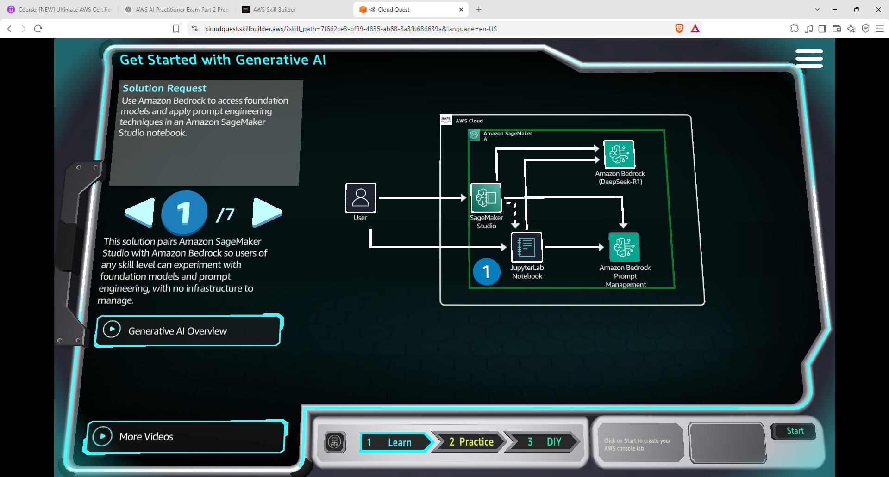

---

# 02 — 🧑‍💻 Open Amazon SageMaker AI

I opened the **Amazon SageMaker AI** console and reached the SageMaker Studio environment.

SageMaker Studio provides an integrated environment for machine learning development.

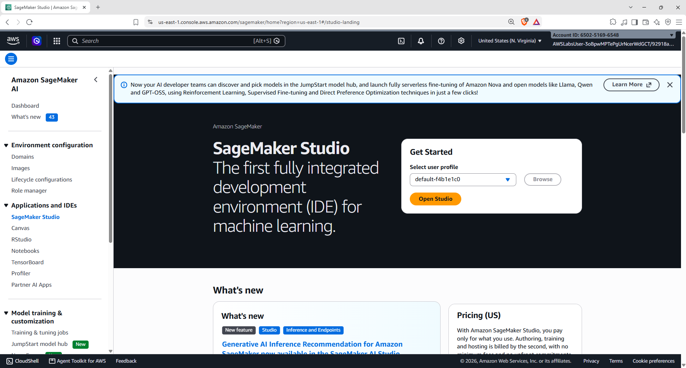

### 💡 Key concept

SageMaker Studio provides a workspace where developers and ML practitioners can work with notebooks, models, data and other machine-learning development tools.

---

# 03 — 🚀 Open SageMaker Studio

I opened the SageMaker Studio environment.

The Studio home page provides access to development environments such as:

- JupyterLab
- Code Editor
- Model-related tools
- Generative AI / foundation model capabilities

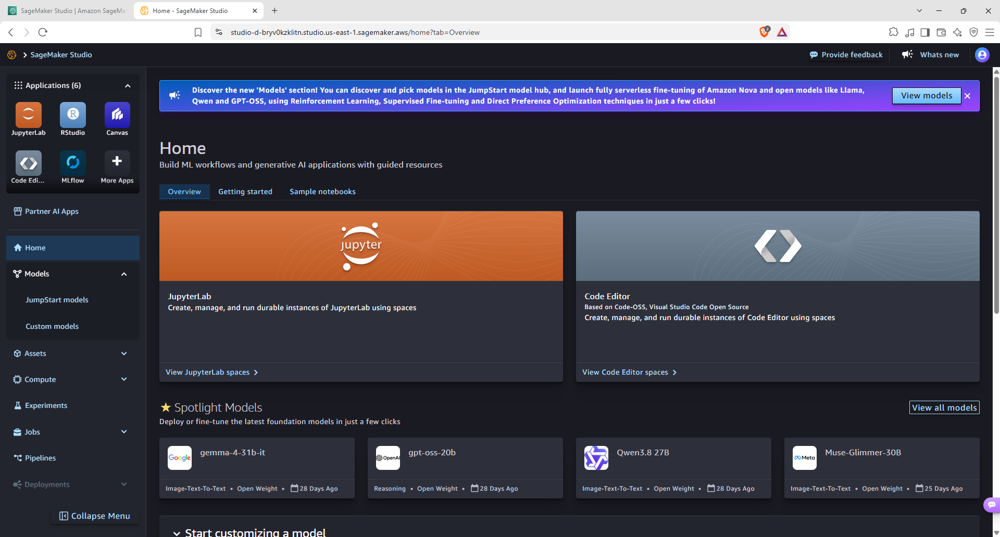

---

# 04 — 🧩 Explore the Studio Workspace

Inside SageMaker Studio, I explored the available development environment and tools.

The workspace provides access to different applications and machine-learning resources.

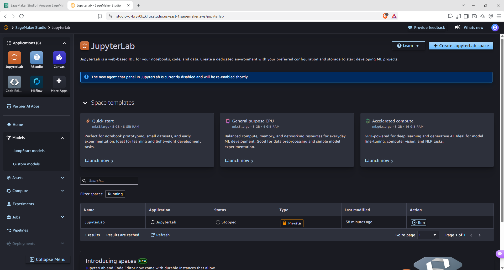

### 🧠 Why this matters

SageMaker Studio acts as a central development environment where ML and Generative AI workflows can be experimented with.

---

# 05 — 📓 Open JupyterLab

I launched **JupyterLab** from the SageMaker Studio environment.

JupyterLab provides an interactive workspace for:

- Python code
- Notebooks
- Terminal commands
- Files
- Experimentation


---

# 06 — 🧪 Start the Generative AI Notebook

Inside JupyterLab, I opened the notebook used for the Generative AI practice.

The notebook contains Python-based examples for interacting with foundation models through Amazon Bedrock.

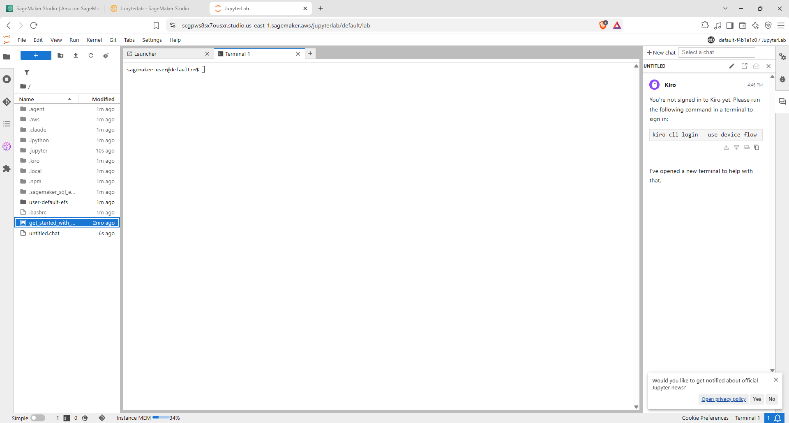

### Workflow

```text
JupyterLab
    │
    ▼
Python Code
    │
    ▼
Amazon Bedrock
    │
    ▼
Foundation Model
    │
    ▼
Generated Response
```

---

# 07 — 🧠 Model Reasoning

The practice includes experimentation with **model reasoning** and model response behaviour.

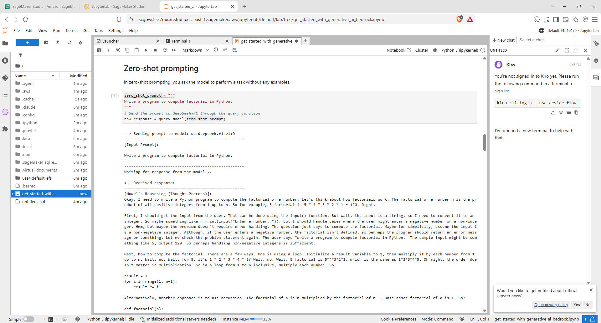

### 💡 What I explored

The notebook demonstrates how model configuration and prompting can influence the generated response.

This provides hands-on exposure to controlling and evaluating Generative AI behaviour rather than simply sending a basic prompt.

---

# 08 — 1️⃣ Zero-Shot Prompting

The notebook demonstrates **zero-shot prompting**.

In zero-shot prompting, the model is asked to perform a task **without being given an example of the desired output**.

A simple conceptual example:

```text
Prompt:
Write a program to calculate factorial in Python.

No example is provided.
```

The model must infer the required task directly from the instruction.

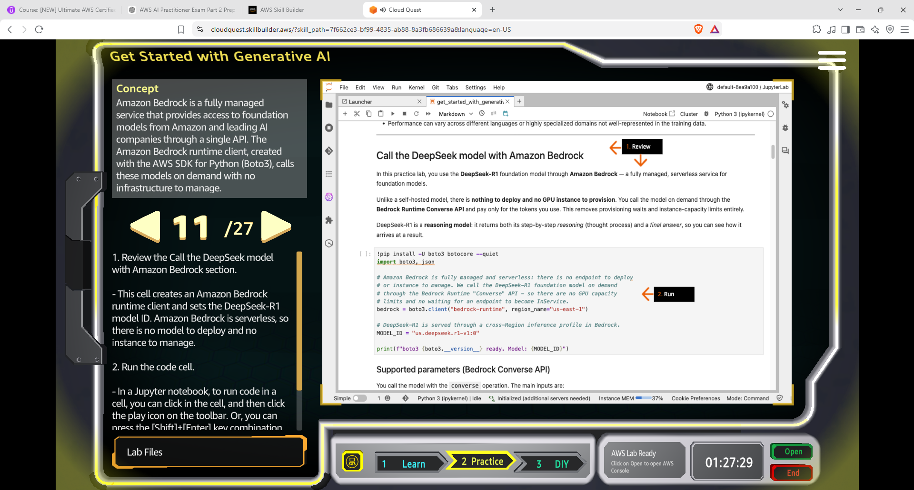

---

# 09 — 1️⃣ One-Shot Prompting

The practice then explores **one-shot prompting**.

One-shot prompting provides the model with **one example** before asking it to perform the target task.

```text
Example:
Input  → Example input
Output → Example output

Task:
Input  → New input
Output → ?
```

The example helps demonstrate the expected pattern or format.

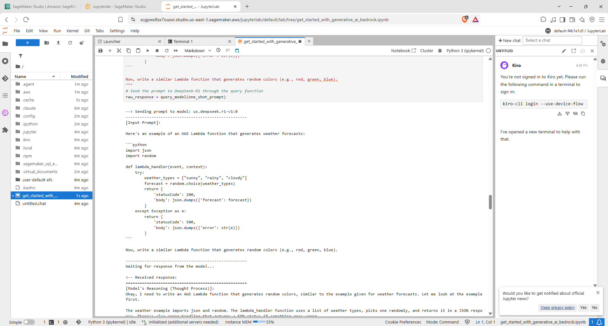

---

# 10 — 🔢 Few-Shot Prompting

Few-shot prompting extends the same concept by providing **multiple examples**.

```text
Example 1 → Input / Output
Example 2 → Input / Output
Example 3 → Input / Output
                  │
                  ▼
              New Input
                  │
                  ▼
            Model Response
```

The examples give the model additional context about the expected behaviour.

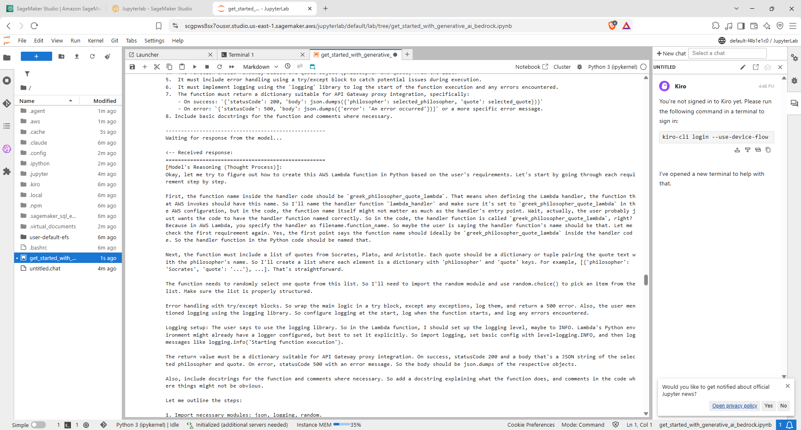

---

# 11 — 🌡️ Experiment With Temperature

The practice also includes experimenting with the **temperature** parameter.

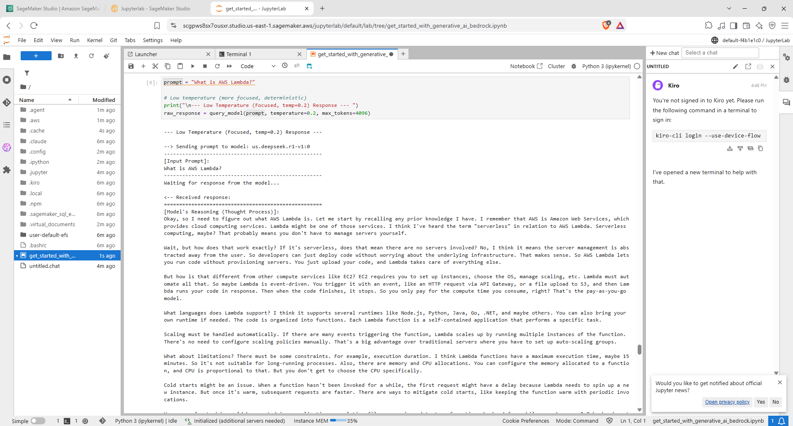

### 🧠 Simple understanding

Temperature controls the randomness of model generation.

Conceptually:

```text
Lower Temperature
      ↓
More predictable / focused output

Higher Temperature
      ↓
More varied / creative output
```

The appropriate setting depends on the application and the type of response required.

---

# 12 — 🎛️ Explore Creativity Control

Another configuration was tested to observe how changing generation behaviour can affect the model response.

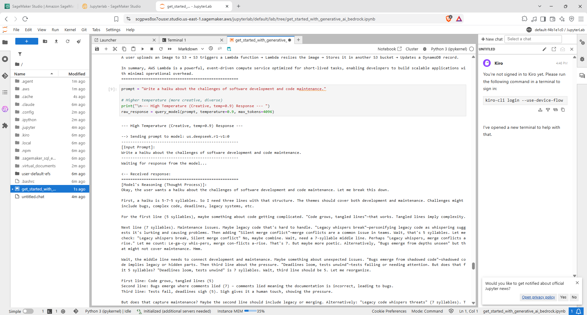

This provides practical exposure to how inference parameters can influence the style and variability of generated output.

---

# 🧩 End-to-End Practice Architecture

```text
                     👤 User
                       │
                       ▼
              Amazon SageMaker Studio
                       │
                       ▼
                    JupyterLab
                       │
                       ▼
                  Python Notebook
                       │
                       ▼
                Amazon Bedrock
                       │
                       ▼
                Foundation Model
                       │
             ┌─────────┴─────────┐
             ▼                   ▼
       Prompt Engineering   Model Parameters
             │                   │
     ┌───────┼────────┐          │
     ▼       ▼        ▼          ▼
 Zero-shot One-shot Few-shot  Temperature
             │                   │
             └─────────┬─────────┘
                       ▼
                Generated Response
```

---

# 🧠 What I Learned

| Concept | Hands-On Practice |
|---|---|
| 🧑‍💻 **SageMaker AI** | Explored the SageMaker AI environment |
| 🖥️ **SageMaker Studio** | Opened and explored Studio |
| 📓 **JupyterLab** | Used JupyterLab for Generative AI experimentation |
| ☁️ **Amazon Bedrock** | Accessed foundation models from the notebook workflow |
| 🧠 **Foundation Models** | Worked with model-based text generation |
| ✍️ **Prompt Engineering** | Tested different prompting approaches |
| 🎯 **Zero-Shot Prompting** | Prompted without examples |
| 1️⃣ **One-Shot Prompting** | Prompted with one example |
| 🔢 **Few-Shot Prompting** | Prompted with multiple examples |
| 🧠 **Model Reasoning** | Explored reasoning-related model behaviour |
| 🌡️ **Temperature** | Experimented with generation variability |
| 🎛️ **Generation Controls** | Observed how parameter changes affect output |

---

# 🔑 Key Takeaway

One of the main takeaways from this practice was understanding that **Generative AI development is not only about selecting a model**.

The overall result depends on:

```text
Model
  +
Prompt
  +
Examples / Context
  +
Inference Parameters
  ↓
Generated Output
```

Using SageMaker Studio with JupyterLab provides a practical development environment for experimenting with these components while interacting with foundation models through Amazon Bedrock.

---

# 🛠️ Skills Practiced

`AWS` `Amazon SageMaker AI` `SageMaker Studio` `JupyterLab` `Amazon Bedrock` `Generative AI` `Foundation Models` `Prompt Engineering` `Zero-Shot Prompting` `One-Shot Prompting` `Few-Shot Prompting` `Model Reasoning` `Python` `Cloud Computing` `AWS Cloud Quest`

---

## 📚 Learning Source

**AWS Cloud Quest — Generative AI Practitioner**

This README documents my personal hands-on practice and the steps completed during the Cloud Quest activity.

---

<p align="center">
  <b>☁️ Explore → Experiment → Prompt → Evaluate → Learn</b>
</p>
